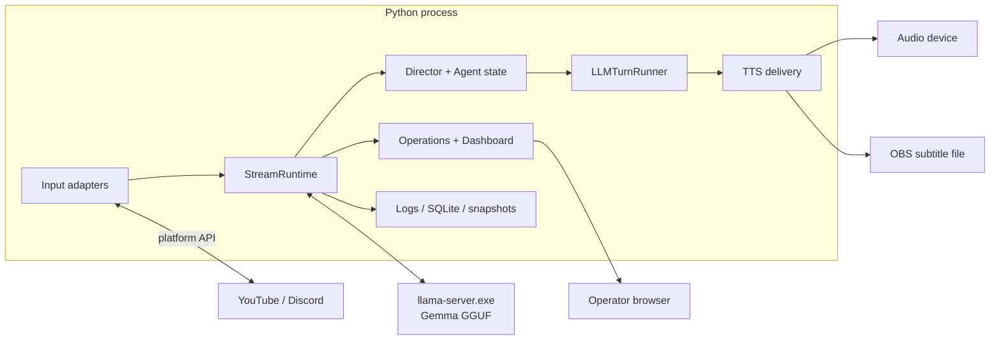

# 01 — Tổng quan hệ thống

> **Applies to:** Mai `1.4.2` (baseline `1.0.0`)
>
> **Release baseline:** `docs/00_V1_0_BASELINE.md`

## 0. Product identity và source of truth

Mai v1.0.0 là một local Windows runtime, không phải cloud multi-tenant service. Product version lấy từ
`config/system.yaml::app.version`. `StreamRuntime` và interface/implementation đang compose mới là
behavior thật; feature flag enabled nhưng chưa có external adapter không được gọi là output production.

## 1. Phạm vi runtime hiện tại

Hệ thống chạy một process Python chính và có thể quản lý một process `llama-server.exe`. Python
process nhận input platform, duy trì state, chọn hành động, gọi LLM, lọc output, phát TTS/subtitle,
commit side effect và phục vụ dashboard.

Đã triển khai:

- YouTube chat và Discord chat.
- llama.cpp OpenAI-compatible `/v1/chat/completions`.
- Director, salience pool, chat pulse, goal/thread/agent state và proactive hosting.
- Mood legacy + TurnAffect/SessionMood v2, hợp nhất thành một `ResponsePlan` Hybrid.
- Rule filter, regeneration và canned fallback.
- VieNeu-TTS streaming, audio queue không overlap và subtitle file fallback.
- VTube Studio animation adapter, trigger expression theo mood sau delivery thành công.
- Working memory; semantic memory tùy chọn; relationship memory trong SQLite.
- Transaction delivery-aware và decision record.
- Dashboard operator v2, dashboard legacy, health/recovery/emergency/shutdown.
- Evaluation, export dataset, backup/restore và release evidence.

Chưa phải input/output production chính:

- STT/voice input có interface nhưng `input_voice` đang tắt.
- Environment/game action thật chưa được nối vào side-effect executor.
- Fine-tuned model candidate không thay model production hiện tại.

## 2. Kiến trúc process

## 3. Các boundary bắt buộc

| Boundary | Contract | Ý nghĩa khi sửa code |
|---|---|---|
| Service lifecycle | `interfaces/base.py::Service` | Service phải start/stop/health/metrics nhất quán |
| Input | `interfaces/input.py` | Adapter chỉ phát `InputEvent`, không tự gọi LLM |
| LLM | `interfaces/llm.py` | Runtime không phụ thuộc chi tiết HTTP llama.cpp |
| Affect | `interfaces/affect.py` | Mood state và response strategy không được chui vào hard priority |
| Filter | `interfaces/filter.py` | Output phải có verdict có category/reason rõ |
| TTS | `interfaces/tts.py` | Delivery phải trả kết quả theo từng câu trước commit |
| Transaction | `interfaces/action_transaction.py` | Side effect chỉ commit sau `DELIVERED` |
| Decision audit | `interfaces/decision_record.py` | Mỗi quyết định có reason/evidence/result bounded |
| Memory | `interfaces/memory.py` | Lỗi memory không làm chết turn chính |
| Relationship | `interfaces/relationship.py` | Identity pseudonymous, context có provenance/consent |
| Self-talk | `interfaces/self_talk.py` | Thought stage chỉ tiến sau delivered commit |
| Operations | `interfaces/operations.py` | Health, shutdown, emergency và control có contract riêng |
| Evaluation/data | `interfaces/evaluation.py`, frozen data contract | Eval/export không suy diễn delivery từ attempt log |

## 4. Ownership và dependency

`StreamRuntime` là composition root duy nhất của live stack. Từ `1.3.1`, root này ủy quyền việc dựng
TTS, feature bindings và operations wiring cho `orchestrator/runtime_tts.py`,
`runtime_feature_bindings.py` và `runtime_operations.py`; thứ tự compose/lifecycle vẫn do
`stream_runtime.py` sở hữu. Business decision thuộc `Director`; generation thuộc `LLMTurnRunner`; delivery
thuộc `TTSPipeline`; commit thuộc `DirectorLoop` + transaction manager. Dashboard chỉ đọc snapshot
và gửi operator command qua control plane, không tự suy luận hay tự sửa state nguồn.

`orchestrator/main.py` không phải composition root thứ hai. Từ `1.4.1`, module này chỉ fail-fast và
trỏ về launcher chuẩn để không thể vô tình mở dashboard-only pseudo-runtime thiếu LLM/TTS/Director.

Quy tắc ownership:

1. Adapter sở hữu kết nối platform và queue raw input.
2. ChatRouter sở hữu chuyển `InputEvent` vào intake.
3. Agent/Director services sở hữu state và quyết định hành động.
4. LLMTurnRunner sở hữu một lần generation/filter/parse và pending delivery.
5. TTSPipeline sở hữu delivery audio/subtitle.
6. DirectorLoop sở hữu transaction state và side-effect commit/release.
7. Operations services sở hữu recovery/shutdown/control; không sở hữu business decision.

## 5. Concurrency model

- I/O dùng `async/await`.
- Mỗi input source có consumer task, nhưng live turn dùng shared turn lock để không chạy hai LLM turn
  đồng thời trên một llama-server.
- Director tick là driver hành động chính khi feature arbiter bật.
- `TTSPipeline.speak()` có lock riêng vì VieNeu không thread-safe.
- `AudioPlayer` dùng queue và không phát overlap.
- Memory write có thể fire-and-forget sau commit; lỗi phải được log và fail-safe.
- EventBus queue bounded và dùng overflow policy từ `config/system.yaml`.

## 6. Startup và shutdown

Startup mức cao:

1. `start_live.ps1` chạy static preflight.
2. Stream entrypoint load toàn bộ YAML.
3. `build_stream_runtime()` validate critical config trước composition.
4. FeatureManager load dependency/toggle.
5. Nếu enabled, process manager start llama.cpp và chờ `/health`.
6. Tạo agent, emotion, filter, memory, TTS, Director và operations.
7. `StreamRuntime.start()` start state/service/router/Director/health/shutdown.

Shutdown mức cao:

1. Pause recovery.
2. Stop Director/autonomy.
3. Stop input.
4. Cancel/stop speech.
5. Close dashboard/WebSocket.
6. Stop supporting services và LLM.
7. Lưu runtime snapshot, flush logger.

Không dùng kill process Python hàng loạt; Ctrl+C đi qua graceful shutdown.

## 7. Dependency ngoài process

| Dependency | Vai trò | Boundary/fallback |
|---|---|---|
| llama.cpp `llama-server.exe` + GGUF | LLM production | health gate; canned fallback khi generation lỗi |
| VieNeu-TTS + CUDA/audio device | speech production | subtitle-only nếu real file sink healthy |
| pytchat/YouTube | chat source | adapter health/reconnect; replay offline để test |
| Discord bot API | chat source | env credential + adapter queue |
| SQLite | memory/relationship | migration + pre-migration backup |
| FastAPI/WebSocket | operator dashboard | standalone snapshot mode khi runtime offline |

Không external dependency nào được phép tự commit Director state hoặc bypass typed delivery result.
