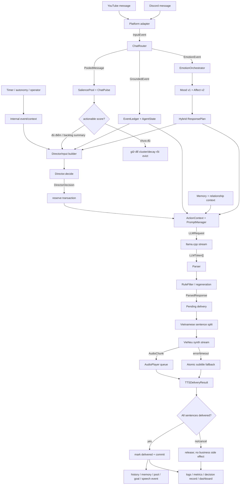
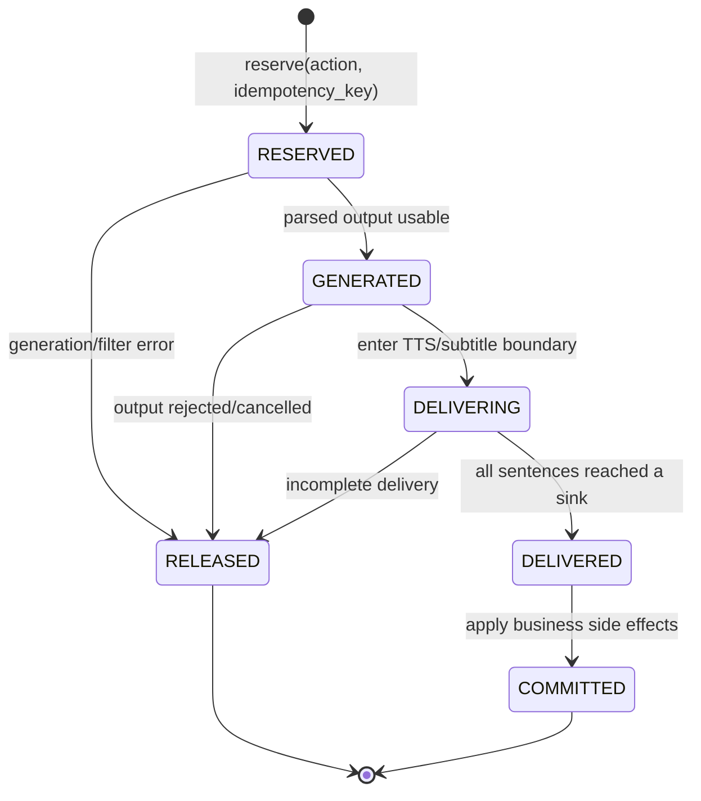
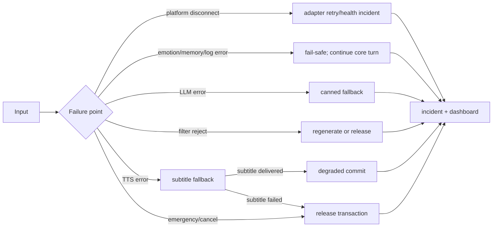

# 02 — Pipeline dữ liệu end-to-end

> **Applies to:** Mai `1.4.0` (baseline `1.0.0`)
>
> **Invariant chính:** generation không đồng nghĩa delivery; delivery không đồng nghĩa commit cho tới
> khi transaction hoàn tất.

## 1. Pipeline live chính

## 2. Input chuẩn hóa

### 2.1 Platform input

Raw input tùy platform được adapter chuyển thành `InputEvent`:

| Field | Type | Nguồn | Quy tắc |
|---|---|---|---|
| `event_id` | string | platform message ID | dùng dedup/idempotency |
| `timestamp` | datetime | platform hoặc local UTC | phải timezone-aware |
| `source` | `EventSource` | YouTube/Discord/... | xác định trigger type |
| `user_id` | string/null | platform | phải hash/mask trước persistent log |
| `user_name` | string/null | platform | không đưa nguyên vào evidence public |
| `content` | string | chat text | input chính cho salience/emotion/LLM |
| `metadata` | dict | donation/channel/platform flags | bounded, không tin cậy |

### 2.2 Internal input

Director còn nhận tín hiệu không phải chat: current goal, open thread, stream phase, environment
observation, silence/urge, safety hold, chat pulse, mood/tone flag, recent speech và operator pin.
Các tín hiệu này tạo `DirectorInput`; chúng không giả thành message của viewer.

## 3. Intake: một event được xử lý ra sao

1. Adapter yield `InputEvent` từ async iterator.
2. ChatRouter convert sang `EmotionEvent`; lỗi emotion được log và không giết source consumer.
3. Event classifier tạo category như compliment, troll, spam, sad share, jailbreak hoặc donation.
4. EmotionOrchestrator cập nhật legacy mood và Affect v2 trên cùng event.
5. Hybrid composer tạo một `ResponsePlan`; plan là hướng dẫn style/response, không thay safety hoặc
   donation priority.
6. Khi Director mode bật, event đi vào salience pool/pulse và grounded ledger/state. Router không gọi
   LLM trực tiếp.
7. Legacy FIFO mode chỉ dùng khi Director không được compose; lúc đó ChatRouter có thể gọi runner.

Output intake: pooled chat candidate, grounded event, mood/affect state và metrics. Chưa có output gửi
ra ngoài, chưa có history/memory commit.

Chat gate không xóa input khỏi emotion, pulse hoặc grounded ledger. Candidate dưới
`director.min_actionable_score` chỉ bị chặn khỏi lượt LLM riêng; nó vẫn ở SaliencePool để có thể tăng
điểm nhờ cluster, được tóm tắt khi backlog lớn, hoặc decay xuống storage floor rồi bị evict. Donation
luôn thắng gate. Khi chat hype, `VIBE` chỉ áp dụng cho candidate loại `chat`; question/mention vẫn đi
đường trả lời trực tiếp.

## 4. Decision pipeline

`DirectorInput` là snapshot bounded gồm chat candidates, goals, threads, mood, pulse, phase, safety và
proactive material. `Director.decide()` trả `DirectorDecision` với:

- action: `WAIT`, `READ_CHAT`, `ACK_DONATION`, `SELF_TALK`, `FOLLOW_UP`, `TRANSITION`,
  `CONTINUE_THREAD`, `ASK_FOLLOW_UP`, `SHARE_GOAL_PROGRESS`;
- reason và evidence ref;
- chat ref/read mode khi đọc chat;
- goal/thread/segment context liên quan;
- stage direction/directive nếu cần.

Hard rule (safety, donation, operator control) phải thắng mood. Mood chỉ điều chỉnh pacing/style và
soft behavior. Nếu action là `WAIT`, decision vẫn được ghi nhưng không mở transaction delivery.

## 5. Transaction và idempotency

State machine:

Idempotency key ngăn một platform event/action bị deliver hoặc commit hai lần. Duplicate đã committed
được nhận diện và không tái phát output. `RELEASED` cho phép hệ thống giữ work cần retry mà không giả
rằng viewer message đã được xử lý.

## 6. Context và LLM

PromptManager tạo `LLMRequest.messages` từ các lớp, theo thứ tự logic:

1. Persona system prompt byte-stable.
2. History bounded.
3. Grounded agent context và conversation continuity nếu feature bật.
4. Memory/relationship context đã sanitize và giới hạn.
5. Mood/Hybrid response directive của turn hiện tại.
6. Action context: chat gốc, reason, stage direction hoặc proactive material.

`LlamaCppLLMService` gọi `/v1/chat/completions` và yield `LLMToken`. Parser loại reasoning/meta block,
tạo `ParsedResponse(text, mood, continuation, reason, ok)`. Rule filter có thể accept, reject hoặc gọi
regenerator; nếu primary LLM thất bại, fallback chain dùng canned response.

Output generation mới chỉ là pending. Với Director path, history/memory chưa commit cho tới delivery.

## 7. Delivery pipeline

Text được `split_vn()` thành danh sách câu. Mỗi câu có sub-request ID `turn_id#index`:

1. VieNeu synthesize `AudioChunk` và enqueue vào AudioPlayer.
2. Nếu primary lỗi/timeout, SubtitleFallback ghi text atomic vào `logs/live/subtitle.txt`.
3. Mỗi câu được phân loại audio hoặc subtitle.
4. Kết quả toàn turn là `TTSDeliveryResult`.

Khi startup, VieNeu phải hoàn tất trong `tts.startup_timeout_s` và qua health gate. Nếu primary
timeout/unhealthy nhưng subtitle sink healthy, runtime vào subtitle-only mode và vẫn giữ callback
delivery typed. Nếu không có sink nào healthy, composition fail-fast. Director coi callback thiếu,
`None`, object không có `delivered=true` hoặc kết quả `delivered=false` là delivery failure và release.

| Mode | `delivered` | Transaction |
|---|---:|---|
| `audio` và đủ mọi câu | true | commit |
| `subtitle` và đủ mọi câu | true | degraded commit |
| `mixed` và đủ mọi câu | true | degraded commit |
| `none` | false | release |
| `cancelled` | false | release |
| bất kỳ câu nào fail | false | release |

`speak()` trả về khi chunk đã enqueue, không đợi loa phát hết. AudioPlayer chịu trách nhiệm thứ tự và
no-overlap. Emergency cancel đánh dấu request, cancel synth và audio queue.

## 8. Commit output

Chỉ sau `DELIVERED`, DirectorLoop mới cho phép các side effect phù hợp action:

- remove/complete chat candidate;
- advance segment/goal/thread;
- ghi history user/assistant;
- schedule memory extraction/write;
- commit self-talk để continuity lượt sau;
- phát grounded `speech_completed` event;
- finalize decision record là committed.

Với self-talk, Thought Engine tạo nội dung theo chuỗi `tín hiệu thật → cause/evidence → cognitive
move → intention → lời nói → outcome ledger`; không còn chọn topic/seed ngữ nghĩa cố định.
`prepare()` chỉ reserve một chặng pending. Output phải qua giới hạn số câu, question policy theo nghĩa
tiếng Việt và gate chống chép lại câu trước; vi phạm được regenerate tối đa một lần rồi release.
`commit()` sau delivery mới chuyển `open → develop → invite → wait`. `invite` phải có đúng một câu hỏi.
Delivery fail gọi `release()` nên giữ nguyên chặng để retry.

Mọi chat thật đều mở global quiet gate, kể cả lúc chưa có arc, nên self-talk không được sinh/delivery
trong cùng tick vừa nhận chat. Chat đến trong lúc generation còn đánh dấu pending là interrupted để
chặn trước TTS; arc đang mở chỉ tạm suspend rồi có thể nối lại, còn chat đến sau `invite` hoàn tất wait.
Cause `silence` là one-shot duy nhất trong một quiet episode và chỉ được nói về chính khoảng im lặng;
chat mới reset episode. Mood chỉ tạo style directive, không được tạo cause, premise hay dữ kiện mới.

Từ `1.4.0`, khi không có grounded/recent/environment material, Thought Engine có thể reserve một bullet
đã duyệt từ character lore làm cause `grounded` trước silence fallback. Lore candidate chỉ được advance
sau delivery thành công; generation/filter/delivery fail phải release candidate để retry. Source vẫn là
`config/prompts/mai_lore.txt`, giới hạn section/độ dài/no-repeat nằm trong `self_talk.yaml`.

Nếu release, pending history/memory không được finalize và work nguồn không bị xóa giả.

Quy tắc này áp dụng cả cho legacy autonomy fallback: chỉ sau khi callback delivery trả
`delivered=true` mới được gọi `on_self_spoke()` và `commit_self_talk()`. Callback thiếu, trả `None`,
raise exception hoặc trả `delivered=false` đều không được thay đổi continuity/autonomy state.

## 9. Output của toàn hệ thống

| Output | Consumer | Dạng dữ liệu |
|---|---|---|
| Audio | sound device/stream mix | PCM bytes trong `AudioChunk` |
| Subtitle | OBS Text Source | UTF-8 text file atomic |
| Dashboard | operator browser | HTTP JSON + WebSocket snapshot |
| Generation-attempt journal | debug/canonicalizer | sanitized append-only JSONL |
| Delivery-outcome journal | quality gate/canonicalizer | sanitized append-only JSONL |
| Dataset bundle | train/eval | canonical JSONL + SFT/DPO splits + manifest |
| Event/audit/incident | operator/debug | sanitized JSONL |
| Memory/relationship | future turns | SQLite rows/vectors |
| Runtime snapshot | post-stream recovery | JSON atomic |
| Metrics | dashboard/Prometheus-style collector | counters/gauges/latency snapshots |

## 10. Failure/degraded pipeline

Để debug, luôn bắt đầu từ `decision_id`/`transaction_id`/`request_id`, sau đó đối chiếu lần lượt:
decision record → transaction state → turn log → TTS delivery mode → incident/health snapshot.
Đối với data/export, tiếp tục join `turns.jsonl` với `delivery_outcomes.jsonl`; không suy luận delivery
từ text đã generate.

## 11. Pipeline dữ liệu train dài hạn

Pipeline train không đọc `turns.jsonl` như bằng chứng đã phát. Nó join ba lớp theo
`session_id + request_id + turn_id`:

1. `turns.jsonl` ghi generation attempt append-only trong từng rotated segment, kể cả candidate cuối
   cùng thất bại delivery;
2. `delivery_outcomes.jsonl` ghi outcome append-only tại delivery boundary;
3. quality gate chỉ canonicalize attempt có outcome version hợp lệ và `delivered=true`.

Canonicalizer dùng adapter được khai báo bằng code cho từng source schema. Việc thêm version vào danh
sách compatibility trong contract nhưng chưa có adapter phải fail-fast. Export tạo một dataset directory
mới có timestamp độ phân giải microsecond và source fingerprint; không ghi đè artifact đã tồn tại.
Manifest giữ contract/schema, adapter ID, SHA-256 nguồn, count và split để dữ liệu cũ có thể được đánh
giá lại khi persona/architecture nâng cấp mà không sửa raw journal.

Active raw logs có rotation/capacity theo `logging.yaml`, vì vậy “append-only” không có nghĩa giữ vô hạn.
Retention dài hạn phụ thuộc backup manifest có SHA-256 trước khi segment cũ bị rotation loại bỏ.

## 12. Conversation Thread Engine

Chat intake may create, match, resume, or add grounded viewer evidence to an open thread immediately.
Topic matching is deterministic and returns no target below the configured threshold; unrelated chat must
never be attached merely because a thread exists. A public conversation move is selected from bounded
thread state and injected as a speaking instruction, not as hidden reasoning.

Output-generated thread progress follows the delivery boundary. Generated text does not add a claim,
increment `move_count`, open a question, or change waiting state. Only the post-delivery
`speech_completed` event with `delivered=true` may apply those changes.
Waiting-for-chat goals additionally require the delivered event to carry the explicit
`expects_chat_answer=true` intent; punctuation echoed from a viewer question is not enough.
