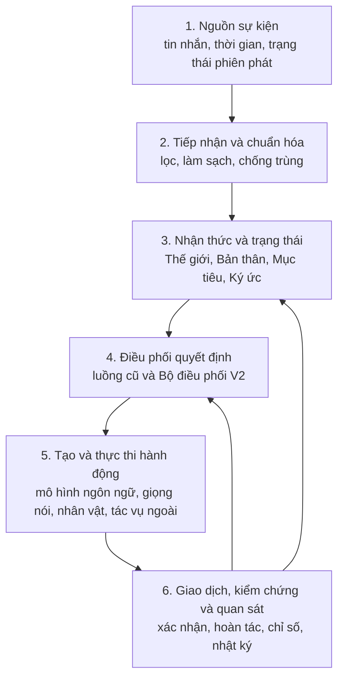
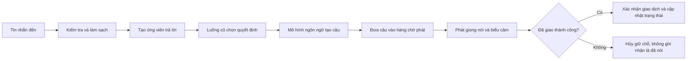
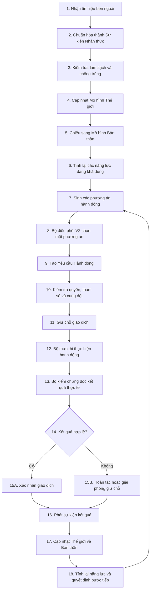
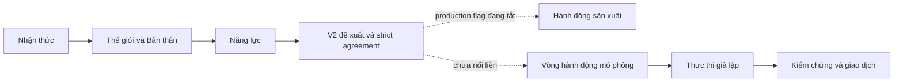
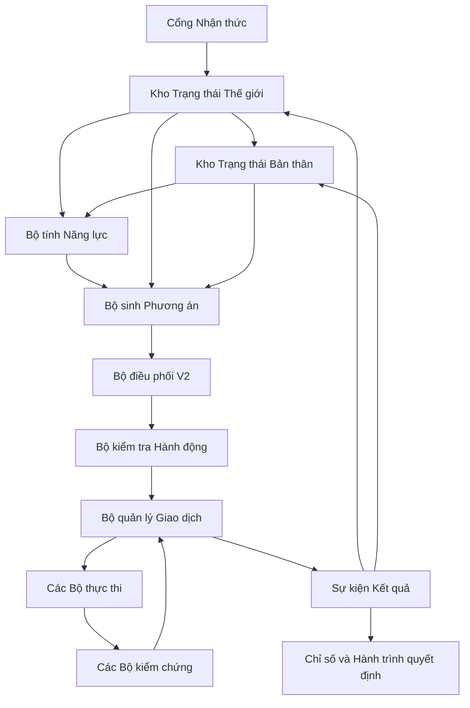
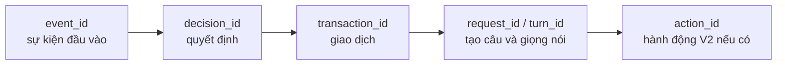
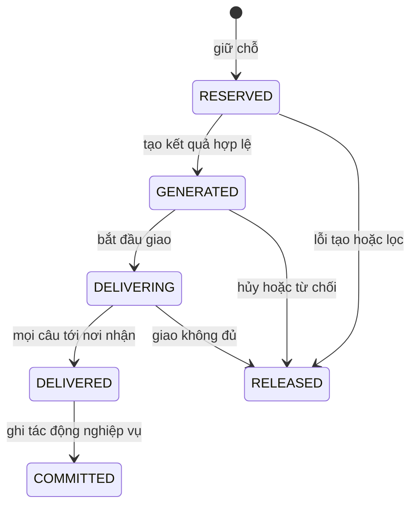
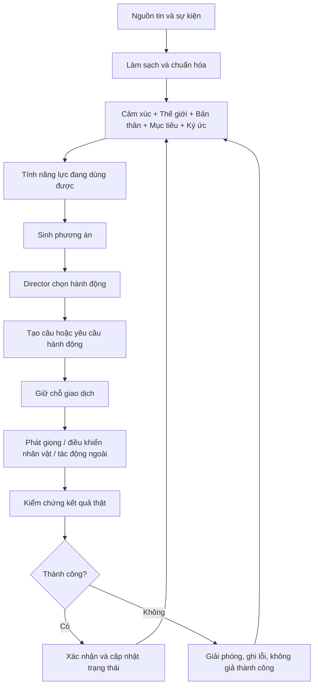

# Mai V2 — Canonical system specification

**Phạm vi:** implementation working tree `v2.0`

**Phiên bản sản phẩm hiện tại:** `1.4.3`

**Ngày xác minh:** 20/08/2026

**Vai trò:** nguồn sự thật duy nhất cho behavior đã triển khai, ownership, vận hành, kiểm thử, an toàn,
tiến độ và known gaps.

Tài liệu này thay thế bộ tài liệu runtime/phase đánh số trước đây. Lịch sử V1 chỉ thuộc
`docs/V1_BASELINE.md`; scope và thứ tự tương lai chỉ thuộc
`MAI_V2_MASTER_IMPLEMENTATION_BLUEPRINT_v2.0.md`. Khi prose mâu thuẫn repository, áp dụng thứ tự:
interface/model bất biến → composition trong `orchestrator/stream_runtime.py` → implementation service →
production YAML → tests → tài liệu này. Nội dung blueprint không phải bằng chứng production.

**Cách đọc tài liệu:**

- Mục 1–15 giúp hiểu tư duy, kiến trúc, luồng vận hành và mức hoàn thiện V2.
- Mục 16–25 là phần bàn giao kỹ thuật: mã nguồn, hợp đồng dữ liệu, cấu hình, lưu trữ, vận hành, an toàn, kiểm thử và xử lý sự cố.
- Mục 26 là bảng thuật ngữ; mục 27 đưa ra mô hình ghi nhớ ngắn nhất cho toàn hệ thống.
- Tên tiếng Anh chỉ được giữ khi đó là tên thật trong mã nguồn, cấu hình, giao thức hoặc công cụ.
- Trạng thái **đã có mã** không mặc nhiên có nghĩa là **đã được ghép vào đường chạy chính** hoặc **đã phát hành**.

---

## 1. Kết luận ngắn

Mai hiện có nền móng kỹ thuật đáng tiếp tục: ranh giới dữ liệu khá rõ, thiết kế giao dịch đúng hướng,
trạng thái có giới hạn, nhiều cờ bật/tắt và bộ kiểm thử rộng. Vòng hành động mô phỏng đã sửa đúng thứ tự
commit rồi mới project Mô hình Thế giới. Phase 9 đã bổ sung lát cắt OBS đổi scene typed, kiểm chứng bằng
truy vấn độc lập và rollback có điều kiện; feature vẫn mặc định tắt và chưa có live OBS canary.
Phase 10 đã đóng canonical perception ingress cho Chat/System và read-only OBS sensing; OBS sensing vẫn
mặc định tắt và chưa có live canary.

Tuy nhiên, **V2 chưa phải một vòng tự chủ hoàn chỉnh đang chạy trong thực tế**. Các phần quan sát thế
giới, mô hình bản thân, năng lực, lựa chọn hành động và khung thực thi đã được xây dựng ở nhiều mức độ
khác nhau, nhưng chưa nối liền với external system thật thành một đường đi production duy nhất. Working
tree hiện dùng cấu hình **V2 test cutover**: controlled takeover ở stage `SPEECH_SCHEDULING`, speech/avatar
typed boundary, Embodiment Policy, ContextSelector/agent context và trajectory được bật để kiểm thử đường
V2. Director V2 hiện chạy strict primary mode: proposal hợp lệ tự dựng executable decision từ evidence
typed cùng tick và có thể khác compatibility policy. Compatibility Director chỉ chạy khi feature/mode
rollback, proposal/selection/material không hợp lệ hoặc service lỗi; safety và segment transition là hard
preemption riêng. Đây vẫn là test-cutover, không phải production takeover.
OBS scene action/perception, closed-loop canary và các integration cần credential vẫn tắt cho tới canary
riêng. Phase 15 chưa đóng release gate và cấu hình test cutover không tự biến capability thành production.

Vì vậy, cách mô tả chính xác nhất là:

> Hệ thống đã có phần lớn khung xương của V2, nhưng chưa có đủ cơ bắp và dây thần kinh để V2 tự quan sát, tự quyết định, thực hiện hành động thật, kiểm chứng kết quả rồi học từ kết quả đó trong cùng một vòng kín.

Trạng thái phát hành khách quan:

| Phạm vi | Trạng thái đã xác minh |
|---|---|
| Đường hội thoại kế thừa V1 | Có implementation và hồi quy rộng; chưa có live evidence mới trong đợt rà soát này |
| Core compatibility contracts Phase 1 | Đã đóng gate: strict validation, immutable value, UTC/serialization, bounded compatibility mapping; không đổi Director production |
| World Model shadow Phase 2 | Đã đóng gate: strict reducer/config, TTL, provenance, authority, uncertainty, bounds, metrics và dashboard read-only; không đổi Director production |
| Self Model projection Phase 3 | Đã đóng gate: strict projection/config, authoritative-source degradation, transaction lifecycle, bounded action history, metrics và dashboard read-only; không đổi Director production |
| Capability registry Phase 4 | Đã đóng gate: strict immutable declaration/config, permission, executor/verifier health, fail-closed transaction/precondition, bounded registration, metrics và dashboard read-only; không đổi Director production |
| General action mock closed loop Phase 5 | Đã đóng gate: strict transaction, verified result, commit-before-World projection, idempotency/cancellation/failure isolation; vẫn mock-only |
| Director V2 shadow Phase 6 | Đã đóng gate: deterministic proposal, hard precedence, strict capability/evidence, bounded log/metrics; không đổi live decision |
| Nền nhận thức/trạng thái V2 | Có mã, chủ yếu ở shadow hoặc từng thành phần riêng |
| Director V2 takeover Phase 7 | Đã đóng gate kỹ thuật; task hậu Phase 15 đã bật strict primary test-cutover ở stage `SPEECH_SCHEDULING`, có agreement/feature-off rollback và fail-safe compatibility fallback |
| Speech/avatar action adapters Phase 8 | Đã đóng gate kỹ thuật và bật cho V2 test cutover: local typed boundary, authoritative TTS/VTS verification, bounded idempotency và runtime composition; chưa có live audio/VTS canary |
| External OBS scene action Phase 9 | Đã đóng gate kỹ thuật: typed transport/executor/verifier, strict transaction, bounded retry/idempotency, conditional rollback và runtime composition; production flag vẫn tắt, chưa có live canary |
| Canonical perception expansion Phase 10 | Đã đóng gate kỹ thuật: Chat/System qua canonical ingress, OBS read-only compose dùng chung transport; OBS flag vẫn tắt, chưa có live canary |
| Vòng tự chủ khép kín | Chưa đạt |
| Release readiness | Chưa đạt: Mức 0 về môi trường/repository/credential đã hoàn tất, nhưng release evidence và các gate V2 chưa đủ |

Không dùng một điểm số tổng hợp làm cổng phát hành. Chỉ code, composition, test và release evidence tương
ứng mới được phép nâng một capability từ “có mã” lên “đang chạy” hoặc “production”.

### 1.1. Ma trận trạng thái capability

Các cột dưới đây độc lập với nhau. “Có mã” không thay thế cho composition, test hoặc release evidence.

| Capability | Có mã | Đã ghép đường chính | Evidence kiểm thử | Đã phát hành |
|---|---|---|---|---|
| Hội thoại V1: input → Director → LLM → TTS | Có | Có | Unit/integration/offline regression | Có, product `1.4.3` |
| World Model | Có | Shadow read-only | Unit, negative-path và full offline regression | Không |
| Self Model | Có | Shadow read-only | Unit, negative-path, impacted và full offline regression | Không |
| Capability/permission/health registry | Có | Shadow read-only | Unit, negative-path, impacted và full offline regression | Không |
| Action transaction | Có | Mock loop và OBS external boundary strict; không nối Director V1 | Unit, negative-path, impacted, replay và full offline regression | External OBS chưa phát hành; mặc định tắt |
| Director V2 shadow | Có | Proposal/log read-only strict; không đổi live decision | Unit, negative-path, impacted, replay và full offline regression | Không |
| Director V2 takeover | Có | V2 strict primary test-cutover stage `SPEECH_SCHEDULING`; tự materialize typed decision, compatibility chỉ là fallback/rollback | Unit, negative-path, impacted, replay và full offline regression | Chưa phát hành; live canary còn thiếu |
| Speech action adapter | Có | `DirectorDeliveryBoundary` đi qua local typed boundary; exact legacy là rollback switch | Unit, negative-path, transaction integration và full offline regression | Bật cho test; chưa live audio canary |
| Avatar action adapter | Có | Local typed intentional-gesture boundary; không giả automatic mood thành action | Unit, VTS fail-safe, composition và full offline regression | Bật cho test; unavailable/fail-safe khi chưa có VTS |
| External OBS scene executor | Có | Compose tại `StreamRuntime`, chỉ callable qua typed boundary khi feature/permission/health đạt | Unit, transaction integration, deterministic fake-OBS replay và full offline regression | Không; mặc định tắt, chưa live canary |
| Perception expansion | Có | Chat/System qua canonical ingress; OBS read-only compose nhưng mặc định tắt | Unit, negative-path, runtime composition, deterministic replay và full offline regression | Không; OBS chưa live canary |
| Goals và short intentions | Có | Có, qua GoalManager/Director/Self/dashboard | Unit, integration, replay và full offline regression | Không |
| Memory và ContextSelector V2 | Có | ContextSelector/agent context strict bounded được bật; semantic memory vẫn optional | Unit, integration, replay và full offline regression | Bật cho test; chưa live semantic-memory canary |
| Embodiment Policy | Có | LOW/MID/HIGH strict arbitration đã compose và bật test | Unit, integration, deterministic replay và full offline regression | Chưa live VTS canary |
| Human-like calibration và trajectory | Có | Trajectory bật read-only theo Director V2; MAI-HLC là workflow offline tách sealed manifest | Unit, integration, deterministic replay, tamper/negative paths và full offline regression; chưa có human review evidence thật | Trajectory bật test; human review chưa phát hành |
| Product `2.0.0` release gates | Có strict tooling source-bound, fixed runner và canary/operations aggregator | Contract kỹ thuật đã triển khai; chưa có closed-loop/live/human/operations bundle hiện hành | Full regression xanh; external Gate D/E và release-commit verification chưa hoàn tất | Không |

Ma trận chỉ được nâng trạng thái khi có đường code tương ứng, test phù hợp và evidence máy đọc hoặc vận
hành. Blueprint tiếp tục giữ scope/phase order; bảng này chỉ mô tả working tree ngày 20/08/2026.

---

## 2. Hệ thống này đang giải quyết bài toán gì?

Mai là một hệ thống nhân vật ảo có khả năng:

- nhận sự kiện từ buổi phát trực tiếp;
- hiểu tin nhắn và tình trạng phiên phát;
- chọn lúc nên nói, chờ hoặc tự nói;
- tạo nội dung bằng mô hình ngôn ngữ chạy qua `llama.cpp`;
- phát giọng nói và điều khiển biểu cảm nhân vật;
- ghi nhận trạng thái giao tiếp;
- từng bước mở rộng sang hành động bên ngoài như đổi cảnh, phát nội dung hoặc gọi khách.

V1 tập trung vào hội thoại trực tiếp và độ ổn định khi phát sóng. V2 mở rộng Mai từ một hệ thống “nhận tin nhắn rồi trả lời” thành một tác nhân có vòng hoạt động đầy đủ:

> quan sát → hiểu tình hình → hiểu bản thân → biết mình làm được gì → chọn hành động → thực hiện → kiểm chứng → cập nhật trạng thái → quyết định tiếp.

Đây là thay đổi về bản chất vận hành, không chỉ là thêm vài chức năng mới.

---

## 3. Cấu trúc hệ thống hiện tại

Hệ thống có thể được hiểu theo sáu lớp.



### 3.1. Lớp nguồn sự kiện

Đây là nơi hệ thống nhận dữ liệu từ bên ngoài, gồm tin nhắn người xem, sự kiện thời gian, trạng thái buổi phát và các tín hiệu mở rộng trong V2.

Trách nhiệm chính:

- nhận dữ liệu thô;
- đóng dấu thời gian và nguồn phát sinh;
- chuyển dữ liệu sang dạng sự kiện chung;
- không tự quyết định hành động.

### 3.2. Lớp tiếp nhận và chuẩn hóa

Lớp này bảo vệ phần lõi khỏi dữ liệu xấu. Nó kiểm tra cấu trúc, làm sạch nội dung, loại sự kiện trùng và giới hạn dữ liệu trước khi đưa vào hệ thống.

Nếu bỏ qua lớp này, cùng một tin nhắn có thể được xử lý nhiều lần hoặc dữ liệu không hợp lệ có thể làm sai trạng thái.

### 3.3. Lớp nhận thức và trạng thái

Đây là phần quan trọng nhất của V2, gồm:

- **Mô hình Thế giới:** hệ thống tin rằng bên ngoài đang xảy ra điều gì;
- **Mô hình Bản thân:** Mai đang nói hay chờ, đang bận hay rảnh, mục tiêu và ý định hiện tại là gì;
- **Danh mục năng lực:** tại thời điểm này Mai được phép và có khả năng làm những gì;
- **Mục tiêu và ý định ngắn:** điều Mai đang muốn đạt được trong vài bước tiếp theo;
- **Ký ức:** dữ liệu cũ có ích cho quyết định hiện tại.

Trạng thái tốt không chỉ lưu giá trị. Nó còn phải lưu nguồn, độ tin cậy, thời hạn hiệu lực và quyền được phép ghi đè.

### 3.4. Lớp điều phối quyết định

Lớp này nhận các phương án như:

- trả lời tin nhắn;
- tiếp tục chờ;
- tự mở lời;
- nói một câu đã tạo;
- đổi biểu cảm;
- thực hiện hành động bên ngoài.

Sau đó nó chọn một phương án phù hợp theo mức ưu tiên, thời gian chờ, xung đột và khả năng thực thi.

Hiện tại có hai cơ chế cùng tồn tại:

- Bộ điều phối V2 được bật trong working tree ở stage `SPEECH_SCHEDULING` và nhận ownership cho mọi nhóm
  quyết định hội thoại agreement-compatible;
- luồng compatibility cũ vẫn tạo executable payload và làm mốc agreement; nó trở thành final owner khi V2
  bị tắt, proposal không hợp lệ, thiếu evidence, hard hold hoặc subsystem lỗi. Cấu hình này phục vụ V2 test
  cutover, chưa phải autonomous divergent takeover hoặc release evidence.

### 3.5. Lớp tạo và thực thi hành động

Lớp này biến quyết định thành kết quả có thể nhìn hoặc nghe thấy:

- mô hình ngôn ngữ tạo câu trả lời;
- bộ phát giọng nói chuyển văn bản thành âm thanh;
- bộ điều khiển nhân vật đổi biểu cảm hoặc chuyển động;
- bộ thực thi ngoài dự kiến điều khiển cảnh, nội dung hoặc cuộc gọi.

Giọng nói và nhân vật đã có adapter V2 được compose vào `StreamRuntime`; OBS `SWITCH_SCENE` cũng đã có
transport/executor/verifier thật qua transaction boundary. Các cờ speech, avatar và OBS vẫn mặc định
tắt, chưa có canary thiết bị/credential và chưa thuộc vòng quyết định tự chủ production.

### 3.6. Lớp giao dịch, kiểm chứng và quan sát

Một hành động không được xem là thành công chỉ vì đã tạo xong nội dung. Hệ thống phân biệt:

1. đã tạo hành động;
2. đã gửi hành động;
3. đã xác nhận hành động thành công;
4. đã ghi nhận kết quả vào trạng thái.

Đây là tư duy đúng. Nó ngăn hệ thống ghi nhớ rằng mình đã nói hoặc đã làm trong khi hành động thực tế chưa tới người xem.

---

## 4. Luồng vận hành đang chạy hiện nay

### 4.1. Luồng trả lời tin nhắn



Điểm tốt của luồng này là **tạo câu không đồng nghĩa với đã nói**. Chỉ khi phần giao nhận xác nhận thành công, trạng thái hội thoại mới được ghi nhận.

### 4.2. Luồng tự nói

Khi không có tin nhắn phù hợp, hệ thống theo dõi thời gian im lặng và điều kiện tự nói. Nếu đủ điều kiện, nó tạo một ứng viên tự nói, đưa qua điều phối, tạo câu rồi sử dụng cùng đường giao nhận như câu trả lời bình thường.

Rủi ro hiện tại không nằm ở kỹ thuật phát câu mà ở chất lượng suy luận. Trong mẫu kiểm tra tải, có trường hợp Mai suy đoán nguyên nhân người xem im lặng hoặc họ đang làm gì dù không có bằng chứng. Bộ chấm tự động không phát hiện các lỗi này vì đang thiên về cấu trúc và chỉ số, chưa đánh giá đủ tính bám sát dữ kiện.

### 4.3. Luồng mô phỏng hành động chung

Hệ thống có vòng mô phỏng và lát cắt OBS thật để chứng minh các bước giữ chỗ, thực thi, kiểm chứng,
xác nhận hoặc hoàn tác. Contract hiện hành bắt buộc verify thành công rồi commit transaction trước khi
project kết quả vào World. Lỗi trước commit phải release transaction còn active và giữ World không đổi;
lỗi projection sau commit được ghi riêng, không được đổi transaction đã commit thành released.

---

## 5. Luồng V2 đầy đủ cần có

Đây là luồng đích của V2, từ lúc có tín hiệu đến lúc kết quả quay lại làm đầu vào cho quyết định tiếp theo.



### Bước 1–3: tiếp nhận sự thật từ bên ngoài

Mọi đầu vào phải được đổi thành một kiểu sự kiện chung, có nguồn, thời gian, mã nhận diện và mức tin cậy. Sau đó hệ thống kiểm tra dữ liệu, loại trùng và từ chối sự kiện không hợp lệ.

Kết quả của ba bước đầu chưa phải là quyết định; nó chỉ là dữ kiện đã được làm sạch.

### Bước 4: cập nhật Mô hình Thế giới

Mô hình Thế giới trả lời câu hỏi “bên ngoài đang có gì?”. Ví dụ:

- có tin nhắn mới;
- buổi phát đang ở cảnh nào;
- khách mời đang trực tuyến hay không;
- hành động vừa rồi thành công hay thất bại.

Mỗi dữ kiện cần kèm nguồn, độ tin cậy, thời hạn và thẩm quyền cập nhật. Dữ kiện hết hạn không được tiếp tục dùng như sự thật hiện tại.

### Bước 5: cập nhật Mô hình Bản thân

Mô hình Bản thân trả lời câu hỏi “Mai đang ở trạng thái nào?”. Ví dụ:

- đang nói hay đang chờ;
- có giao dịch nào đang mở;
- đang theo mục tiêu nào;
- ý định ngắn hiện tại là gì;
- có thể nhận thêm hành động hay không.

Hiện phần mục tiêu đã có khả năng chứa một số bước ngắn, nhưng liên kết từ ý định hiện tại vào ảnh chụp trạng thái bản thân chưa hoàn chỉnh.

### Bước 6: tính năng lực khả dụng

Danh mục năng lực không chỉ liệt kê chức năng. Nó phải trả lời “ngay lúc này hành động nào thực sự dùng được?”.

Ví dụ, `CALL_GUEST` chỉ khả dụng khi:

- chức năng đã được bật;
- có bộ thực thi thật;
- khách đang trực tuyến;
- Mai không ở trong hành động xung đột;
- thời gian chờ đã hết;
- quyền vận hành cho phép.

Nguyên tắc hiện tại là từ chối mặc định: thiếu bằng chứng thì coi như không khả dụng. Đây là lựa chọn an toàn.

### Bước 7–8: sinh phương án và chọn hành động

Các bộ phận chuyên trách tạo ra phương án. Bộ điều phối V2 so sánh chúng rồi chọn đúng một hành động hoặc chọn tiếp tục chờ.

Quyết định phải dựa trên:

- ưu tiên;
- mức cấp thiết;
- mục tiêu đang theo đuổi;
- năng lực khả dụng;
- xung đột với hành động đang chạy;
- thời gian chờ;
- rủi ro và khả năng hoàn tác.

Điểm còn thiếu quan trọng nhất là Bộ điều phối V2 chưa thực sự sở hữu quyết định trong đường chạy chính. Kết quả V2 được tính nhưng vẫn bị bỏ qua để trả về quyết định của luồng cũ.

### Bước 9–11: lập yêu cầu và giữ chỗ

Quyết định được chuyển thành Yêu cầu Hành động có kiểu rõ ràng, tham số, nguồn quyết định và mã chống thực hiện lặp. Hệ thống kiểm tra quyền, tham số, xung đột và năng lực thêm một lần trước khi giữ chỗ giao dịch.

Giữ chỗ có hai mục đích:

- ngăn hai hành động cùng chiếm một tài nguyên;
- bảo đảm có thể hủy sạch nếu hành động chưa được giao thành công.

### Bước 12–14: thực thi và kiểm chứng

Bộ thực thi gửi lệnh tới giọng nói, nhân vật hoặc hệ thống bên ngoài. Bộ kiểm chứng không được chỉ tin vào việc “đã gửi lệnh”; nó phải đọc bằng chứng thực tế.

Ví dụ với đổi cảnh:

- bộ thực thi gửi yêu cầu đổi sang cảnh B;
- bộ kiểm chứng đọc lại cảnh đang hoạt động;
- chỉ khi cảnh thật sự là B mới cho phép xác nhận giao dịch.

### Bước 15–18: xác nhận, cập nhật và khép vòng

Nếu thành công, giao dịch được xác nhận. Nếu thất bại, hệ thống hoàn tác hoặc giải phóng giữ chỗ. Cả hai trường hợp đều phát một sự kiện kết quả có cấu trúc.

Sự kiện kết quả cập nhật lại Mô hình Thế giới và Mô hình Bản thân. Danh mục năng lực được tính lại, rồi Bộ điều phối chọn bước tiếp theo. Khi kết quả thực tế quay lại ảnh hưởng quyết định sau, vòng V2 mới thực sự khép kín.

---

## 6. Ví dụ cụ thể: gọi khách mời

Giả sử Mai muốn gọi khách có tên Evil.

### Trường hợp thành công

1. Hệ thống nhận tín hiệu Evil đang trực tuyến.
2. Mô hình Thế giới lưu trạng thái này cùng nguồn và thời hạn.
3. Danh mục năng lực bật `CALL_GUEST`.
4. Bộ tạo phương án đề xuất gọi Evil.
5. Bộ điều phối V2 chọn phương án này.
6. Hệ thống tạo yêu cầu `CALL_GUEST(Evil)`.
7. Bộ kiểm tra xác nhận quyền, tham số và xung đột đều hợp lệ.
8. Giao dịch được giữ chỗ.
9. Bộ thực thi gửi lời mời.
10. Bộ kiểm chứng xác nhận lời mời đã được gửi hoặc khách đã vào phòng.
11. Giao dịch được xác nhận.
12. Mô hình Thế giới ghi nhận trạng thái mới.
13. Mô hình Bản thân chuyển sang chờ khách hoặc bắt đầu hội thoại.

### Trường hợp thất bại

Nếu Evil ngoại tuyến, bộ thực thi không sẵn sàng hoặc lời mời không được xác nhận:

1. hành động bị từ chối hoặc thất bại;
2. giao dịch được giải phóng;
3. trạng thái không được ghi là đã gọi thành công;
4. lý do thất bại được phát thành sự kiện;
5. năng lực được tính lại;
6. Bộ điều phối có thể chọn chờ, nói lời chuyển tiếp hoặc thử hành động khác.

Hiện hệ thống chưa có bộ thực thi thật cho ví dụ này. Vì vậy đây là luồng đích, không phải khả năng đang chạy trong sản phẩm.

---

## 7. V2 đã đi đến đâu?

| Khối chức năng | Trạng thái | Nhận định |
|---|---|---|
| Hợp đồng tương thích | Đã có | Tạo nền để V1 và V2 cùng tồn tại |
| Mô hình Thế giới | Đã có ở chế độ an toàn | Có nguồn, độ tin cậy, thời hạn và quyền cập nhật |
| Mô hình Bản thân | Đã có một phần | Chưa nối đầy đủ ý định hiện tại |
| Danh mục năng lực | Đã có | Từ chối mặc định, phù hợp yêu cầu an toàn |
| Vòng hành động mô phỏng | Đã có | Chứng minh được giao dịch nhưng chưa phải hành động thật |
| Bộ điều phối V2 quan sát | Đã có | So sánh được với luồng cũ |
| Tiếp quản có kiểm soát | Bật strict primary test-cutover, chưa live canary | V2 chọn và tự materialize decision ở stage cuối; compatibility chỉ chạy khi invalid/failure/rollback |
| Chuyển đổi giọng nói và nhân vật | Bật V2 test cutover, chưa live canary | Speech dùng verified local action boundary; intentional avatar route và Embodiment Policy bật nhưng fail-safe khi VTS unavailable |
| Khung thực thi bên ngoài | Có OBS scene executor thật | Các external action khác chưa có executor production |
| Nhận thức mở rộng | Có nền | Cần gắn với nguồn tín hiệu thật |
| Mục tiêu và ý định ngắn | Có một phần | Liên kết vào trạng thái bản thân còn thiếu |
| Chọn ký ức theo ngữ cảnh | Đã có nền | Cần đo chất lượng khi chạy thật |
| Chính sách hiện thân | Đã có nền | Cần nối với thiết bị và trạng thái thật |
| Ghi hành trình quyết định | Đã đóng gate kỹ thuật và bật test | Compose bounded/read-only theo Director V2; không có decision side effect |
| Cổng đánh giá V2 | MAI-HLC và strict release tooling đã có | Blind artifact/commitment, source/hash/freshness gate đã fail closed; chưa có human review thật và Phase 15 external evidence bundle |
| Vòng tự chủ khép kín | Có operator-only canary kỹ thuật | Fake-OBS integration đã đạt; chưa có live canary và không có autonomous production trigger |

Đường V2 đang chạy thực tế có thể tóm tắt như sau:



Nói ngắn gọn: **nửa trên hiểu và đề xuất; nửa dưới chứng minh cách thực thi an toàn; đoạn nối giữa hai nửa chưa hoàn thành.**

---

## 8. Điểm mạnh hiện tại

### 8.1. Tư duy giao dịch đúng

Hệ thống không đồng nhất việc tạo nội dung với việc đã giao nội dung. Cách tách “tạo → giao → xác nhận → ghi trạng thái” giúp hạn chế ghi sai ký ức và trạng thái.

### 8.2. Ưu tiên an toàn khi thiếu thông tin

Năng lực không đủ bằng chứng sẽ bị coi là không khả dụng. Đây là nguyên tắc phù hợp với tác nhân có thể điều khiển hệ thống bên ngoài.

### 8.3. Dữ liệu có nguồn và thời hạn

Mô hình Thế giới lưu cả nguồn, độ tin cậy, thời hạn và thẩm quyền. Nhờ đó dữ kiện cũ hoặc yếu không dễ trở thành sự thật vĩnh viễn.

### 8.4. Có đường lui về V1

V2 được đưa vào theo từng lớp, có cờ bật/tắt và chế độ quan sát. Khi một phần mới sai, hệ thống vẫn có thể quay về hành vi cũ mà không làm hỏng toàn bộ phiên phát.

### 8.5. Bộ kiểm thử rộng

Bộ kiểm thử bao phủ nhiều subsystem và các bài targeted cho lõi V2 đang xanh. Ngày 20/08/2026, sau
closure Phase 14, full offline regression bằng `v2.0\venv` đạt 2.267 bài và 0 lỗi.
Kết quả này chứng minh đường offline hiện có đang xanh; nó không thay thế live/LLM acceptance hoặc chứng
minh các capability chưa compose đã production.

### 8.6. Có chỉ số, ghi lại và khả năng phát lại

Hệ thống đã chú ý đến chỉ số, nhật ký, phát lại sự kiện, dừng mềm và phục hồi. Đây là nền cần thiết để chẩn đoán một hệ thống thời gian thực.

### 8.7. Hiệu năng mô hình ngôn ngữ ở mức khả dụng

Trong báo cáo tải đã kiểm tra:

- không dùng câu dự phòng;
- không lặp nguyên văn;
- độ trễ từ đầu vào đến từ đầu tiên ở mốc 95% khoảng 807 mili giây;
- độ trễ toàn lượt ở mốc 95% khoảng 2,30 giây;
- tốc độ sinh trung vị khoảng 38 từ đơn vị mô hình mỗi giây.

Về kỹ thuật sinh câu, kết quả đủ khả quan để tiếp tục. Phần cần cải thiện lớn hơn là tính đúng ngữ cảnh và chất lượng hành vi.

---

## 9. Điểm yếu và rủi ro

### 9.1. Controlled takeover đã bật test cutover nhưng chưa live canary — mức cao

Nhánh tiếp quản hiện dùng ownership mode cấu hình strict `agreement | primary` và working tree đặt
`primary`. Proposal V2 hợp lệ được materialize trực tiếp thành
`DirectorDecision` executable từ evidence typed cùng tick và không cần action compatibility đồng thuận.
Compatibility policy chỉ được gọi khi feature bị tắt/rollback, proposal hoặc selector lỗi/invalid, hay
materialization không dựng được payload an toàn. Safety hold và segment transition đến hạn là hard
preemption nằm ngoài soft policy V2; chúng không được compatibility scoring hoặc V2 soft scoring ghi đè.

**Hậu quả:** V2 đã là primary conversational policy trong test-cutover và có thể chọn khác compatibility,
nhưng chưa thể gọi là production takeover trước live canary/rollback rehearsal. Tắt feature trả exact
compatibility behavior; chuyển mode về `agreement` giữ đường so sánh Phase 7.

### 9.2. Speech/avatar adapters chưa rollout production — mức trung bình

Speech/avatar adapters đã được compose vào `StreamRuntime`, có lifecycle, toggle, bounded idempotency và
verification typed; chúng cùng Embodiment Policy được bật cho V2 test cutover. Chưa có audio/VTS canary
thật, nên VTS unavailable phải tiếp tục fail-safe và trạng thái này chưa phải production readiness.

**Hậu quả:** closure kỹ thuật chưa chứng minh adapter ổn định với thiết bị, hotkey và tải phát sóng thật;
production tiếp tục dùng exact legacy speech path cho tới khi owner bật rollout có giám sát.

### 9.3. External OBS action chưa rollout production — mức cao

Lát cắt OBS `SWITCH_SCENE` đã có transport/executor/verifier typed, transaction, independent query,
conditional rollback, World projection và runtime composition. Feature vẫn mặc định tắt; chưa có OBS
instance/credential canary hoặc rollback rehearsal với operator thật.

**Hậu quả:** closure kỹ thuật không phải bằng chứng action đã production; không được bật trên phiên phát
thật nếu chưa kiểm tra scene inventory, authentication, operator race và recovery.

### 9.4. External action chưa thuộc vòng quyết định tự chủ — mức trung bình

OBS action chỉ được gọi qua public typed runtime boundary; Phase 9 không đưa `SWITCH_SCENE` vào Director,
prompt hoặc Perception. Director takeover cũng vẫn mặc định tắt.

**Hậu quả:** hệ thống có một external closed-loop callable để kiểm chứng kiến trúc nhưng chưa tự quan sát,
tự chọn và thực hiện scene action trong cùng vòng production.

### 9.5. Ý định ngắn đã trở thành trạng thái sống — đã xử lý ngày 20/08/2026

`GoalManager` hiện sở hữu value object/vòng đời `ShortIntention` 1–3 bước, projection ID hiện tại sang
Self/dashboard và gắn đúng ID vào delivery request. Verified success advance đúng một bước; failure,
cancellation, TTL và preemption chuyển trạng thái theo policy deterministic, bounded và có metric.

**Rủi ro còn lại:** `goal_proposals` vẫn mặc định tắt; Phase 11 không thêm autonomous planner và không
thay thế rollout/canary của Director V2.

### 9.6. Ghi hành trình đã strict; cổng phát hành vẫn chưa hoàn tất — mức trung bình

Phase 14 đã nối trajectory dạng bounded/read-only vào Director V2, thêm deterministic replay và hash phát
hiện artifact tamper. MAI-HLC tách blind reviewer artifact khỏi sealed manifest và chỉ reveal sau khi score
đã persist/validate. Tuy nhiên Phase 15 release gate vẫn chưa xác minh đầy đủ toàn bộ tệp evidence, source
revision, live/canary hoặc rollback rehearsal; chưa có human review artifact thật.

**Hậu quả:** có thể báo đạt về hình thức trong khi bằng chứng thực tế thiếu hoặc không khớp.

### 9.7. Chất lượng hiểu ngữ cảnh chưa được chấm đủ sâu — mức cao về sản phẩm

Bộ chấm tự động phát hiện tốt lỗi cấu trúc, lặp câu và một số kiểu mở đầu. Tuy nhiên nó bỏ sót suy đoán không có căn cứ về người xem.

**Hậu quả:** hệ thống có thể đạt chỉ số kỹ thuật nhưng tạo cảm giác thiếu tự nhiên hoặc “bịa suy nghĩ” của khán giả.

### 9.8. Số lượng ứng viên và giao dịch bị hủy cao — mức trung bình

Một lần phát lại ghi nhận 778 sự kiện đầu vào, 1.003 giao dịch được giữ chỗ, 879 giao dịch được giải phóng và 124 kết quả được giao.

**Hậu quả:** hệ thống tạo nhiều phương án hơn mức cần thiết, gây tốn tài nguyên, làm chỉ số khó đọc và tăng nguy cơ tranh chấp.

### 9.9. Điểm ghép chính quá lớn — mức trung bình

Tệp điều phối khởi động dài 2.395 dòng và vòng điều phối dài 1.632 dòng theo
working tree tại lần audit ngày 20/08/2026.

**Hậu quả:** khó đọc, khó cô lập trách nhiệm, dễ phát sinh lỗi khi thêm một phần V2 mới.

### 9.10. Kiểu dữ liệu và bắt lỗi còn rộng — mức trung bình

Quét heuristic ngày 20/08/2026 trên 212 tệp Python thuộc runtime/tooling ghi nhận khoảng 1.423 lần
xuất hiện `Any` và 435 dòng `except Exception`/`BaseException` hoặc suppress ngoại lệ rộng. Một phần
là chủ ý để hệ thống không
sập khi phát sóng, nhưng mật độ cao làm giảm khả năng phát hiện lỗi thiết kế.

**Hậu quả:** lỗi có thể bị nuốt, hợp đồng giữa các phần kém rõ và việc sửa đổi tốn nhiều công sức hơn.

### 9.11. Cấu hình phân tán — mức trung bình

Có khoảng 31 tệp YAML và gần 50 cờ chức năng nhưng chưa có các hồ sơ cấu hình chuẩn theo mục đích chạy.

**Hậu quả:** khó biết tổ hợp nào là an toàn cho phát triển, thử nghiệm, quan sát V2 hoặc phát sóng thật.

### 9.12. Môi trường chuẩn đã được khôi phục — đã xử lý ngày 19/08/2026

`v2.0\venv` hiện dùng CPython `3.11.15` do `uv` quản lý, cài đúng `requirements.lock.txt` và không còn
phụ thuộc interpreter/package trong snapshot V1. `pip check` đạt; kiểm tra môi trường đạt 9 mục, 0 lỗi và
bỏ qua riêng health endpoint vì `llama-server` không chạy trong lúc xác minh.

**Rủi ro còn lại:** cần giữ bootstrap script và lock file đồng bộ; live/LLM acceptance vẫn phải chạy khi
server thật hoạt động. Backup của venv hỏng đã được xóa sau khi môi trường mới vượt qua regression.

### 9.13. Snapshot source-only và credential cũ đã được thu hồi — đã xử lý ngày 19/08/2026

Trước khi làm sạch ngày 19/08/2026, bản lưu V1 trong `ver/v1.0` có kích thước khoảng 12,9 GB, gồm mô
hình, môi trường Python, nhật ký, sao lưu, cơ sở dữ liệu và tệp `.env` có dữ liệu. Sau khi đối chiếu,
hai model trong snapshot giống byte-for-byte với model đang giữ trong `v2.0/models`.

Ngày 19/08/2026, bản sao model, môi trường Python, cache dependency, `.env`, venv backup V2 và `.uv-cache`
đã bị loại. `logs`, `data`, `backups`, cache Python lồng và `.claude/worktrees` được chuyển có thể phục hồi
sang `E:\BAI_CUA_DUC\AI_VTUBER_RUNTIME_ARCHIVE\mai-v1.4.3-20260819`; không coi kho này là source of truth
hoặc release evidence. Snapshot hiện chỉ còn 470 file nguồn, khoảng 3,06 MiB; không còn `.env`, bytecode,
cache test/Python hoặc worktree metadata.

Owner xác nhận ngày 19/08/2026 rằng Discord credential cũ đã được reset tại nhà cung cấp. Credential mới
chỉ được cấp qua environment/secret store khi chạy và không được ghi vào snapshot, Git hoặc tài liệu.

**Contract sau làm sạch:** source V1 tiếp tục nằm trong `ver/v1.0`; model production chỉ nằm trong
`v2.0/models`; runtime artifact không được đưa trở lại snapshot; kho vận hành ngoài repository không được
Git theo dõi; credential thật không được lưu trong source snapshot.

### 9.14. Tài liệu chính đã hợp nhất; code tiền V2 không thay thế closure gate — mức trung bình

Ba nguồn chính thức hiện là `docs/V1_BASELINE.md`, tài liệu này và blueprint. Ma trận Mục 1.1 tách rõ
“có mã”, “đã ghép”, “đã test” và “đã phát hành”. Product version vẫn đúng là `1.4.3`; việc changelog
chưa có release mới là chủ ý, không phải thiếu đồng bộ.

Sau closure Phase 14, `main` không coi release tooling đã có từ implementation generation trước là evidence
đóng Phase 15. Phase còn lại vẫn phải được audit theo
blueprint, cập nhật tài liệu này trước khi sửa code, chạy gate riêng và được user duyệt; không tạo
lại tài liệu phase riêng.

Repository root và `docs/` không giữ character draft, checklist giao việc hoặc tuning plan song song.
Nội dung còn giá trị phải thuộc một trong ba nguồn chính thức hoặc tệp cấu hình/prompt được runtime đọc.
README và `.env.example` chỉ làm entrypoint/inventory. Comment/docstring trong implementation chỉ mô tả
invariant, ownership, failure semantics hoặc lý do hiện tại; lời hứa triển khai tương lai và nhãn công
việc đã hoàn tất chỉ thuộc blueprint, System Spec hoặc Changelog.

**Rủi ro còn lại:** nếu WIP được commit chung hoặc prose được nâng trạng thái trước test/evidence, người
đọc vẫn có thể nhầm mã thử nghiệm với capability production.

---

## 10. Đánh giá tư duy phát triển dự án

### Điều đang làm đúng

1. **Tiến hóa thay vì viết lại:** giữ đường lui V1 và đưa V2 vào từng lớp là quyết định phù hợp cho hệ thống đang phát sóng.
2. **Hợp đồng trước phần cài đặt:** các phần giao tiếp qua kiểu dữ liệu và giao diện chung giúp giảm phụ thuộc trực tiếp.
3. **An toàn trước tự chủ:** từ chối mặc định, thời hạn dữ kiện và cơ chế giao dịch phù hợp với hành động có tác động bên ngoài.
4. **Có khả năng quan sát:** chỉ số, nhật ký và phát lại được xem là một phần kiến trúc, không phải phần thêm sau.
5. **Cấu hình thay vì số cứng:** ngưỡng và thời gian chờ được đẩy ra YAML, thuận lợi cho điều chỉnh.

### Điều cần thay đổi trong cách làm

1. **Hoàn thành theo lát cắt dọc:** không nên tiếp tục tạo thêm nhiều khung ngang. Cần làm trọn một hành động từ nhận thức đến kết quả thật.
2. **Tách “có mã” khỏi “đang chạy”:** mỗi chức năng phải có ba nhãn rõ: đã viết, đã ghép, đã phát hành.
3. **Bằng chứng phải độc lập:** cổng phát hành phải tự đọc và xác minh bằng chứng, không chỉ tin vào dữ liệu tự khai.
4. **Đánh giá con người là bắt buộc:** tính tự nhiên và bám dữ kiện không thể chỉ chấm bằng số liệu cấu trúc.
5. **Giảm độ rộng trước khi tăng độ sâu:** hiện dự án có nhiều giai đoạn và cờ chức năng hơn số vòng hành động thật đã hoàn tất.
6. **Một thay đổi, một mục tiêu kiểm chứng:** tránh gộp nhiều giai đoạn trong cùng một lần ghi nhận vì sẽ khó hồi quy và khó quay lui.

---

## 11. Kiến trúc đích nên hướng tới



Điểm ghép chính chỉ nên làm ba việc:

1. đọc cấu hình;
2. tạo các thành phần;
3. nối chúng với nhau và quản lý vòng đời.

Mỗi trách nhiệm còn lại nên nằm trong một thành phần riêng, có giao diện, kiểm thử và chỉ số riêng. Cách này sẽ giảm kích thước của tệp khởi động và vòng điều phối, đồng thời giúp thay thế từng phần mà không ảnh hưởng toàn hệ thống.

---

## 12. Kế hoạch sửa đổi và nâng cấp

### Mức 0 — khôi phục nền vận hành

Mục tiêu: mọi người có thể chạy đúng cùng một môi trường.

1. **Đã hoàn tất 19/08/2026:** tạo lại môi trường Python `3.11.15` cho V2 từ lock file.
2. **Đã hoàn tất 19/08/2026:** sửa bootstrap/preflight path và chạy lại kiểm tra môi trường chính thức.
3. **Đã hoàn tất 19/08/2026:** full offline regression chạy bằng chính `v2.0\venv`.
4. **Đã hoàn tất 19/08/2026:** snapshot V1 chỉ còn source; runtime/environment/cache và dữ liệu vận hành
   đã bị loại hoặc chuyển sang kho ngoài repository.
5. **Đã hoàn tất 19/08/2026:** owner xác nhận reset Discord credential cũ tại nhà cung cấp; token mới
   không được lưu trong repository.

**Điều kiện hoàn tất Mức 0:** **đạt ngày 19/08/2026** — Python 3.11/lock file đã xác minh, snapshot V1
source-only, runtime artifact đã tách khỏi repository và credential cũ đã được reset.

### Mức 1 — lập lại nguồn sự thật

Mục tiêu: tài liệu, mã và phiên bản nói cùng một điều.

1. Lập bảng trạng thái từng chức năng: đã viết, đã ghép, đã kiểm thử, đã phát hành.
2. Đồng bộ tài liệu giới thiệu, mục lục, tài liệu giai đoạn và nhật ký thay đổi.
3. Ghi rõ phiên bản sản phẩm vẫn là `1.4.3` cho tới khi một bản phát hành mới được chấp nhận.
4. Từ đây chỉ duyệt một giai đoạn hoặc một lát cắt trong mỗi thay đổi.

**Trạng thái:** đã chuẩn hóa lại sau audit ngày 20/08/2026. Documentation guard phải tiếp tục kiểm tra
inventory/link/version; review thay đổi behavior vẫn phải đọc chéo prose với code vì guard cấu trúc
không tự chứng minh tính đúng ngữ nghĩa.

### Mức 2 — tính đúng của giao dịch (đã đóng trong Phase 5)

Mục tiêu: trạng thái không bao giờ đi trước kết quả thật.

1. Chỉ cập nhật World sau khi kết quả bên ngoài đã verify và transaction đã `committed`.
2. Nếu executor, verifier hoặc final commit thất bại trước commit, giải phóng transaction còn active,
   trả kết quả thất bại rõ ràng và giữ World không đổi.
3. Nếu World projection thất bại sau commit, không được release transaction đã commit hoặc phủ nhận
   kết quả bên ngoài đã verify; ghi nhận projection inconsistency riêng và không bịa World fact.
4. Idempotency key chỉ được replay khi fingerprint request trùng khớp; cùng key nhưng request khác phải
   bị từ chối, không được trả nhầm kết quả cache.

**Trạng thái:** closure Phase 5 đã đạt contract này bằng code, failure tests và regression. Mọi thay đổi
action boundary sau đó phải giữ nguyên: không ghi World trước commit, không báo transaction committed
thành released và không để lỗi metrics/dashboard làm mất terminal result.

### Mức 3 — cho V2 tiếp quản từng hành vi ít rủi ro

Mục tiêu: chứng minh V2 có quyền quyết định thật mà vẫn an toàn.

Thứ tự nên dùng:

1. `WAIT` — tiếp tục chờ;
2. `READ_CHAT` — đọc và trả lời tin nhắn;
3. tự nói;
4. giọng nói và biểu cảm;
5. hành động bên ngoài.

Mỗi hành vi cần ba chế độ:

- quan sát và so sánh;
- tiếp quản cho một tỷ lệ nhỏ hoặc điều kiện hẹp;
- tiếp quản đầy đủ có thể quay lui.

**Điều kiện hoàn tất:** nhật ký chứng minh quyết định V2 đã được dùng thật, kết quả được giao đúng và có thể tắt về V1 ngay.

### Mức 4 — ghép giọng nói, nhân vật và ý định

Mục tiêu: các phần đã có mã trở thành thành phần đang chạy.

1. Speech/avatar adapters và cờ/chỉ số đã được compose; còn thiếu live rollout/canary.
2. Nối mã ý định hiện tại vào ảnh chụp trạng thái bản thân.
3. Trajectory quyết định đã compose vào bounded replay evidence; còn đưa evidence thật vào Phase 15 release gate.

**Điều kiện hoàn tất:** có thể lần theo một câu nói từ dữ kiện, ý định, quyết định, giao dịch đến kết quả phát thực tế.

### Mức 5 — hoàn thành một lát cắt hành động thật

Mục tiêu đề xuất: **đổi cảnh phát sóng**.

Luồng phải hoàn chỉnh:

> nhận cảnh hiện tại → xác định cảnh được phép → V2 chọn đổi cảnh → kiểm tra quyền → giữ chỗ → gửi lệnh → đọc lại cảnh thật → xác nhận → cập nhật Thế giới → tính quyết định tiếp.

Lý do chọn đổi cảnh:

- kết quả dễ quan sát;
- dễ kiểm chứng bằng cách đọc lại trạng thái;
- dễ giới hạn danh sách cảnh cho phép;
- có thể hoàn tác về cảnh an toàn;
- ít mơ hồ hơn gọi khách hoặc điều khiển trò chơi.

**Điều kiện hoàn tất:** hành động chạy thật, có kiểm chứng độc lập, có hoàn tác, có chỉ số và có kiểm thử từ đầu đến cuối.

### Mức 6 — nâng chất lượng hành vi

Mục tiêu: Mai không chỉ chạy đúng mà còn nói đúng tình huống.

1. Bổ sung kiểm tra suy đoán không có căn cứ.
2. Tổ chức đánh giá ẩn danh bởi con người cho độ tự nhiên, bám dữ kiện và phù hợp nhân vật.
3. Đưa các lỗi đã phát hiện thành tập kiểm thử hồi quy.
4. Giảm số ứng viên và giao dịch bị giải phóng bằng cách lọc sớm.
5. Đo riêng chất lượng trả lời, tự nói và chuyển tiếp sau hành động thất bại.

**Điều kiện hoàn tất:** đạt cả cổng kỹ thuật và đánh giá con người; không dùng chỉ số tốc độ để thay thế đánh giá nội dung.

### Mức 7 — giảm nợ bảo trì

Mục tiêu: hệ thống dễ mở rộng mà không làm tệp lõi tiếp tục phình to.

1. Tách điểm ghép chính theo nhóm: nhận thức, trạng thái, quyết định, hành động và quan sát.
2. Tách vòng điều phối thành các bộ tạo phương án và chính sách lựa chọn nhỏ hơn.
3. Thu hẹp kiểu dữ liệu quá rộng tại các ranh giới quan trọng.
4. Thay bắt mọi ngoại lệ bằng các nhóm lỗi có ý nghĩa; vẫn giữ lớp bảo vệ cuối để phiên phát không sập.
5. Thêm kiểm tra kiểu, định dạng, độ bao phủ và bí mật vào quy trình tự động.
6. Tạo hồ sơ cấu hình chuẩn: phát triển, kiểm thử, quan sát V2, tiếp quản hạn chế và phát sóng.

---

## 13. Điều kiện để được gọi là V2 hoàn chỉnh

Không nên đổi nhãn sản phẩm thành V2 chỉ vì các lớp hoặc tài liệu mang tên V2. Bản phát hành chỉ nên được công nhận khi đáp ứng đồng thời các điều kiện sau:

1. Bộ điều phối V2 nắm quyền thật trên các hành vi đã công bố.
2. Có ít nhất một hành động bên ngoài chạy từ đầu đến cuối.
3. Mọi hành động đều có kiểm tra quyền, giữ chỗ, thực thi, kiểm chứng và xác nhận hoặc hoàn tác.
4. Kết quả thực tế quay lại cập nhật Thế giới, Bản thân và quyết định tiếp theo.
5. Giọng nói và nhân vật đi qua bộ chuyển đổi V2 trong đường chạy chính.
6. Ý định hiện tại được thể hiện trong trạng thái bản thân và ảnh hưởng quyết định.
7. Hành trình quyết định được ghi đầy đủ và có thể phát lại.
8. Cổng phát hành tự xác minh bằng chứng thay vì tin vào số liệu tự khai.
9. Kiểm thử đơn vị, tích hợp, hồi quy và từ đầu đến cuối đều đạt.
10. Đánh giá con người xác nhận nội dung tự nhiên, bám dữ kiện và đúng nhân vật.
11. Có cách tắt V2 và quay về V1 an toàn trong thời gian ngắn.
12. Môi trường cài đặt chuẩn chạy được trên máy sạch theo đúng tài liệu.

---

## 14. Thứ tự ưu tiên đề xuất

Nếu nguồn lực có hạn, nên làm đúng thứ tự này:

1. chạy Phase 7 ở V2 test cutover stage cuối, giữ rollback switch và thu takeover metrics trước live canary;
2. giữ Phase 11 goal/short-intention, Phase 12 Memory/ContextSelector, Phase 13 Embodiment Policy và
   Phase 14 calibration/trajectory
   trong regression;
3. thu human review evidence bằng MAI-HLC mà không tự động thay đổi release decision;
4. thực hiện Phase 15 release gate, live/canary, security và rollback rehearsal;
5. giữ external OBS/Perception và operator canary tắt tới khi có credential/live canary; các boundary
   Phase 8/12/13 đã bật test phải fail-safe khi dependency ngoài unavailable;
6. giảm nợ bảo trì mà không đổi thứ tự phase hoặc thêm logic V3.

Thứ tự này ưu tiên độ tin cậy trước, quyền quyết định thật sau, rồi mới mở rộng hành động và tối ưu kiến trúc.

---

## 15. Kết luận đánh giá kiến trúc

Mai không thiếu ý tưởng và cũng không thiếu nền tảng kỹ thuật. Vấn đề chính là dự án đã phát triển nhiều khối V2 theo chiều ngang nhưng chưa khép kín một đường đi sản xuất theo chiều dọc.

Việc quan trọng nhất lúc này không phải tạo thêm giai đoạn mới. Cần nối các phần hiện có thành một vòng nhỏ nhưng thật, bắt đầu từ hành vi ít rủi ro, có kiểm chứng và có đường quay lui. Khi V2 tự chọn một hành động, thực hiện nó trong hệ thống thật, xác minh kết quả và dùng kết quả đó cho quyết định tiếp theo, dự án mới vượt qua ranh giới từ “khung V2” sang “hệ thống V2 đang hoạt động”.

---

## 16. Bản đồ mã nguồn và nơi chịu trách nhiệm

### 16.1. Cấu trúc thư mục

| Đường dẫn | Vai trò | Khi nào cần đọc |
|---|---|---|
| `interfaces/` | Hợp đồng qua ranh giới giữa các phần | Khi thêm hoặc thay dữ liệu đi qua nhiều hệ thống con |
| `orchestrator/` | Khởi tạo, ghép nối, vòng đời, cấu hình và hạ tầng | Khi sửa cách hệ thống khởi động, dừng hoặc nối dịch vụ |
| `services/` | Phần cài đặt nghiệp vụ theo từng lĩnh vực | Khi sửa hành vi cụ thể |
| `config/` | Ngưỡng, thời hạn, giới hạn, cờ chức năng và đường dẫn | Khi điều chỉnh hành vi vận hành |
| `dashboard/` | Giao diện vận hành, ảnh chụp trạng thái và kênh điều khiển | Khi sửa màn hình hoặc lệnh người vận hành |
| `scripts/` | Khởi động, kiểm tra, đánh giá, sao lưu và phục hồi | Khi chạy hệ thống hoặc tạo bằng chứng phát hành |
| `tests/unit/` | Kiểm thử từng thành phần độc lập | Khi đổi luật hoặc thuật toán cục bộ |
| `tests/integration/` | Kiểm thử đường đi qua nhiều thành phần | Khi đổi ghép nối hoặc ranh giới giao dịch |
| `logs/` | Nhật ký đang chạy, kết quả giao nhận và sự cố | Khi chẩn đoán một phiên |
| `data/` | Cơ sở dữ liệu, muối ẩn danh và bộ dữ liệu xuất | Khi xử lý ký ức, quan hệ hoặc huấn luyện |
| `backups/` | Bản sao dữ liệu có bảng kê và mã kiểm tra | Khi phục hồi |
| `migrations/` | Thay đổi cấu trúc cơ sở dữ liệu | Khi nâng lược đồ SQLite |
| `eval/` | Hợp đồng dữ liệu và tài nguyên đánh giá | Khi xuất dữ liệu hoặc kiểm tra tương thích |
| `models/` | Mô hình ngôn ngữ, giọng nói và tài nguyên liên quan | Khi thay mô hình hoặc giọng |

### 16.2. Điểm khởi động và điểm ghép chính

`scripts/start_live.ps1` là cửa vào chính thức cho phiên phát. Tệp này nhận nền tảng, chạy kiểm tra trước phiên, dựng tham số giọng nói–bảng điều khiển–ký ức rồi gọi `scripts/stream_youtube.py` hoặc `scripts/stream_discord.py`.

`orchestrator/stream_runtime.py` là **điểm ghép duy nhất** của hệ thống đang chạy. Nó đọc cấu hình, tạo dịch vụ, nối hàm gọi lại và quản lý thứ tự khởi động–tắt. Ba tệp sau chỉ hỗ trợ ghép nối, không phải điểm khởi động thứ hai:

- `orchestrator/runtime_tts.py`: dựng giọng nói, kiểm tra sức khỏe và chế độ chỉ phụ đề;
- `orchestrator/runtime_feature_bindings.py`: nối bật/tắt và sức khỏe của chức năng;
- `orchestrator/runtime_operations.py`: nối bảng điều khiển, phục hồi, dừng khẩn cấp và tắt hệ thống.

Không chạy `python -m orchestrator.main`. Đây là lệnh cũ và hiện chủ động thoát để ngăn tạo một hệ thống giả chỉ có bảng điều khiển nhưng thiếu phần lõi.

### 16.3. Bản đồ thành phần nghiệp vụ

| Nhóm | Tệp chính | Trách nhiệm |
|---|---|---|
| Đầu vào | `services/input/youtube_chat.py`, `discord_chat.py`, `chat_router.py` | Nhận tin, chuẩn hóa và chuyển vào hệ thống |
| Cảm xúc | `services/emotion/`, `orchestrator/emotion_orchestrator.py`, `mood_engine.py` | Phân loại, cập nhật cảm xúc và tạo chỉ dẫn phản hồi |
| Trạng thái tác nhân | `services/agent/` | Sự kiện có căn cứ, mục tiêu, chủ đề, mạch hội thoại và ngữ cảnh |
| Tự nói | `services/autonomy/self_talk_planner.py`, `lore_material.py` | Chọn nguyên nhân, ý định, chặng nói và chống lặp |
| Điều phối V1 | `services/director/director.py`, `director_loop.py` | Chọn hành động, mở giao dịch, gọi tạo câu và xác nhận kết quả |
| Điều phối V2 | `services/director/v2_shadow.py`, `v2_takeover.py` | Tạo đề xuất V2, so sánh và tiếp quản có điều kiện |
| Mô hình Thế giới | `services/world/world_model.py` | Lưu sự thật ngoài tác nhân cùng nguồn, độ tin cậy và thời hạn |
| Mô hình Bản thân | `services/self_model/projection.py` | Chiếu trạng thái đang nói, bận, suy giảm, mục tiêu và chủ đề |
| Năng lực | `services/capability/registry.py` | Khai báo và tính khả dụng của hành động |
| Nhận thức V2 | `services/perception/ingress.py` | Nhận, kiểm tra và chống trùng sự kiện nhận thức |
| Hành động chung | `services/action/mock_loop.py`, `mock_backend.py` | Chứng minh vòng giao dịch bằng mô phỏng |
| Chuyển đổi hành động | `services/action/legacy_adapters.py` | Đưa giọng nói và nhân vật cũ về hợp đồng hành động V2 |
| Bộ thực thi ngoài | `services/action/external_registry.py` | Đăng ký bộ thực thi và kiểm chứng bên ngoài |
| Mô hình ngôn ngữ | `services/llm/` | Quản lý `llama.cpp`, dựng lời nhắc, sinh, phân tích và dự phòng |
| Bộ lọc | `services/filter/` | Chặn, yêu cầu tạo lại hoặc thay nội dung không đạt |
| Giọng nói | `services/tts/` | Tách câu, tổng hợp, xếp hàng âm thanh và phụ đề dự phòng |
| Nhân vật ảo | `services/animation/` | Điều khiển VTube Studio, biểu cảm và chính sách hiện thân |
| Ký ức | `services/memory/` | Ký ức làm việc, ký ức ngữ nghĩa và trích xuất sau xác nhận |
| Quan hệ | `services/relationship/` | Hồ sơ ẩn danh, ghi chú, câu chuyện và chi tiết lặp lại |
| Vận hành | `services/operations/` | Sức khỏe, điều khiển, sự cố, dừng, phục hồi và theo dõi dài |
| Đánh giá | `services/evaluation/` | Kịch bản, chất lượng, hiệu chỉnh hành vi và cổng phát hành |
| Dữ liệu | `services/data/` | Làm sạch, kiểm tra lược đồ và cách ly bản ghi lỗi |

### 16.4. Quyền sở hữu bắt buộc

- Bộ chuyển đổi nền tảng sở hữu kết nối và hàng chờ đầu vào.
- `ChatRouter` đưa tin nhắn vào hệ thống, không sở hữu quyết định.
- `Director` sở hữu luật chọn hành động.
- `LLMTurnRunner` sở hữu một lần tạo, phân tích và lọc câu.
- `TTSPipeline` sở hữu kết quả giao nhận giọng nói hoặc phụ đề.
- `DirectorLoop` sở hữu giao dịch và tác động nghiệp vụ sau giao nhận.
- Bảng điều khiển chỉ đọc ảnh chụp và gửi lệnh qua kênh điều khiển; không tự sửa trạng thái nguồn.
- Ký ức không được làm hỏng lượt nói chính nếu truy xuất hoặc ghi thất bại.

---

## 17. Hợp đồng dữ liệu cốt lõi

Các kiểu dữ liệu qua ranh giới nằm trong `interfaces/`. Đây là nguồn sự thật cao hơn phần cài đặt và tài liệu mô tả.

### 17.1. Dữ liệu hội thoại đang chạy

| Kiểu | Trường quan trọng | Ý nghĩa |
|---|---|---|
| `InputEvent` | mã sự kiện, thời gian, nguồn, người dùng, nội dung, thông tin phụ | Tin đã chuẩn hóa từ YouTube hoặc Discord |
| `LLMRequest` | mã yêu cầu, lời nhắc hoặc danh sách tin, giới hạn, độ ngẫu nhiên, hạt giống | Yêu cầu gửi tới mô hình ngôn ngữ |
| `LLMToken` | mã yêu cầu, phần văn bản, cờ kết thúc, thông tin phụ | Dòng kết quả theo đúng thứ tự |
| `ParsedResponse` | văn bản sạch, cảm xúc, tiếp nối, lý do, trạng thái hợp lệ | Kết quả sau khi bỏ phần suy luận và siêu dữ liệu |
| `ResponsePlan` | tình huống, phong cách, cách phản hồi, năng lượng, độ ấm, độ khẩn | Chỉ dẫn duy nhất cho cách nói hiện tại |
| `TTSRequest` | mã yêu cầu, văn bản, giọng, cảm xúc, cường độ, tốc độ | Yêu cầu phát một câu |
| `TTSDeliveryResult` | đã giao, chế độ, tổng câu, câu âm thanh, câu phụ đề, câu lỗi, đã hủy | Bằng chứng giao nhận của toàn lượt |
| `ActionTransaction` | mã giao dịch, khóa chống lặp, hành động, trạng thái, thời gian, lý do | Theo dõi vòng đời tác động nghiệp vụ |
| `DecisionRecord` | mã quyết định, hành động, lý do, bằng chứng, giao dịch, kết quả | Dấu vết cho người vận hành |

### 17.2. Dữ liệu V2

| Kiểu | Nội dung |
|---|---|
| `PerceptionEvent` | sự kiện nhận thức có nguồn tạo, phiên, nền tảng, thực thể, độ tin cậy và khóa chống trùng |
| `StateValue` | giá trị trạng thái kèm nguồn, độ tin cậy, thời gian, bằng chứng, thời hạn và thẩm quyền |
| `WorldSnapshot` | ảnh chụp Thế giới: phiên phát, xã hội, cuộc gọi, nội dung, vật lý và trò chơi |
| `SelfSnapshot` | ảnh chụp Bản thân: đang nói, bận, suy giảm, hành động, ý định, mục tiêu, mạch hội thoại và nhân vật |
| `Capability` | hành động, bộ thực thi, bộ kiểm chứng, rủi ro, quyền, tham số và chính sách giao dịch |
| `CapabilityAvailability` | năng lực có dùng được không, lý do, thời điểm và bằng chứng |
| `DirectorV2Candidate` | phương án V2 gồm nguồn, hành động, năng lực, điểm và bằng chứng |
| `DirectorV2Proposal` | đề xuất được chọn, lý do, điểm và bằng chứng |
| `ActionRequest` | hành động cần làm, mục tiêu, tham số, ý định, bằng chứng, khóa chống lặp và ưu tiên |
| `VerificationResult` | kết quả kiểm chứng, nguồn, mã lý do và bằng chứng |
| `ActionResult` | trạng thái cuối, thời gian, kết quả đã kiểm chứng, dữ liệu kết quả và mã lỗi |

#### 17.2.1. Invariant compatibility contract Phase 1

- Mã, tên nguồn, loại hành động và các trường text bắt buộc phải là `str` không rỗng; không stringify
  `None`, số hoặc object để “cho qua” validation.
- `schema_version` và integer field phải là `int` thật, không nhận `bool` hoặc số thực rồi truncate.
- Boolean field phải là `bool` thật; chuỗi như `"false"` không được coercion thành `True`.
- Confidence/priority phải là số hữu hạn, không nhận chuỗi hoặc `bool`; confidence nằm trong `[0, 1]`.
- `ActionResult.verified=true` chỉ hợp lệ với `status=success` và `verification_source` có giá trị.
  Kết quả không thành công không được mang verification source như thể đã xác minh.
- Contract shape của tám kiểu Phase 1 được khóa bằng test field-level để drift phải là thay đổi có chủ ý.
- Giới hạn kích thước payload thuộc boundary nhận dữ liệu: `perception_event_from_input` bắt buộc nhận
  `max_payload_items`/`max_payload_chars` từ cấu hình, sau đó World Model kiểm tra lại bằng YAML. Value
  object `PerceptionEvent` chịu trách nhiệm immutability, kiểu dữ liệu và sensitive-key rejection; không
  sở hữu threshold production hoặc hardcode một giới hạn thứ hai.

**Trạng thái Phase 1:** đạt closure gate ngày 19/08/2026. Tám contract có một owner duy nhất, strict
negative-path và shape-drift tests; compatibility mapper không được gọi trong Director production và
full offline regression đạt sau khi siết validation.

#### 17.2.2. Closure contract World Model shadow Phase 2

World Model chỉ là reducer belief hiện tại, không phải memory và không được chọn hành động. API công khai
giữ nguyên `apply_event`, `snapshot`, `query`, `evict_stale`; trạng thái chỉ được quan sát qua snapshot,
metric và dashboard read-only.

Gate Phase 2 yêu cầu:

- Chỉ nhận `PerceptionEvent` loại `world.observation`, source đã khai báo và path thuộc sáu domain
  `stream/social/call/media/physical/game`; path và evidence reference phải là chuỗi hợp lệ, không coercion.
- Observation đã hết TTL tại thời điểm nhận phải bị từ chối. Trước kiểm tra conflict/capacity, reducer phải
  dọn stale state để entry hết hạn không chặn observation mới; `query` và `snapshot` không được báo metric
  entry còn fresh khi thực tế đã stale.
- Conflict resolution cố định theo `source authority` rồi `event timestamp`; confidence được giữ như độ
  bất định của belief, không được dùng để vượt authority. Cùng authority chỉ observation mới hơn mới thắng.
- `StateValue.evidence_refs` phải bảo toàn trace về perception/source event bên cạnh evidence do producer
  gửi, khử trùng lặp và áp dụng `max_evidence_refs` theo thứ tự deterministic.
- Toàn bộ payload World, gồm path, value và evidence, phải qua giới hạn item/character từ
  `agent_state.yaml`; state, dedup cache, snapshot và dashboard đều bounded/read-only.
- Invalid/duplicate/stale/lower-authority/capacity outcomes phải fail isolated và có metric; không exception
  nào từ shadow reducer được làm hỏng grounded-event production path.
- `world_model_shadow` tiếp tục do `FeatureManager` sở hữu và có health/metrics; World snapshot không được
  đưa vào Director V1 hoặc prompt production trong Phase 2. Consumer thuộc phase sau chỉ được chạy ở
  shadow/disabled gate tương ứng.

**Trạng thái Phase 2:** đạt closure gate ngày 19/08/2026. Observation đã stale bị từ chối; stale state
được dọn trước conflict/capacity và trên read path; provenance reference luôn được giữ deterministic;
path/evidence/config không coercion; toàn payload được bound. Targeted consumer tests và full offline
regression đạt; World Model vẫn chỉ shadow/read-only và không đi vào Director V1 hoặc production prompt.

#### 17.2.3. Closure contract Self Model projection Phase 3

Self Model là projection read-only tức thời, không phải domain store. Mỗi lần `snapshot()` phải đọc
lại nguồn authoritative hiện có; service không được sao chép hoặc sở hữu Mood, Goal, Thread,
transaction, TTS hay animation mutable thứ hai.

Nguồn và quy tắc projection:

- `AgentStateSnapshot` sở hữu current topic và danh sách open thread; focused thread là thread có
  `updated_at` mới nhất, tie-break bằng `thread_id` để kết quả deterministic.
- `GoalManager.snapshot()` sở hữu active goal. `ActionTransactionService.snapshot()` sở hữu vòng
  đời action; transaction mới nhất trong `reserved/generated/delivering/delivered` là current action
  và làm `busy=true`. Chỉ `committed/released` là terminal.
- `AudioPlayer.is_playing` là nguồn duy nhất của `speaking`; `busy=true` khi đang phát audio hoặc có
  transaction chưa terminal. Animation projection chỉ phản ánh feature enabled và adapter connected.
- Health projection đọc target của runtime/executor. Source exception, source bắt buộc bị thiếu,
  shape không hợp lệ, target `unknown/stopped/degraded/unhealthy`, hoặc animation đã bật nhưng mất
  kết nối đều phải cho `degraded=true`; không được bịa state thay thế.
- `recent_action_ids` sắp theo `updated_at` rồi `transaction_id`, mới nhất trước, không
  trùng lặp và bị giới hạn bởi `agent_state.yaml::self_model.max_recent_action_ids`.
  Threshold này phải là `int` thật dương; không nhận `bool`, chuỗi hay float qua coercion.
- `SelfSnapshot` và mọi mapping lồng nhau phải immutable. `snapshot_id` là hash nội dung ổn định,
  không phụ thuộc `created_at`: source state không đổi thì ID không đổi; source state thay đổi
  thì ID phải phản ánh thay đổi.
- Khi feature tắt, snapshot rỗng có ID cố định và `degraded=true`. Dashboard chỉ đọc snapshot
  và metric; lỗi projection phải fail isolated khỏi dashboard và đường hội thoại V1.
- `self_model_projection` do `FeatureManager` sở hữu và có health/metrics bounded. Trong Phase 3,
  `SelfSnapshot` không được đi vào Director V1 hoặc production prompt. Consumer của phase sau
  chỉ được đọc snapshot qua feature gate shadow/disabled của chính nó.

Gate kiểm thử Phase 3 gồm contract/immutability, source reflection, missing/malformed/exception
isolation, transaction lifecycle, TTS/animation/health degradation, recent-action bound, stable ID,
FeatureManager, metrics, dashboard snapshot và negative boundary với Director V1/production prompt.

**Trạng thái Phase 3:** đạt closure gate ngày 19/08/2026. Config không còn coercion;
transaction `delivered` tiếp tục là active cho tới commit/release; source bắt buộc thiếu, sai
shape hoặc exception và health không `healthy` đều fail isolated thành projection degraded;
recent action được sort, khử trùng và bound deterministic. ContextSelector đã đọc đúng
`self_model.snapshot`; feature này vẫn tắt. Targeted/impacted regression đạt 88 test và full
offline regression đạt 1927 test; Self Model vẫn shadow/read-only, không đi vào Director V1
hoặc production prompt.

#### 17.2.4. Closure contract Capability, permission và health registry Phase 4

Capability Registry là projection khai báo read-only, deterministic và fail-closed. Registry chỉ trả
lời capability nào có thể làm ngay và lý do AVAILABLE/BLOCKED; không gọi LLM, không trả
callable thực thi và không tự reserve/execute/verify/commit action.

Inventory Phase 4 gồm sáu declaration nội bộ `SPEAK`, `WAIT`, `READ_CHAT`, `SELF_TALK`,
`FOLLOW_UP`, `AVATAR_GESTURE` và năm declaration mock-only `PLAY_MUSIC`, `STOP_MUSIC`,
`SWITCH_SCENE`, `CALL_GUEST`, `REMOVE_GUEST`. Thêm capability ngoài inventory này là thay đổi
scope có chủ ý, không được xuất hiện do config coercion hoặc registration runtime.

Gate Phase 4 yêu cầu:

- `Capability`, `CapabilityDefinition` và `CapabilityRegistryConfig` phải immutable sau khi dựng.
  ID, action type, description, executor, verifier, health target, permission, precondition path và
  conflict action phải là chuỗi không rỗng; không stringify `None`, số hay object.
- `max_evidence_refs` phải là `int` thật dương. `mock_only` phải là `bool` thật. Sequence và
  mapping config sai shape, duplicate ID/permission/conflict, policy/risk/schema không hợp lệ và
  declaration không có `WAIT` phải bị từ chối khi load, không ép kiểu để cho qua.
- Thứ tự reason deterministic là feature/unknown declaration → permission → executor health →
  verifier registration/health → transaction conflict → World precondition → Self precondition
  → `available`. LLM không tham gia bất kỳ bước nào.
- Direct health provider đăng ký theo `Capability.executor_id`, đúng interface. Provider chỉ được
  trả `HealthStatus`, health mapping hợp lệ hoặc boolean strict (`true=healthy`); exception, false,
  missing, unknown, stopped, degraded, unhealthy hoặc malformed đều BLOCKED. Nếu không có direct
  provider thì đọc `health_target_id` từ runtime health snapshot. Verifier phải đã đăng ký
  và health dependency của verifier phải healthy; declaration hiện tại có thể dùng chung target
  với executor, nhưng target khác phải được khai báo rõ.
- Capability có conflict phải BLOCKED khi transaction cùng action ở `reserved`, `generated`,
  `delivering` hoặc `delivered`; chỉ `committed`/`released` là terminal. Transaction source thiếu, exception
  hoặc malformed phải fail closed, không được suy ra “không có conflict”.
- World/Self precondition chỉ pass khi path thực sự tồn tại và value bằng expected value.
  Path bị thiếu không được trùng với expected `null`; source thiếu, exception hoặc malformed
  đều BLOCKED. Precondition mapping phải là bản immutable thuộc declaration.
- Runtime chỉ được register verifier/executor health ID đã được declaration tham chiếu;
  registration lạ phải bị từ chối để state không tăng vô hạn. Evidence refs, declarations,
  registration, check reason và dashboard snapshot đều phải bounded/deterministic.
- Metrics/dashboard failure không được thay đổi kết quả availability hoặc làm hỏng V1.
  Dashboard phải hiển thị AVAILABLE/BLOCKED kèm `reason_code` và `mock_only`; action consumer
  phải từ chối capability unavailable trước executor boundary.
- `capability_registry` do `FeatureManager` sở hữu. Phase 4 chỉ cho dashboard, ContextSelector
  disabled, Director V2 shadow và action mock của phase sau đọc snapshot; registry không được
  nắm quyền Director V1 hoặc mở external action production.

Gate kiểm thử gồm strict/deep-immutable config, inventory, deterministic reason precedence,
World/Self path presence, permission denied, executor/verifier health, missing verifier, transaction
lifecycle/malformed source, unavailable-action rejection, bounded registration/evidence, metric failure
isolation, dashboard reason và negative boundary với Director V1/production prompt.

**Trạng thái Phase 4:** đạt closure gate ngày 19/08/2026. Config/API không còn
stringify/coercion; declaration và precondition được freeze sâu; inventory production/mock-only
được khóa bằng test. Direct health provider được tra đúng executor ID và hỗ trợ boolean
strict; verifier registration/health được kiểm tra và registration lạ bị từ chối. Transaction
`delivered`, source transaction thiếu/sai và World/Self path không tồn tại đều fail closed;
metric failure không đổi availability. Targeted/impacted regression đạt 87 test và full offline
regression đạt 1946 test. Registry vẫn shadow/read-only, chỉ cung cấp declaration và
availability; không thực thi action, không nắm Director V1 và không mở external action production.

#### 17.2.5. Closure contract General action mock closed loop Phase 5

Phase 5 chỉ đóng vòng action bằng mock executor/verifier cho `CALL_GUEST` và `REMOVE_GUEST`.
Nó không compose external executor thật, không trao quyền Director V1 và không nâng capability mock-only
thành production. Capability Registry tiếp tục là cổng fail-closed trước executor boundary; dashboard
chỉ đọc snapshot/result và không được phát action.

Thứ tự thành công bắt buộc là: validate request và availability → reserve → `generated` →
`delivering` → execute → verify → `delivered` → commit transaction → project World event → lưu và
trả terminal result. World không được thay đổi trước commit. Kết quả `CALL_GUEST(Evil)` chỉ tạo
World fact `connected=true` sau chuỗi này; lần kiểm tra availability kế tiếp mới được BLOCK
`CALL_GUEST` và cho phép `REMOVE_GUEST`.

Gate Phase 5 yêu cầu:

- `ActionMockConfig` phải immutable và strict: timeout hữu hạn dương, mọi bound là `int` thật dương,
  default outcome thuộc tập cho phép; không nhận `bool`, chuỗi số, float số nguyên hoặc stringify object.
  Threshold, timeout, capacity và outcome production đều lấy từ YAML.
- `VerificationResult` phải dùng boolean strict, reason/source không rỗng theo trạng thái, evidence là
  tuple chuỗi hợp lệ và bị giới hạn theo config. Executor/verifier phải trả đúng interface type,
  đúng `action_id` và status hợp lệ; không dùng truthiness/coercion để biến dữ liệu malformed thành success.
- Target canonical phải duy nhất. `target` và `arguments.guest_id` nếu cùng xuất hiện phải trùng nhau;
  thiếu, blank hoặc mâu thuẫn phải bị từ chối trước reserve/backend mutation.
- Fingerprint idempotency phải bao gồm toàn bộ identity có ảnh hưởng hành vi của request. Cùng key và
  cùng fingerprint trả đúng terminal result cũ; cùng key nhưng fingerprint khác trả
  `idempotency_conflict`. Retry sau terminal transaction không được chạy executor lần hai kể cả khi
  recent-result cache đã eviction.
- Executor timeout/exception/failure, verifier exception/negative/malformed và final commit failure
  trước terminal commit đều phải tạo failure result deterministic, release transaction còn active và
  giữ World không đổi. Cancellation sau reserve phải release transaction còn active rồi re-raise để
  caller giữ cancellation semantics.
- Khi lệnh commit ném exception, implementation phải đọc lại authoritative transaction state. Chỉ
  release nếu state chưa `committed`; tuyệt đối không chuyển hoặc báo transaction đã commit thành
  released.
- World projection chỉ chạy sau commit. Nếu projection từ chối hoặc ném exception, giữ transaction
  `committed` và kết quả bên ngoài `verified=true`, không bịa World fact; terminal result phải chỉ rõ
  `world_projected=false` cùng error code projection và tăng metric inconsistency riêng.
- Kết quả terminal phải được lưu trước best-effort metrics/dashboard notification. Metrics, snapshot
  hoặc dashboard failure không được làm mất result, đổi transaction/World state hay ném lỗi thay cho
  terminal result đã xác định.
- Recent results, idempotency ledger, mock backend connected guests, executor/verifier registration,
  evidence và dashboard snapshot đều phải bounded, deterministic. Registration chỉ chấp nhận adapter
  ID đã được declaration Phase 4 tham chiếu; duplicate conflict phải bị từ chối.
- Feature `general_action_mock` tiếp tục do `FeatureManager` sở hữu, có health và metrics bounded.
  Feature tắt hoặc unavailable phải fail closed trước executor; mọi lỗi Phase 5 phải fail isolated khỏi
  speech transaction, Director V1 và production prompt.

Gate kiểm thử gồm success `CALL_GUEST`/`REMOVE_GUEST`, availability trước/sau World commit, executor
failure/timeout/exception/malformed, verifier negative/exception/malformed, final commit exception trước
và sau state mutation, World rejection/exception sau commit, idempotent replay/collision/cache eviction,
cancellation, strict config/verification/target, mọi capacity bound, metrics/dashboard failure isolation,
FeatureManager ownership và negative boundary với speech transaction/Director V1/external executor.

**Trạng thái Phase 5:** đạt closure gate ngày 19/08/2026. World chỉ được project sau authoritative
transaction commit; commit exception trước mutation release và giữ World không đổi, còn exception sau
mutation đọc lại state và không release transaction đã commit. World projection failure giữ kết quả
external đã verify, đánh dấu `world_projected=false` và tăng inconsistency metric riêng. Config,
verification, target, adapter registration, backend capacity và evidence đều strict/bounded;
idempotency fingerprint từ chối collision và ledger sống lâu hơn recent-result view. Terminal result
được lưu trước best-effort metric notification; cancellation release transaction active rồi propagate.
Targeted strict suite đạt 35 test, impacted regression đạt 124 test, full offline regression đạt 1966
test. Replay success chạy lặp đều cho `verified=true`, World `connected=true`, transaction `committed`;
replay failure chạy lặp đều cho `mock_failed`, World giữ `connected=false`, transaction `released`.
Feature vẫn mock-only, không nối Director V1, speech transaction hoặc external executor production.

#### 17.2.6. Closure contract Director V2 shadow Phase 6

Phase 6 chỉ đọc các projection/source đã có để tạo `DirectorV2Proposal` và structured shadow log.
`DirectorDecision` hiện hành tiếp tục là object duy nhất đi vào action transaction, LLM, TTS và delivery.
Phase này không bật takeover, không execute proposal, không reserve action và không tiêu thụ/mutate chat,
thread, goal, World, proactive material hoặc capability state. Implementation Phase 7 hiện có phải tiếp
tục disabled và chỉ được dùng làm negative boundary chứng minh proposal Phase 6 không đổi live behavior.

Hard arbitration precedence bắt buộc là emergency → operator hold → safety hold → permission hold →
transaction conflict → critical state → donation theo policy hiện hành. Hold phải là boolean strict;
không dùng truthiness. Emergency/operator state có sẵn trong composition root phải được phản ánh vào
context; source bắt buộc exception/malformed phải fail closed thành proposal `WAIT` có reason rõ ràng,
không được bịa trạng thái “không hold”. Transaction `reserved`, `generated`, `delivering` và `delivered`
đều là active conflict; chỉ `committed`/`released` là terminal.

Gate Phase 6 yêu cầu:

- `DirectorV2Candidate`, `DirectorV2Context` và `DirectorV2Proposal` phải immutable và strict. Source,
  ID, action, capability, snapshot ID và reason phải là chuỗi không rỗng; tuple phải đúng kiểu và chứa
  đúng contract type; score/timestamp/weight phải hữu hạn; hold/donation phải là `bool` thật. Không nhận
  `None`, số, list, mapping mutable, `NaN`/infinity hoặc stringify/coercion để cho qua.
- `DirectorV2ShadowConfig` phải deep-immutable. Tick là số hữu hạn dương; capacity/label bound là `int`
  thật dương; weights hữu hạn; `source_weights` và `source_priority` phải chứa đúng một lần toàn bộ
  inventory `chat`, `thread`, `goal`, `world`, `capability`, `proactive`, `wait`. Không nhận chuỗi số,
  `bool`, float số nguyên, duplicate hoặc source lạ.
- Candidate generation phải validate rồi canonical-sort trước hard donation selection, giới hạn từng
  source bằng YAML và luôn tạo đúng một fallback `WAIT/WAIT`. Duplicate source/candidate identity,
  label vượt bound và malformed candidate phải fail closed/deterministic, không silently truncate hoặc
  phụ thuộc thứ tự input.
- Donation priority chỉ áp dụng cho candidate chat/donation hợp lệ, có evidence và action/capability
  đúng policy hội thoại hiện hành. Nhiều donation candidate phải dùng cùng scoring/tie-break canonical;
  đảo thứ tự input không được đổi proposal.
- Soft score bằng candidate score cộng đúng một lần source weight. Sort theo score giảm dần, source
  priority rồi identity canonical; mọi score/weight phải hữu hạn. Cùng context phải tạo cùng proposal,
  reason, evidence và proposal ID trên replay.
- `WAIT` chỉ hợp lệ khi action/capability đều là `WAIT`. Action khác phải có declaration tồn tại,
  `candidate.action_type` trùng declaration action và availability trả object typed với boolean strict.
  Missing/malformed/exception, permission denied, unhealthy dependency, precondition hoặc transaction
  conflict đều fallback `WAIT` với reason fail-closed; không nhận chuỗi truthy làm `available=true`.
- Composition root phải tạo snapshot ID từ nội dung projection ổn định, không dùng riêng số lượng
  capability. Mỗi source candidate bị bound trước khi dựng context; capability chỉ vào context khi
  availability strict true. World source chỉ dùng fact/evidence đã được World Model chấp nhận; proactive
  source chỉ đọc metadata đã có, không reserve/consume material.
- Structured log, evidence, reason, candidate collection và dashboard snapshot đều bounded. Lần lặp
  cùng proposal vẫn phải có outcome/metric quan sát được mà không tăng state vô hạn. Metrics/dashboard
  failure không được đổi proposal, làm mất record đã xác định hoặc giết background task.
- Feature disabled không tạo background task/record và chỉ trả safe `WAIT` không side effect. Lifecycle
  start/stop/toggle phải idempotent; health phải degraded khi disabled và không báo healthy nếu worker
  đã chết ngoài ý muốn.
- Dashboard chỉ đọc proposal/log/metrics. Director V1 phải trả exact legacy decision kể cả shadow
  context/proposal/metric lỗi; Phase 6 không được xuất hiện trong production prompt hoặc gọi action mock,
  external registry, transaction reserve, LLM hay speech delivery.

Gate kiểm thử gồm strict/deep-immutable contracts và config, hard precedence, emergency/operator/source
failure, delivered transaction conflict, donation evidence/order, per-source/total bounds, duplicate,
finite score/weight, stable replay/ID, action-capability mismatch, malformed availability, fallback WAIT,
retention/metrics failure isolation, lifecycle/worker health, dashboard read-only và negative boundary với
Director V1, prompt, transaction, mock/external executor và Phase 7 disabled.

**Trạng thái Phase 6:** đạt closure gate ngày 20/08/2026. Candidate/context/proposal và config đã strict,
finite và deep-immutable; không còn stringify/coercion hoặc mutable weight mapping. Candidate được
validate, bound và canonical-sort trước donation/scoring; donation thiếu evidence bị từ chối và đảo thứ
tự input không đổi proposal. Validator đối chiếu declaration action với capability và chỉ nhận
`CapabilityAvailability` typed. Duplicate, overflow, label/evidence quá bound, source/malformed
availability và metrics failure đều fail closed/fail isolated thành `WAIT` có reason quan sát được.
Structured log giữ từng lần proposal trong capacity, worker health phát hiện task chết và lifecycle
disabled không gọi context provider.

Composition context đã phản ánh emergency latch, operator pause, Self degraded và transaction active kể
cả `delivered`; source exception/malformed tạo `source_failures` thay vì bịa state. Capability candidate
chỉ nhận strict `available=true`, bị bound trước context và snapshot ID là hash nội dung ổn định thay vì
available count. Targeted strict suite đạt 22 test, impacted Director/runtime regression đạt 210 test và
full offline regression đạt 1978 test. Replay với candidate order đảo nhau tạo cùng proposal ID/action;
replay transaction hold tạo cùng `WAIT`/reason. Shadow/selector cùng lỗi vẫn trả exact legacy
`READ_CHAT` và delivery cũ. Phase 7 takeover tiếp tục disabled; Phase 6 không execute/reserve action,
không đi vào prompt và không nắm live behavior.

#### 17.2.7. Closure contract controlled conversational takeover Phase 7

Phase 7 chuyển quyền sở hữu quyết định hội thoại theo rollout
`WAIT → READ_CHAT → SELF_TALK → FOLLOW_UP → SPEECH_SCHEDULING`, nhưng không thay executor hoặc delivery
boundary hiện hành. `DirectorDecision` chỉ được đánh dấu do Director V2 sở hữu khi proposal V2 hợp lệ,
còn mới, thuộc stage đang cho phép, có evidence cùng tick khi action cần evidence và đồng ý với action
legacy sau canonical alias. Payload thực thi, chat refs, read mode, goal/thread metadata, transaction key,
LLM, filter, TTS và commit semantics tiếp tục dùng compatibility payload đã được V1 chứng minh. Đây là
controlled agreement takeover: V2 sở hữu quyết định được chấp nhận; V1 vẫn là fallback độc lập và không
bị retire trong phase này.

Gate Phase 7 yêu cầu:

- `DirectorV2TakeoverSelection` phải immutable và strict. `accepted` là `bool` thật; stage, reason và
  action là chuỗi hợp lệ; owner chỉ là `legacy` hoặc `director_v2`. Selection accepted bắt buộc có
  proposal ID và owner V2; selection rejected bắt buộc giữ owner legacy. Không nhận truthiness,
  stringify hoặc object duck-typed qua execution boundary.
- `DirectorV2TakeoverConfig` phải deep-immutable và strict. Stage inventory phải đúng thứ tự khóa trong
  blueprint; mỗi stage có action set không rỗng, tăng đơn điệu và chỉ chứa action hội thoại được hỗ trợ;
  `WAIT` chỉ chứa `WAIT`. Alias phải trỏ về canonical action hợp lệ. Capacity, label/evidence bound là
  `int` thật dương; proposal age là số hữu hạn dương. Không nhận chuỗi số, `bool`, float số nguyên,
  stage/action lạ, duplicate hoặc mapping/list mutable sau construction.
- Feature tắt phải trả exact legacy decision, không tạo takeover record và không đổi prompt,
  transaction, LLM/TTS hoặc state. Enable/disable và start/stop phải idempotent; disabled health phải
  degraded, stopped health phải stopped. `FeatureManager` tiếp tục sở hữu toggle; cấu hình production
  mặc định giữ `enabled=false` cho tới khi owner duyệt rollout/live evidence.
- Proposal phải là `DirectorV2Proposal` typed, không ở tương lai và không cũ quá TTL YAML. Proposal
  missing/malformed/stale, action ngoài stage, action mismatch, capability/source failure, hard hold
  hoặc evidence thiếu/sai đều fallback exact legacy decision với reason deterministic. Metrics hoặc
  audit record failure không được đổi selection.
- `ACK_DONATION` được canonical về `READ_CHAT`; thread/goal actions được canonical về `FOLLOW_UP`.
  `READ_CHAT`/donation chỉ nhận candidate ID có trong chat refs cùng tick; follow-up/thread/goal chỉ nhận
  ID có trong goal/thread refs cùng tick. Evidence input phải là tuple chuỗi unique, bounded và strict.
- Khi selection accepted, `DirectorLoop` tạo executable `DirectorDecision` mới với
  `decision_owner=director_v2` và proposal ID tương ứng, nhưng giữ nguyên toàn bộ action payload legacy.
  Selection object sai contract, selector/shadow exception hoặc accepted result không khớp action/
  proposal phải fail isolated và trả đúng object legacy ban đầu.
- Takeover không reserve hoặc execute trực tiếp. `DirectorLoop` vẫn là transaction owner duy nhất;
  duplicate committed action không deliver lần hai, delivery failure không remove chat/advance state,
  và cancellation sau reserve phải release transaction active rồi re-raise `CancelledError`.
- Takeover records, evidence, reason, dashboard snapshot và metrics phải bounded/deterministic. Replay
  cùng decision/proposal/evidence phải cho cùng accepted/fallback reason và không đổi user-visible
  action, prompt hoặc delivery payload so với compatibility path.

Gate kiểm thử gồm strict/deep-immutable contract và config, stage inventory/monotonic rollout, alias,
freshness, evidence, hard/capability/source rejection, disabled/exceptions/malformed selection exact
fallback, accepted ownership, FeatureManager toggle/lifecycle/health, bounded record và metrics failure
isolation. Integration phải bao phủ `WAIT`, `READ_CHAT`, donation, self-talk, follow-up, duplicate commit,
delivery failure và cancellation; deterministic replay phải chứng minh accepted path giữ action/payload
V1 và rollback switch trả exact legacy behavior.

**Trạng thái Phase 7:** đạt closure gate ngày 20/08/2026. Selection/config đã strict và deep-immutable;
stage inventory tăng đơn điệu theo thứ tự blueprint, alias donation/thread được khóa, proposal stale/
future/malformed, evidence sai, hard/capability/source rejection và metrics failure đều fail closed hoặc
fail isolated. Accepted agreement tạo executable `DirectorDecision` mới với ownership V2 nhưng giữ
nguyên action payload, prompt, idempotency và delivery semantics compatibility; disabled, mismatch,
selector/shadow exception hoặc malformed selection trả đúng object legacy ban đầu. Cancellation sau
reserve release transaction rồi propagate; delivery failure không remove chat; duplicate committed
không deliver lần hai.

Targeted Phase 7 đạt 79 test, impacted Director/transaction/runtime regression đạt 220 test và full
offline regression đạt 1999 test, 5 deselected. Replay cùng proposal/decision/evidence tạo cùng ownership
selection; rollback switch giữ exact legacy behavior. Sau closure kỹ thuật, owner đã duyệt V2 test
cutover: `director_v2_takeover.enabled=true`, stage `SPEECH_SCHEDULING`. Đây vẫn là agreement-controlled
test state, chưa có live/canary evidence và chưa được phát hành; product version vẫn là `1.4.3`.

##### Strict V2 primary takeover contract (task hậu Phase 15)

Task này không mở phase mới và không thêm action ngoài scope Phase 7. Nó thay ownership semantics của
nhánh đã rollout, với các điều kiện khóa sau:

- `director_v2_takeover.ownership_mode` là enum YAML strict `agreement | primary`; thiếu, sai kiểu hoặc
  giá trị lạ phải fail startup config. `agreement` giữ nguyên contract Phase 7 để rollback; `primary`
  cho proposal action khác compatibility action. Feature flag tắt vẫn đi exact compatibility path.
- Trong primary mode, `DirectorLoop` phải lấy proposal/selection trước khi gọi compatibility policy.
  Proposal accepted phải được materialize thành `DirectorDecision` typed từ đúng chat/goal/thread và
  readiness snapshot của tick. Không dùng raw payload từ proposal, duck typing hoặc evidence ngoài tick.
- World/Self/capability projection chỉ là snapshot, hold và availability evidence; chúng không được
  bịa thành soft action candidate. Candidate executable chỉ được tạo khi có intent/evidence tương ứng;
  khi không có candidate thật, generator dùng canonical `WAIT` duy nhất.
- Materializer chỉ hỗ trợ inventory Phase 7: canonical `WAIT`, `READ_CHAT`, `SELF_TALK`, `FOLLOW_UP` và
  executable alias donation/goal/thread hiện có. Chat ID phải map đúng `DirectorChatRef`; donation mới
  được `ACK_DONATION`; goal ID phải map đúng active `Goal`; thread ID phải map đúng open thread. Action
  không được segment hiện tại cho phép, stale/missing evidence hoặc readiness sai phải fallback.
- Safety hold tạo hard `WAIT`; segment transition đã đến hạn vẫn là deterministic hard preemption vì
  `TRANSITION` không thuộc soft action inventory Phase 7. Hai nhánh này không gọi compatibility soft
  policy và không được proposal V2 ghi đè. Emergency/operator/permission/transaction/critical hold từ
  context V2 phải fail-safe thành `WAIT`, không được fallback thành một action nói.
- Compatibility `Director.decide()` chỉ được gọi khi primary path không khả dụng: feature/mode rollback,
  proposal/selector exception hoặc invalid, stage/evidence/capability rejection, hay materialization
  failure. Primary success không được gọi compatibility policy chỉ để so action hoặc mượn payload.
- `DirectorLoop` tiếp tục là execution, transaction, delivery verification và commit owner duy nhất.
  Primary materializer không gọi LLM/TTS, không reserve transaction, không mutate pool/goal/thread và
  không advance segment. Delivery failure/cancellation/duplicate semantics giữ nguyên.
- Trajectory phải ghi proposal, selected owner, executable action và verified result như trước. Primary
  materialization failure phải được đánh dấu fallback; snapshot/metrics phải hiển thị ownership mode và
  bounded outcome. Cùng typed input/proposal phải replay ra cùng executable decision.

Acceptance bắt buộc bao phủ divergent V2/compatibility action, chứng minh compatibility `decide()` không
được gọi khi primary thành công, strict mode config, từng materialized action, hard hold/transition,
shadow/selector/materializer failure, rollback `agreement` và feature-off, duplicate/delivery/cancel,
impacted V1 regression và deterministic replay. Trạng thái chỉ chuyển từ contract sang implemented sau
khi các gate này xanh và phần trạng thái tại mục 9/19 được cập nhật theo bằng chứng thật.

**Trạng thái strict primary takeover:** implemented và đạt gate offline ngày 20/08/2026. Primary success
materialize action khác compatibility mà không gọi `Director.decide()`; safety/transition hard preemption
không gọi soft policy; selector/shadow/materializer failure gọi compatibility đúng một lần. World và
capability projection không còn bị bịa thành action candidate. Targeted Director/selector/materializer/
transaction/trajectory đạt 139 test; composition/config/documentation/compatibility impacted đạt 204
test; full offline `pytest tests -q` đạt 2.304 test, 0 lỗi trong 177,36 giây. Chưa có live takeover canary,
do đó product version vẫn là `1.4.3` và trạng thái phát hành không đổi.

#### 17.2.8. Closure contract speech và avatar action adaptation Phase 8

Phase 8 chỉ chuyển hai side-effect hiện có qua action boundary typed; không thay nội dung LLM, pacing,
fallback TTS, quyền transaction của `DirectorLoop`, automatic mood expression hoặc scope external
executor Phase 9. `StreamRuntime` là composition owner. `GeneralActionMockLoop` tiếp tục chỉ phục vụ
mock action Phase 5 và `ExternalExecutorRegistry` tiếp tục inert cho Phase 9; không được dùng một trong
hai thành phần này để tuyên bố speech/avatar Phase 8 đã compose.

Gate Phase 8 yêu cầu:

- Speech executor/verifier phải implement `ActionExecutor`/`ActionVerifier`, chỉ nhận `ActionRequest`
  typed cho capability hội thoại được khai báo và gọi đúng callback TTS hiện có nhiều nhất một lần.
  `TTSDeliveryResult` thật do callback trả về là authority duy nhất; không chấp nhận `None`, object
  duck-typed, truthiness, stringify/coercion hoặc `ActionResult.result_data` tự khai làm bằng chứng giao
  hàng. Result phải có `request_id` đúng action/request đang chạy, `delivered is True`, không cancelled,
  `sentences_total` là `int` thật dương và toàn bộ câu đã được giao. `SUBTITLE` và `MIXED` vẫn là degraded
  success khi toàn bộ câu thành công; thiếu callback, mode `NONE`/`CANCELLED`, request ID sai hoặc partial
  sentence đều fail closed.
- `DirectorDeliveryBoundary` tiếp tục là delivery-state boundary duy nhất. Khi adapter bật, boundary tạo
  một request deterministic từ request/transaction hiện hành, gọi executor rồi verifier; chỉ
  verification thành công mới được `mark_delivered`, finalize history, ghi speech-completed và trả success
  cho `DirectorLoop`. `DirectorLoop` tiếp tục là business transaction owner duy nhất và chỉ commit/remove
  chat/advance goal hoặc segment sau success đó. Executor/verifier không commit application state và
  generation/result tự khai không được coi là delivery.
- Feature `speech_action_adapter` tắt phải đi chính xác callback/delivery path hiện hành, không tạo
  `ActionRequest` và không đổi user-visible text, pacing, filler, subtitle fallback, transaction key hoặc
  delivery finalization. Khi adapter đã bắt đầu một attempt, lỗi execute/verify phải fail closed; không
  gọi lại callback legacy trong cùng attempt vì có thể phát hai lần. Rollback switch chỉ áp dụng cho
  attempt kế tiếp.
- Cancellation phải propagate `asyncio.CancelledError` để transaction active được owner release; adapter
  không được chuyển cancellation thành success/failure thông thường. Duplicate cùng idempotency key và
  cùng fingerprint trả cùng terminal outcome mà không gọi TTS/VTS lần hai; cùng key khác fingerprint bị
  từ chối. Idempotency/evidence/outcome retention phải bounded bằng YAML và không giữ text, audio hoặc PII
  trong snapshot/metric.
- Avatar executor/verifier chỉ nhận `AVATAR_GESTURE` intentional với `gesture_id` strict, allowlisted và
  evidence bounded. Success chỉ khi lời gọi `trigger_intentional_gesture` của VTube Studio trả
  acknowledgement `bool` thật; disconnected/degraded VTS, hotkey thiếu, policy rejection, exception hoặc
  non-bool acknowledgement đều fail safe và không làm chết speech/runtime. Nếu Embodiment Policy bật,
  lease intentional phải được kết thúc đúng một lần ở success, failure và cancellation.
- Automatic mood expression sau confirmed speech vẫn chạy trực tiếp qua `express` hoặc
  `EmbodimentPolicy.apply_mid`; nó là cosmetic delivery follow-up, không được tạo `AVATAR_GESTURE`, action
  transaction, verification record hoặc evidence giả. Intentional gesture không được gọi từ mood
  dominant/keyword hay tự suy ra từ nội dung LLM.
- `StreamRuntime` phải compose/start/stop các adapter, nối handler enable/disable/health với
  `FeatureManager`, đưa speech pair vào live delivery boundary và cung cấp avatar pair tại local typed
  action boundary. Toggle phải strict/idempotent; stopped/disabled/degraded health phải phân biệt được.
  Metrics adapter phải bounded, không ném lỗi ngược vào side-effect và không làm đổi result khi metrics,
  log hoặc snapshot hỏng.
- Hai feature production tiếp tục mặc định `enabled=false` trong lúc đóng gate kỹ thuật. Việc bật flag
  hoặc có unit test không tự chứng minh production/live readiness; cần composition evidence, impacted
  regression và live VTS/audio canary riêng trước rollout.

Gate kiểm thử gồm strict type/action/capability/request identity, malformed result/ack, subtitle-only và
mixed degraded success, missing callback, partial sentence failure, cancel trước/trong execute và verify,
duplicate/idempotency conflict, metrics failure isolation, lifecycle/FeatureManager toggle, VTS
disconnected/hotkey missing/policy rejection, automatic mood không tạo action và no commit before verified
delivery. Integration phải chứng minh enabled adapter không double-deliver, disabled adapter giữ exact
legacy path, delivery failure/cancel không remove chat hoặc advance state, duplicate committed không phát
lần hai và runtime composition không đăng ký nhầm route vào mock loop hoặc external registry.

**Trạng thái Phase 8:** đạt closure gate kỹ thuật ngày 20/08/2026. `LocalActionAdapterBoundary` implement
interface local typed, compose/start/stop tại `StreamRuntime`, nối hai toggle qua `FeatureManager` và
không đăng ký route vào mock loop Phase 5 hoặc external registry Phase 9. Speech executor lưu bounded
`TTSDeliveryResult` typed làm authority cho verifier; request ID/count/mode/cancel/partial đều strict và
failure không gọi callback legacy lần hai. Boundary chỉ `mark_delivered` sau verified result;
`DirectorLoop` vẫn là transaction/commit owner duy nhất. Duplicate cùng fingerprint trả terminal result
đã lưu, conflict bị từ chối và cancellation propagate để owner release transaction.

Avatar route chỉ nhận intentional gesture, VTS acknowledgement phải là `bool` thật, allowlist/degraded/
policy/exception đều fail safe. Automatic mood expression vẫn là cosmetic follow-up sau speech và không
tạo action record. Targeted Phase 8 đạt 163 test, impacted Director/TTS/animation/runtime regression đạt
306 test và full offline `pytest tests -q` đạt 2.028 test, 0 lỗi. Transaction integration chứng minh
subtitle verified mới commit, partial không remove chat và duplicate committed không gọi TTS lần hai;
YouTube replay regression tiếp tục xanh. Sau closure kỹ thuật, `speech_action_adapter` và
`avatar_action_adapter` được bật cho V2 test cutover; chưa có live audio/VTS canary và chưa được phát hành.
Rollback vẫn là tắt từng feature cho attempt kế tiếp; product version vẫn là `1.4.3`.

#### 17.2.9. Closure contract external OBS scene action Phase 9

Phase 9 chỉ đóng lát cắt external đầu tiên theo blueprint: `SWITCH_SCENE` qua OBS WebSocket 5.x. Media,
call/guest và game/environment tiếp tục ngoài scope; Phase 9 không cho Director quyền tự sinh/chọn
`SWITCH_SCENE`, không mở rộng Perception Phase 10 và không biến `GeneralActionMockLoop` thành production
executor. `StreamRuntime` là composition owner, `ExternalExecutorRegistry` là registry typed và service
điều phối external action phải dùng transaction boundary hiện có.

Gate Phase 9 yêu cầu:

- Chỉ chấp nhận `ActionRequest` typed với capability/action đúng `SWITCH_SCENE`, target scene canonical
  duy nhất và `arguments.scene_name` nếu có phải trùng target. Scene thiếu, blank, quá giới hạn, chứa ký
  tự điều khiển, tham số thừa hoặc identity mâu thuẫn phải bị từ chối trước reserve và trước mọi OBS I/O.
  Không stringify/coerce `None`, số, mapping hoặc object duck-typed thành scene/ID hợp lệ.
- `ExternalExecutorBinding`, registry và route phải strict/deep-immutable, bounded và chỉ đăng ký executor/
  verifier implement đúng interface, ID khớp declaration capability. Duplicate cùng object có thể
  idempotent; duplicate conflict, unknown declaration, route thiếu hoặc vượt capacity phải fail closed.
  Registry start/stop adapter đúng một lần và không báo healthy chỉ vì bản thân registry đang chạy.
- OBS transport là interface crossing subsystem; production adapter dùng dependency `websockets` hiện
  có và protocol OBS WebSocket 5.x, không thêm SDK/runtime backend song song. Host, port, connect/request/
  verification timeout, retry/backoff, capacity, scene/evidence limit và retention production lấy từ
  YAML. Password chỉ đọc từ environment variable được YAML nêu tên; không lưu secret vào YAML, result,
  snapshot, metric, exception hay log.
- Feature `obs_scene_executor` do `FeatureManager` sở hữu và mặc định `enabled=false`. Capability phải có
  permission `scene.control`, executor/verifier/health target cụ thể và schema `scene_name`; feature tắt,
  permission thiếu, adapter stopped/degraded, conflict hoặc health stale phải chặn trước OBS I/O. Toggle,
  lifecycle và health probe phải strict/idempotent; health chỉ tốt sau khi kết nối, xác thực và truy vấn
  current program scene thành công trong giới hạn thời gian.
- Executor phải đọc current program scene trước attempt để giữ rollback candidate, sau đó gửi
  `SetCurrentProgramScene` cho đúng target. OBS acknowledgement chỉ chứng minh request được nhận, không
  phải verified success. Verifier phải thực hiện truy vấn độc lập `GetCurrentProgramScene`, kiểm tra
  response/request identity và chỉ thành công khi scene trả về là chuỗi strict trùng chính xác target.
  Cached executor result, command acknowledgement, local target hay World state không được dùng thay
  authoritative query.
- Retry phải bounded, dùng cùng idempotency key/fingerprint và cùng target; không được đổi scene giữa
  retry. Timeout, authentication failure, disconnect, malformed response, request mismatch, OBS error,
  negative verification hoặc không xác định outcome đều fail closed. Cùng key và fingerprint trả terminal
  result cũ mà không gửi lệnh lần hai; cùng key khác fingerprint trả `idempotency_conflict`. Ledger và
  recent-result view đều bounded nhưng eviction recent result không được cho phép execute lại terminal
  transaction.
- Coordinator phải giữ đúng thứ tự validate/availability → reserve → execute → authoritative verify →
  mark delivered → commit → project World. Chỉ transaction đã commit sau verification mới được project
  `stream.current_scene` từ verified action evidence. Failure/unknown/cancellation trước commit phải
  release transaction còn active và giữ World không đổi; cancellation propagate `asyncio.CancelledError`.
  Commit exception phải đọc lại authoritative transaction state như Phase 5, không release transaction
  đã commit và không bịa outcome.
- Compensating rollback chỉ được thử khi executor đã lưu previous scene strict và một authoritative query
  mới xác nhận current scene vẫn đúng target của attempt này. Khi đó mới gửi lệnh trả về previous scene
  và verify độc lập lần nữa. Nếu operator đã đổi sang scene khác, previous scene thiếu, query không thực
  hiện được hoặc rollback verification không thành công thì không ghi đè trạng thái hiện tại; outcome
  rollback phải là `skipped`, `failed` hoặc `unknown`, có reason/evidence bounded. Không trường hợp nào
  được đổi action failure/unknown thành success vì rollback thành công.
- World projection failure sau external commit giữ transaction `committed` và verified external result,
  đánh dấu `world_projected=false`, tăng inconsistency metric và không rollback scene đã commit. Metrics,
  health publication, dashboard/snapshot hoặc log failure là best-effort, không được đổi terminal result,
  transaction, OBS state hay World state đã xác định.
- Metrics tối thiểu phải phân biệt validation/availability rejection, permission/feature/health block,
  execute attempt/success/failure/timeout, verification success/failure/unknown, retry, idempotent hit/
  conflict, transaction commit/release, rollback attempted/succeeded/failed/skipped/unknown, World
  projection inconsistency và bounded eviction. Snapshot chỉ chứa ID/reason/count/state đã sanitize,
  không chứa password, raw OBS payload hoặc dữ liệu nhạy cảm.

Gate kiểm thử gồm strict config/binding/request/scene, missing credential, authentication/connect/health,
feature và permission fail-closed trước I/O, successful set với independent query, acknowledgement nhưng
scene mismatch, unknown/malformed/request-ID mismatch, timeout/disconnect và bounded retry, duplicate/
idempotency conflict/eviction, cancellation, rollback success/failure/unknown/operator-race, registry
capacity/lifecycle, transaction ordering, commit exception và World projection failure. Integration phải
chứng minh runtime composition không dùng mock loop, không thay Director V1/V2 proposal hoặc prompt,
không tự chuyển scene khi chưa có caller được cấp quyền và deterministic fake-OBS replay cho cùng chuỗi
success/failure tạo cùng terminal transaction, rollback outcome và World state. Impacted Phase 4/5/6/7/8,
runtime, documentation guard và full offline regression phải tiếp tục xanh.

**Trạng thái Phase 9:** đạt closure gate kỹ thuật ngày 20/08/2026. `SWITCH_SCENE` đã chuyển từ mock-only
declaration sang route `obs_scene`/`obs_scene_state`, compose tại `StreamRuntime` và chỉ callable qua
`execute_external_action`; Director V1/V2, prompt, mock loop và Perception không nhận route này. Transport
OBS WebSocket 5.x thực hiện authentication từ environment, command acknowledgement không được coi là
success và verifier luôn query `GetCurrentProgramScene` độc lập trước commit/World projection.

Registry/binding/config/request/result đều strict và bounded; health projection cần probe còn mới trong
TTL, retry giữ nguyên target, idempotency từ chối collision và cancellation release transaction. Failure,
unknown hoặc commit failure trước mutation thực hiện rollback có điều kiện: chỉ restore previous scene
khi query mới xác nhận operator chưa đổi khỏi target; rollback success không đổi action failure thành
success. Commit exception sau mutation được đọc lại thành committed; World projection failure sau commit
giữ external verified result và không rollback.

Targeted Phase 9 đạt 35 test; impacted Phase 4–8/runtime đạt 192 test; documentation guard đạt 9 test và
full offline `pytest tests -q` đạt 2.057 test, 0 lỗi. Deterministic fake-OBS replay success/failure,
operator race, rollback success/unknown, malformed executor, cancellation, commit trước/sau mutation và
projection failure đều xanh. Feature `obs_scene_executor` vẫn mặc định `enabled=false`, chưa có live OBS
instance/credential canary hay rollback rehearsal; product version tiếp tục là `1.4.3` và action chưa
được tuyên bố production.

#### 17.2.10. Closure contract canonical perception expansion Phase 10

Phase 10 đóng một receive boundary chung cho ba adapter bắt buộc: Chat compatibility, System và OBS.
STT, Vision và Game tiếp tục optional/interface-only vì working tree chưa có backend production tương
ứng; không dựng adapter giả rồi tuyên bố capability đã chạy. Phase này không sửa Director core, prompt,
action selection, action transaction hoặc quyền takeover, và không biến observation thành world truth
chỉ vì callback đã nhận được dữ liệu.

Owner dự kiến của contract là `interfaces/perception.py`; canonical admission và bounded state thuộc
`services/perception/ingress.py`; các mapper/adapter Chat, System, OBS được gom trong
`services/perception/adapters.py`; `orchestrator/stream_runtime.py` chỉ compose dependency và lifecycle.
OBS adapter phải tái sử dụng đúng một `OBSSceneTransportService` đã có từ Phase 9 theo kiểu read-only,
không tạo SDK/backend/config OBS thứ hai và không gọi method ghi scene.

Gate Phase 10 yêu cầu:

- Mọi adapter chỉ được tạo `PerceptionEvent` typed rồi gọi một canonical `submit` của
  `PerceptionIngressService`. SDK callback, timer, STT chunk, Vision frame và Game event không được gọi
  Director, World, capability registry, executor hoặc action coordinator trực tiếp. Chỉ ingress có thể
  chuyển tiếp `world.observation` đã hợp lệ sang `WorldModelService.apply_event`.
- `PerceptionEvent`, config và adapter dependency phải strict/deep-immutable: không stringify/coerce
  `None`, số, mapping, chuỗi boolean hoặc object duck-typed thành source, producer, event type, path,
  timestamp hay enabled flag hợp lệ. Source, producer, event type và đường projection phải khớp route
  allowlist trong YAML; unknown/disabled route fail closed trước retention và trước World.
- Ingress phải từ chối event đã quá `max_event_age_s`, timestamp vượt `max_future_skew_s`, payload quá
  bound, key nhạy cảm, duplicate hoặc event được nộp khi service stopped/feature disabled. Dedup dùng
  `dedup_key` hoặc `event_id`, có TTL và capacity bounded từ YAML; recent history chỉ giữ accepted event
  theo arrival order, read-only và bounded. World tiếp tục là owner của authority/timestamp arbitration;
  ingress không bịa lại conflict policy Phase 2.
- Chat compatibility adapter chỉ nhận `InputEvent` thật từ các source chat được khai báo, bảo toàn
  event identity/timestamp/platform và tạo `input.received`. Nó không ghi World. Metadata phải sanitize,
  user identity/token/credential không được đưa vào payload; content chỉ tồn tại trong bounded in-memory
  history, không xuất hiện trong metric, health, dashboard snapshot hoặc log của Perception.
- System adapter chỉ nhận hai schema explicit: `InputEvent` từ system source allowlist thành
  `system.signal` không project World; và `GroundedEvent(kind=environment_observed)` từ producer/route
  allowlist thành `world.observation`. Runtime startup summary hiện có chỉ được chiếu vào path
  `stream.runtime` qua mapping khai báo trong YAML; GroundedEvent khác, payload thiếu schema hoặc raw
  observation không được tự trở thành truth.
- OBS adapter chỉ được poll/read `GetCurrentProgramScene` trong interval/timeout bounded, validate typed
  `OBSSceneState`, rồi submit `world.observation` cho `stream.current_scene` với source `environment` và
  evidence/provenance đầy đủ. Scene không đổi phải bị suppress deterministic; scene đổi đi rồi quay lại
  vẫn là observation mới hợp lệ. Adapter không được gọi `SetCurrentProgramScene`, action transaction hay
  dùng cached Phase 9 action result làm observation.
- Runtime dùng một OBS transport instance chung; registry Phase 9 giữ lifecycle transport, adapter
  Phase 10 chỉ giữ poll task và không tự start/stop transport. Startup phải theo thứ tự transport → World
  → ingress → adapter; shutdown ngược lại. Cancellation phải propagate, poll task phải dừng idempotent và
  adapter failure không được làm chết chat/router/runtime.
- `perception_expansion` tiếp tục gate ingress và các adapter local an toàn. OBS sensing có feature riêng
  `obs_perception_adapter`, phụ thuộc `perception_expansion` và `world_model_shadow`, mặc định
  `enabled=false`; nó độc lập với quyền ghi `obs_scene_executor`. Tắt feature phải ngừng I/O mới, hủy poll
  task an toàn và xóa recent/dedup/last-seen cache chứa dữ liệu; bật lại không được replay cache cũ.
- Threshold, TTL, interval, timeout, route allowlist, producer/path mapping và mọi capacity production nằm
  trong `config/agent_state.yaml`/`config/features.yaml`; không hardcode. Credential OBS tiếp tục chỉ đọc
  theo environment variable Phase 9 và không được lưu trong Perception event, evidence, metric, exception,
  health, snapshot hoặc log.
- World trả về chỉ được coi accepted khi là `bool` chính xác; malformed return, exception hoặc projection
  reject phải fail isolated và có reason metric, không xóa canonical event đã accepted và không làm hỏng
  producer path. Metric/health/snapshot callback đều best-effort, không được đổi admission result hoặc
  state đã xác định.
- Metrics tối thiểu phân biệt accepted/rejected/duplicate/stale/future/disabled/stopped/capacity theo
  adapter/source/reason; projection accepted/rejected/error; OBS poll success/unchanged/failure; cache
  eviction, retained count và active adapter count. Nhãn metric phải bounded từ allowlist, không dùng raw
  content, scene, event ID hoặc exception text làm label.

Gate kiểm thử gồm strict interface/config/routes/dependency; payload/provenance immutability; lifecycle,
toggle và cache clearing; stale/future/dedup/capacity; sensitive metadata; chat không ghi World; System
schema/path allowlist; OBS feature-off không I/O, query-only, unchanged suppression, change-away-return,
timeout/auth/malformed state/cancellation và shared-transport ordering; World false/malformed/exception;
metric exception isolation và negative source-code boundary chứng minh adapter không import/call Director
hoặc action execution. Integration phải chứng minh cả ba adapter đi qua cùng ingress mà không sửa
Director V1/V2 proposal, takeover, prompt hay transaction; deterministic replay cùng input sequence phải
tạo cùng accepted/rejected outcomes, recent history và World snapshot. Impacted Phase 1/2/3/4/6/7/9,
router/runtime, documentation guard và full offline regression phải tiếp tục xanh.

**Trạng thái Phase 10:** đạt closure gate kỹ thuật ngày 20/08/2026. Chat compatibility, System và OBS
adapter đều implement `PerceptionAdapterService` và chỉ submit `PerceptionEvent` qua một strict ingress;
ingress là owner duy nhất của freshness, route allowlist, dedup, bounded retention và World projection.
Runtime startup summary được chiếu vào `stream.runtime`; system timer/dashboard chỉ thành `system.signal`;
chat không ghi World. STT/Vision/Game tiếp tục optional/interface-only.

OBS adapter dùng chung transport Phase 9, chỉ gọi `GetCurrentProgramScene`, suppress scene không đổi và
chấp nhận chuỗi đổi-đi-quay-lại như observation mới; adapter không sở hữu lifecycle transport, không gọi
action/Director và feature `obs_perception_adapter` vẫn mặc định `enabled=false`. Toggle, cancellation,
malformed/timeout/metric/World failure đều fail isolated; disable/stop xóa recent/dedup/last-seen cache.

Targeted ingress/adapter/boundary đạt 29 test; documentation guard đạt 9 test và full offline
`pytest tests -q` đạt 2.080 test, 0 lỗi. Deterministic replay của cùng Chat/System sequence tạo cùng
canonical history và World events. Chưa có live OBS instance/credential sensing canary, nên Phase 10
closure không phải production rollout; product version tiếp tục là `1.4.3`.

#### 17.2.11. Closure contract goals và short intentions Phase 11

Phase 11 hoàn thiện state machine goal hiện có bằng một short-intention projection authoritative thuộc
`GoalManager`; không tạo planner/service mutable thứ hai. Phạm vi chỉ gồm một goal active và một
intention hiện tại có 1–3 bước tuyến tính. Không planning tree, recursive decomposition, background
autonomy, online learning hoặc logic V3. `director_goal_arbiter` tiếp tục dùng đường compatibility hiện
có; `goal_proposals` tiếp tục mặc định tắt và LLM chỉ được tạo proposal schema, không được tự activate,
advance, terminalize hay commit goal/intention.

Gate Phase 11 yêu cầu:

- `Goal`, `ShortIntention`, snapshot và status phải immutable, strict và UTC-aware. ID/reason/step/success
  condition phải là chuỗi không rỗng; collection phải đúng tuple/mapping shape; priority, index, bound và
  TTL phải là số đúng kiểu/range. Không stringify/coerce `None`, số, object, chuỗi số/boolean hoặc nhận
  timestamp naive. Metadata phải freeze sâu và bị bound trước khi vào state.
- Lifecycle public của short intention chỉ gồm `PROPOSED`, `ACTIVE`, `COMPLETED`, `FAILED`, `CANCELLED`,
  `SUSPENDED`. Goal compatibility có thể tiếp tục xuất `candidate`/`expired`; mapping bắt buộc là
  deterministic: candidate→proposed, active→active, preemption→suspended, success→completed,
  execution failure→failed, operator/thread invalidation/TTL→cancelled. Không thêm trạng thái ngầm hoặc
  đổi wire value goal kế thừa trong phase này.
- Mỗi goal có đúng một short intention gồm 1–3 bước tuyến tính lấy từ `Goal.steps`; mỗi bước có index và
  intention ID ổn định, deterministic từ goal identity + index. Chỉ intention của goal active được
  `ACTIVE`; preemption suspend đúng intention, resume giữ nguyên index/identity. Success chỉ advance một
  bước; chỉ bước cuối verified/delivered mới complete intention rồi complete goal. Operator complete có
  thể terminalize toàn bộ intention bằng audit explicit.
- `GoalManager` là owner mutable duy nhất của goal + intention. `AgentState.active_goal_ref`,
  `SelfModelProjection`, Director context, dashboard và metrics chỉ đọc/projection; không giữ bản mutable
  thứ hai. `SelfSnapshot.current_intention_id` phải phản ánh intention active hiện tại và tham gia stable
  `snapshot_id`; source thiếu/malformed phải degrade thay vì bịa ID.
- `DirectorLoop` phải gắn đúng current intention vào action/delivery request. `ActionRequest.intention_id`
  không được dùng `goal_id` thay thế. Outcome chỉ được áp dụng khi cả expected goal ID và intention ID còn
  khớp snapshot hiện tại, để attempt cũ không terminalize goal mới sau preemption/operator action.
- Action đã verified/delivered áp dụng success đúng một lần; duplicate committed không advance lần hai.
  Not-delivered, executor/verifier failure, exception và cancellation cập nhật intention theo policy
  deterministic khai báo trong `agent_goals.yaml`; policy không được retry/replan bằng LLM. Failure hook
  phải chạy sau outcome authoritative, fail isolated khỏi transaction owner và không biến failed delivery
  thành success. Safety/operator precedence và commit-after-delivery invariant V1 không thay đổi.
- TTL/capacity cleanup phải bounded và deterministic. Intention hết hạn bị `CANCELLED` với reason code
  cố định, được giữ trong terminal history bounded rồi eviction cùng owner. Candidate/suspended overflow
  không được để intention orphan; active ref, goal snapshot, Self projection và dashboard phải chuyển
  atomically theo cùng state transition quan sát được.
- `GoalLimits`, `AgendaPolicyConfig` và proposal config phải đọc toàn bộ priority, TTL, step/failure policy,
  evidence/token/temperature/capacity từ `config/agent_goals.yaml` bằng strict validation. Missing/unknown,
  duplicate kind, bool-as-int, numeric string, NaN/Infinity, invalid range hoặc policy lạ phải fail-fast
  khi composition; reload lỗi phải giữ config nguyên khối trước đó theo `ConfigLoader`.
- Metrics tối thiểu phải phân biệt intention proposed/activated/advanced/suspended/resumed/completed/
  failed/cancelled/rejected, action outcome reason, active intention age/current step và bounded eviction.
  Metric/dashboard/audit sink failure không được đổi transition. Snapshot không chứa prompt, chain-of-
  thought, raw credential hoặc payload không bound.
- Phase 11 không bật `goal_proposals`, không thay production takeover/speech/avatar/OBS flags, không đưa
  World/Memory Phase 12 vào prompt và không xóa V1 fallback. Rollback bằng tắt `director_goal_arbiter`
  phải giữ đường hội thoại kế thừa; intention projection khi arbiter tắt không được tự phát action.

Gate kiểm thử gồm strict/deep-immutable contract + YAML, lifecycle sáu trạng thái, 1–3 step bound,
preempt/resume/TTL/capacity cleanup, stale/duplicate action outcome, failure/cancellation policy,
LLM proposal authority, Self projection, ActionRequest linkage, dashboard/metrics/audit isolation và
FeatureManager rollback. Integration phải chứng minh verified delivery advance/complete đúng một lần,
failure không commit/remove input, preempted attempt không làm hỏng goal mới và deterministic replay cho
cùng event/outcome tạo cùng lifecycle (bỏ qua timestamp/UUID runtime được inject). Impacted Phase 1/3/5/
7/8/10, Director/runtime, documentation guard và full offline regression phải tiếp tục xanh.

**Trạng thái Phase 11:** đạt closure gate kỹ thuật ngày 20/08/2026. `GoalManager` là owner mutable duy
nhất của goal và short intention; mỗi goal có 1–3 bước tuyến tính với ID deterministic, lifecycle sáu
trạng thái, preemption/resume/TTL/capacity cleanup và terminal history bounded. Goal wire status kế thừa
được giữ; mapping intention dùng contract Phase 11, không tạo planner tree hoặc owner state thứ hai.

`SelfSnapshot.current_intention_id`, dashboard và Director action context đều project cùng intention
authoritative. Speech `ActionRequest` mang intention ID thật thay vì goal ID; outcome chỉ áp dụng khi
expected goal + intention còn khớp. Verified delivery advance/complete đúng một lần; not-delivered,
exception và cancellation dùng policy strict trong `agent_goals.yaml`. Proposal LLM vẫn proposal-only,
`goal_proposals` mặc định tắt và fallback/production flag Phase 7–10 không đổi.

Targeted Phase 11 đạt 160 test; full offline `pytest tests -q` đạt 2.188 test, 0 lỗi trong 150,83 giây.
Replay cùng goal/event/outcome tạo cùng lifecycle snapshot. Documentation guard đạt 11 test;
`compileall` và diff check đều đạt. Product version vẫn `1.4.3` vì đây chưa phải release acceptance.

#### 17.2.12. Closure contract Memory và ContextSelector Phase 12

Phase 12 chuẩn hóa memory chain và bounded context selector đã có; không tạo pipeline context, store,
planner hoặc tài liệu component thứ hai. `MemoryFallbackManager` tiếp tục là facade duy nhất của semantic
và working memory trong live runtime. World Model sở hữu current external truth; Memory chỉ sở hữu past
event/turn đã được chấp nhận; Relationship Manager sở hữu relationship state; ContextSelector chỉ đọc
snapshot qua interface và không commit hay sửa bất kỳ source state nào.

Gate Phase 12 yêu cầu:

- `MemoryEntry`, tier, metadata và collection qua interface phải strict, immutable sâu, UTC-aware và
  bounded. ID/content/tag/viewer/session/provenance/outcome ref phải là chuỗi không rỗng đúng vai trò;
  importance/confidence phải hữu hạn trong range; timestamp naive, bool-as-number, numeric string,
  mapping/list sai shape, value không serialize được hoặc metadata vượt bound phải bị từ chối thay vì
  stringify/coerce. Snapshot/query result không được cho caller sửa state owner.
- Memory write chỉ được đánh dấu action/speech success khi có delivery/action outcome authoritative đã
  verified. Failed, cancelled, timeout hoặc unknown outcome có thể được giữ như failure evidence nhưng
  không được đổi thành success, tạo success callback hoặc làm World/Self/Goal advance. Deferred speech
  chỉ extract/write sau delivery success; duplicate outcome/entry ID phải idempotent. Raw generation,
  proposal, reservation và executor attempt không phải success memory.
- Working memory phải bounded theo YAML và eviction deterministic. Semantic query phải có timeout,
  `top_k`, text/viewer/tier validation và fallback rõ; primary timeout/error/empty không làm chết turn.
  Fallback chỉ trả đúng viewer scope, không cross-leak; merge/export/forget phải deterministic và privacy
  deletion tiếp tục strict trên cả hai tier. Query/write/forget shape sai phải fail-safe hoặc fail-fast
  đúng interface, không âm thầm mở scope viewer.
- ContextSelector phải chọn bounded context từ World, Self, Memory, Relationship, Goal, current
  ShortIntention, Capabilities, Thread và operator constraints. Mỗi source chỉ đi qua public immutable
  snapshot/service contract; thiếu, exception hoặc malformed source bị loại và ghi metric, không dùng
  private mutable state hay bịa fallback fact. Feature tắt phải giữ nguyên compatibility renderer và
  không query Memory/World/Self/Capability mới.
- Current truth luôn lấy từ World Model. Selector phải lập tập **toàn bộ** fresh World path trước khi áp
  render budget; past memory trùng path đó bị suppress kể cả World item không còn chỗ hiển thị. State
  hết TTL không được coi là fresh. World và Memory line giữ source/provenance, confidence, evidence/outcome
  ref và UTC timestamp; unknown/missing fields phải biểu diễn uncertainty hoặc bỏ item, không nâng thành
  fact chắc chắn.
- Selection và truncation phải deterministic, query-aware và bounded theo per-source count,
  per-item chars, total chars và timeout trong YAML. Ưu tiên safety/operator constraints, fresh World,
  current Goal/Intention/Thread rồi mới past Memory. Không dump raw snapshot, full transcript, embedding,
  prompt history, chain-of-thought, credential hoặc metadata tùy ý vào prompt; truncation không được cắt
  mất nhãn source/outcome khiến failure nhìn như success.
- `ConversationContextConfig`, working/semantic/extractor limits và memory query/write bounds phải đọc
  strict từ canonical YAML. Missing key, unknown key, bool-as-int, numeric string, NaN/Infinity, invalid
  timeout/range/capacity hoặc feature dependency sai phải fail-fast khi composition; composition root phải
  thực sự dùng cùng config đã validate, không dựng service bằng default constructor bỏ qua YAML.
- Background memory write phải được runtime/runner sở hữu, bounded và cleanup khi stop/cancel; task lỗi
  phải được observe và ghi metric, không tạo warning task thất lạc hoặc ghi tiếp sau khi owner shutdown.
  Memory/metric/dashboard failure không được làm hỏng core turn, transaction hay V1 fallback.
- Metrics tối thiểu phải có accepted/rejected/duplicate/failed write, semantic hit/timeout/error,
  working fallback/eviction, viewer-scope rejection, selector render/source item/drop/error, World conflict
  suppression, prompt chars/truncation và pending background write. Label phải bounded, không chứa raw
  viewer ID, content, query, credential hoặc event ID cardinality cao.
- Phase 12 không tự bật `memory_semantic`, `context_selector`, `agent_context` hoặc production action
  flags; không đổi Director ownership, không đưa Memory vào action authority và không xóa compatibility
  renderer/V1 fallback. Rollback bằng tắt `context_selector` hoặc chạy launcher không `-Memory` phải giữ
  conversation path hoạt động và không xóa dữ liệu đã persist.

Gate kiểm thử gồm strict/deep-immutable Memory contract + YAML, working bound/eviction, semantic timeout
và fallback, duplicate/idempotent write, verified-success/failure provenance, viewer isolation/export/
forget, complete fresh-World precedence, stale/uncertain source, Goal/Intention/Relationship/Capability/
Thread/operator projection, deterministic selection/truncation, malformed-source and metric isolation,
FeatureManager enable/disable/rollback, background task cleanup và compatibility renderer negative
boundary. Integration phải chứng minh failed/unknown action không tạo success memory, fresh World không bị
past memory override dù vượt render budget, cùng snapshot/query tạo cùng context và shutdown không để
pending memory write. Impacted Phase 1/2/3/4/5/7/10/11, Director/runtime, privacy, documentation guard và
full offline regression phải tiếp tục xanh.

**Trạng thái Phase 12:** đạt closure gate kỹ thuật ngày 20/08/2026. `MemoryEntry` hiện strict,
deep-immutable và UTC-aware; runtime bounds thuộc `system.yaml`, semantic/working/extractor cùng đọc một
`MemoryRuntimeConfig` và composition root không còn dựng semantic service bằng default bỏ qua YAML.
Legacy SQLite timestamp naive được chuẩn hóa UTC tại reader boundary mà không rewrite dữ liệu cũ.

Verified delivery mới schedule dialogue memory; action success metadata thiếu verified provenance/outcome
ref bị từ chối. Background write có capacity, owner task, observed failure metrics và cancellation trước khi
memory service đóng. ContextSelector đọc World/Self/Memory/Relationship/Goal/current Intention/
Capabilities/Thread/operator constraints; toàn bộ fresh World path chặn conflicting past memory trước
render budget, stale World không được nâng thành current truth và line truncation không cắt mất nhãn
provenance/outcome. Compatibility renderer không query source mới khi feature tắt.

Targeted Phase 12 đạt 267 test; deterministic context/lifecycle replay đạt; full offline
`pytest tests -q` đạt 2.207 test, 0 lỗi trong 150,27 giây. Documentation guard, `compileall` và diff check
đạt. Sau closure kỹ thuật, `context_selector` và `agent_context` được bật cho V2 test cutover;
`memory_semantic` vẫn optional/tắt. Chưa chạy live BGE-M3/SQLite latency/callback canary nên trạng thái
này không phải production rollout. Product version vẫn `1.4.3` vì đây chưa phải release acceptance.

#### 17.2.13. Strict Embodiment Policy contract Phase 13

Phase 13 chỉ hợp nhất arbitration quanh VTube Studio adapter và local typed action boundary đã có;
không tạo animation engine, perception source, planner hoặc Director ownership thứ hai. Ba tầng có owner
không chồng lấn:

- LOW gồm blink, idle và lip-sync do model/avatar/audio path tự động sở hữu. LOW không đọc mood để tạo
  fact, không tạo `ActionRequest`, transaction, evidence hoặc success record.
- MID gồm mood/posture/gaze cosmetic sau confirmed speech delivery. `DirectorDeliveryBoundary` chỉ gọi
  `EmbodimentPolicy.apply_mid` sau authoritative delivery success. Mood chỉ chọn style; không được tạo
  fact, cause, hard priority, intention hoặc intentional gesture. MID fail/cancel phải cleanup lease và
  không được đổi delivery/business outcome đã xác nhận.
- HIGH là intentional gesture và chỉ đi qua typed `ActionRequest` `AVATAR_GESTURE`. Request phải có
  `gesture_id` strict thuộc operator allowlist, evidence ref không rỗng và bounded. HIGH không được suy ra
  từ mood dominant, keyword hoặc raw LLM text; một thời điểm chỉ có một HIGH lease và MID/HIGH chặn nhau.

Gate Phase 13 yêu cầu:

- `EmbodimentPolicyConfig`, command/record/snapshot public và mọi ID/evidence phải strict, deterministic,
  bounded, deep-immutable ở read boundary và không chứa raw speech/chat/credential. Timeout, cooldown,
  lease TTL, ID length, evidence/record bound nằm trong `animation.yaml`; thiếu key, key thừa,
  bool/string coercion,
  NaN/Infinity hoặc giá trị ngoài miền phải fail startup.
- Policy chỉ được cấp HIGH lease khi service running/enabled, downstream animation usable, gesture
  allowlisted và evidence hợp lệ. Lease stale phải expire deterministic; disable/stop/cancel/timeout/
  executor failure/verifier failure đều release đúng một lần. Không acknowledgement, exception, non-bool
  acknowledgement hoặc VTS disconnected phải fail safe và không làm chết speech/runtime.
- VTS API acknowledgement chỉ là authority input của `AvatarGestureVerifier`; executor không được tự ghi
  `high_verified`. Chỉ `VerificationResult.verified=true` đúng action/gesture/evidence mới kết thúc HIGH
  bằng verified record. Visual playback completion nằm ngoài khả năng VTS hotkey API và không được tuyên
  bố là đã quan sát.
- `avatar_action_adapter` khi bật phải phụ thuộc `embodiment_policy` và `animation_smooth`; policy disabled
  hoặc unavailable phải fail closed thay vì bypass arbitration. `AVATAR_GESTURE` declaration phải công bố
  `gesture_id: string`, self/health/permission precondition và conflict với intentional gesture khác.
- Snapshot/metric operator phải hiển thị running/enabled, active level/lease, bounded recent outcomes và
  counter reject/fail/verified. Metric, log, snapshot hoặc downstream cosmetic failure không được ném lỗi
  ngược vào core turn. Snapshot không được cấp mutable alias tới state nội bộ.
- Rollback bằng tắt `embodiment_policy` phải đưa MID về exact automatic expression path hiện hành cho lượt
  sau; HIGH adapter không được chạy nếu policy không active. Phase 13 không đổi `director_v2_takeover`,
  không tự bật production flag và không coi unit test là live VTS readiness.

Gate kiểm thử gồm strict config/interface/snapshot, LOW negative boundary, MID post-delivery/cooldown/
conflict/cancel/failure isolation, HIGH allowlist/evidence/single lease/TTL/cooldown, executor timeout,
authoritative verification, duplicate/idempotency, disable/stop cleanup, VTS degraded/non-bool ack,
FeatureManager dependency/rollback, composition lifecycle, operator snapshot/metrics và exact disabled
fallback. Integration/replay phải chứng minh cùng delivery/action/evidence tạo cùng arbitration outcome,
không intentional overlap, failed/unknown action không tạo verified embodiment record và speech commit
không phụ thuộc cosmetic success. Impacted Phase 1/3/4/5/7/8/11/12, Director/runtime, documentation guard
và full offline regression phải tiếp tục xanh.

**Trạng thái Phase 13:** đạt closure gate kỹ thuật ngày 20/08/2026. Command, record và snapshot
embodiment hiện strict/frozen; config policy fail startup với coercion, key thừa/thiếu, giá trị không hữu
hạn hoặc ngoài bound. LOW tiếp tục automatic và không tạo action; MID chỉ chạy sau confirmed delivery,
chặn HIGH, cleanup cancellation/disable và không đảo ngược speech success; HIGH bắt buộc policy running,
VTS allowlist, bounded evidence, single lease và timeout/TTL/cooldown từ YAML.

`AvatarGestureExecutor` chỉ giữ VTS acknowledgement làm authority input; `high_verified` chỉ được ghi sau
`AvatarGestureVerifier` thành công. Timeout, cancellation, non-bool/no acknowledgement, degraded VTS,
disable/stop và verifier failure đều release lease mà không tạo verified record. Runtime expose boundary
`execute_avatar_action` chỉ cho typed HIGH gesture, đưa policy vào lifecycle/snapshot/metrics và buộc
`avatar_action_adapter` phụ thuộc `animation_smooth` + `embodiment_policy`. Rollback policy tắt giữ exact
automatic expression path cho lượt sau và intentional adapter fail closed.

Targeted Phase 13 đạt 381 test; deterministic arbitration replay đạt; full offline
`pytest tests -q` đạt 2.235 test, 0 lỗi trong 149,02 giây. Sau closure kỹ thuật, `embodiment_policy` và
`avatar_action_adapter` được bật cho V2 test cutover; chưa chạy live VTS visual/audio canary nên trạng thái
này không phải production rollout. VTS API acknowledgement chỉ chứng minh hotkey request được nhận, không
chứng minh animation đã phát xong. Product version vẫn `1.4.3` vì đây chưa phải release acceptance.

#### 17.2.14. Strict human-like calibration và trajectory contract Phase 14

Phase 14 harden hai đường quan sát độc lập; không được dùng điểm đánh giá để tự thay đổi Director,
prompt, memory, sampling hoặc production feature. Human-like calibration chỉ tạo evidence có người duyệt;
trajectory chỉ ghi bằng chứng có cấu trúc để debug/replay và không sở hữu execution hay business commit.

MAI-HLC có đúng sáu dimension và trọng số cố định trong `evaluation.yaml`: Language `20%`, Presence
`25%`, Context `15%`, Character `15%`, Timing `15%`, Spontaneity `10%`. Mỗi candidate phải có điểm nguyên
`1..5` cho sáu dimension, AI Smell boolean kèm tag thuộc allowlist khi có smell, Liveness nguyên `1..5`,
Action coherence nguyên `1..5` và note đã sanitize. Aggregate là weighted mean deterministic; báo cáo bắt
buộc nêu previous-build delta và weakest dimension, không được coi aggregate là release gate duy nhất.

Blind A/B tách artifact reviewer khỏi sealed manifest. Trước khi score được validate và lưu, reviewer
artifact không được chứa build identity, Director score, prompt, memory internals, mapping A/B hoặc raw
transcript. Candidate order được hoán đổi deterministic bằng seed YAML và pair reference; sealed manifest
chỉ giữ mapping, internal references đã sanitize/bounded và commitment hash. Finalization fail closed nếu
artifact/manifest mismatch, duplicate pair, score thiếu/sai kiểu, note rỗng, AI Smell tag không hợp lệ hoặc
artifact chưa được persist. Chỉ finalized artifact mới được reveal build mapping và bounded internals;
automated metric không được tự điền human score hoặc chuyển `pending_human_review` thành `passed`.

Trajectory schema versioned/frozen ghi một decision lifecycle có giới hạn:

- `S_t`: `world_snapshot_id`, `self_snapshot_id`, `capability_snapshot_id`;
- Decision: bounded candidate summaries, selected action và structured `reason_codes`;
- `A_t`: sanitized `ActionRequest` khi decision tạo action; WAIT/no-action phải ghi explicit terminal state,
  không tạo request giả;
- `R_t`: sanitized `ActionResult` và verification outcome khi có execution;
- `S_t+1`: ba next snapshot ID sau terminal outcome.

Record không lưu chain-of-thought, raw prompt, raw chat/speech, memory payload, credential hoặc arbitrary
action argument/result data. Candidate, reason/evidence, record history và character length đều bounded từ
YAML. Snapshot trả deep copy/read-only projection. Record incomplete/failure phải hiển thị đúng trạng thái,
không được bịa request/result/verification để tự nhận complete. Recorder, metric, dashboard hoặc replay lỗi
phải fail isolated và không đổi selected action, delivery, transaction hoặc World/Self projection.

Replay chỉ dựng lại typed `DirectorV2Context` từ snapshot IDs, structured flags và candidate summaries,
chạy deterministic proposal rồi so selected action, capability, candidate và reason codes. Replay không
được truy xuất prompt/memory internals hoặc thực thi action. Hash/fingerprint dùng để phát hiện artifact
tamper, không phải bằng chứng rằng external side effect đã xảy ra.

`human_like_calibration` và `trajectory_records` là optional features do `FeatureManager` sở hữu, có health,
metric, strict config và safe disable/stop cleanup. Trajectory runtime mặc định tắt cho tới khi operator bật;
human calibration là offline human workflow. Dashboard chỉ đọc bounded sanitized snapshot và không có API
để sửa score, reveal sealed manifest hoặc phát lại action.

Gate kiểm thử gồm strict YAML/interface/frozen shape, weighted score/weakest/delta, AI Smell/Liveness/action
coherence negative paths, deterministic blinding, persist-before-reveal, commitment/tamper/PII/internal leak,
trajectory lifecycle/WAIT/incomplete/failure isolation/retention, deterministic replay mismatch, runtime
feature lifecycle, metrics và dashboard read-only. Impacted Director V2, action, evaluation, dashboard,
documentation guard, V1 regression và full offline suite phải tiếp tục xanh.

**Trạng thái Phase 14:** đạt closure gate kỹ thuật ngày 20/08/2026. MAI-HLC strict blind workflow,
persist-before-reveal, commitment/tamper guard và trajectory lifecycle/replay/read-only composition đã được
triển khai; targeted/impacted đạt 471 test, deterministic Director replay đạt và full offline
`pytest tests -q` đạt 2.267 test, 0 lỗi. Sau closure kỹ thuật, `trajectory_records` được bật read-only cho
V2 test cutover; `human_like_calibration` vẫn là workflow operator tắt mặc định. Chưa chạy human review
thật hoặc live/canary, không có automatic release decision và product version vẫn `1.4.3`.

#### 17.2.15. Strict release evidence và closed-loop canary contract Phase 15

Phase 15 không được nâng release readiness từ file tồn tại, số test tự khai hoặc preflight cấu hình. Release
bundle phải phân biệt `configuration_ready`, `canary_passed`, `eligible_for_version_bump` và
`release_ready`; chỉ trạng thái cuối sau version-bump verification mới là release acceptance. Target version
là `2.0.0`, còn `config/system.yaml::app.version` tiếp tục là `1.4.3` cho tới khi Gate A–E đạt.

Mọi artifact Phase 15 phải là JSON object strict, không duplicate/unknown key, có marker/schema, UTC
timestamp còn fresh, `sanitized=true`, current/target product version và full Git source revision. Release
builder tự tính SHA-256 từng file; digest, source revision hoặc version mismatch phải fail closed. Verification
artifact chỉ hợp lệ khi do allowlisted runner thực sự chạy exact test groups; command text và positive count
do người dùng tự điền không phải evidence. Worktree bẩn, source revision không phải HEAD hoặc artifact cũ
không được tuyên bố release-ready.

Artifact source-bound mặc định ghi atomic vào `logs/operations/` đã Git-ignore và được đính kèm vào CI/release
record; không commit ngược artifact vào source tree vì thao tác đó làm đổi revision mà artifact đang chứng minh.
`docs/baselines/` chỉ giữ evidence lịch sử không tự nhận là current-revision release acceptance.

Gate A bắt buộc năm correctness counters bằng `0`: unauthorized executed action, unavailable capability
executed, duplicate committed action, false committed world state và transaction inconsistency. Bounded
state/queue phải có test group riêng đạt. Gate C yêu cầu targeted, offline, real `llama.cpp`, slow/bounded và
smoke groups đều chạy trên cùng revision, không lỗi; kết quả cũ cùng product version nhưng khác revision
không được tái dùng.

Closed-loop canary là operator-triggered feature mặc định tắt. Nó chỉ nhận typed `ActionRequest` thuộc
allowlist, yêu cầu Director V2 proposal cùng action/capability, chạy existing verified external transaction,
đòi authoritative verified result, World snapshot thay đổi, capability được re-evaluate và next Director V2
proposal được quan sát. Canary không thêm autonomous trigger, không bypass permission/health/emergency,
không retry side effect ngoài transaction contract và không biến rollback thành success. Artifact chỉ giữ
ID, reason code, status và snapshot references; release bundle tự tính digest file. Không giữ scene
credential, raw prompt/chat, action argument value hoặc chain-of-thought.

Gate D chỉ nhận finalized MAI-HLC artifact đã persist/reveal hợp lệ, candidate aggregate tốt hơn previous,
AI Smell không tăng, Character không giảm và core correctness không collapse. Human score không được tự
sinh hoặc thay bằng metric tự động. Gate E cần current-revision evidence cho required preflight checks,
backup/restore verification, deny-by-default permission, secrets/PII scan, emergency stop, graceful shutdown,
live canary và rollback rehearsal. Platform preflight chỉ chứng minh cấu hình; nó không thay live canary.

Release evidence output phải nêu riêng Gate A–E và mọi reason fail; thiếu artifact luôn là `not_ready`.
Gate F chỉ được thực hiện sau khi A–E đạt: owner duyệt version bump, cập nhật Changelog/Applies-to, chạy lại
verification trên release commit rồi mới archive/tag. Director/dashboard/V1 fallback không bị xóa trong
implementation change này và không được retire chỉ vì canary pass.

Gate kiểm thử gồm strict config/interface/schema, duplicate/tamper/stale/source/version/dirty-tree negative
paths, fixed runner execution/parse failure, preflight required-check completeness, canary disabled/
permission/proposal/action/result/world/next-decision failure isolation, metric/dashboard read-only,
deterministic fake-OBS replay, V1 regression và full offline suite. Live YouTube/Discord, audio/VTS/OBS,
human review, backup/restore và rollback rehearsal vẫn là external evidence bắt buộc sau commit.

**Trạng thái Phase 15:** contract và implementation kỹ thuật đạt ngày 20/08/2026: strict config/interface,
fixed verification runner, source/hash/freshness-bound release builder, operator-only closed-loop canary,
MAI-HLC release projection, hashed operations rehearsal aggregator, lifecycle/metric/dashboard read-only và
fake-OBS integration đã triển khai. Targeted documentation/release/canary đạt 65 test; canary/lifecycle
impacted đạt 14 test; full offline `pytest tests -q` đạt 2.288 test, 0 lỗi. Phase 15 chưa đóng release gate:
chưa có real-LLM, human review, live platform/audio/VTS/OBS/memory, backup/restore, security/PII và rollback
artifacts trên clean release revision. Feature vẫn mặc định tắt, product version vẫn `1.4.3`, không có
release evidence `2.0.0` hợp lệ và chưa được retire fallback.

### 17.3. Chuỗi mã để lần theo một lượt



Các mã không thay thế nhau. Khi chẩn đoán, bắt đầu từ `decision_id`, tìm giao dịch, yêu cầu tạo câu, kết quả giao nhận rồi đối chiếu sự kiện đầu vào. Không nối bản ghi chỉ bằng thời gian.

### 17.4. Trạng thái giao dịch



Chỉ `COMMITTED` mới chứng minh tác động nghiệp vụ đã được ghi nhận. Nhật ký tạo câu chỉ chứng minh đã thử, không chứng minh người xem đã nghe.

---

## 18. Sự kiện, xử lý đồng thời và giới hạn trạng thái

### 18.1. Các nhóm sự kiện

| Nhóm | Ví dụ | Nơi tiếp nhận | Tác động |
|---|---|---|---|
| Nền tảng | tin YouTube, Discord, ủng hộ | Bộ chuyển đổi đầu vào | Cảm xúc, độ nổi bật, trạng thái và phương án trả lời |
| Nội bộ | đồng hồ, im lặng, mục tiêu, mạch hội thoại | Đầu vào của Director | Phương án chờ, tự nói hoặc tiếp tục chủ đề |
| Vận hành | tạm dừng, tiếp tục, dừng khẩn cấp | Kênh điều khiển | Đóng hoặc mở cổng hành động |
| Giao nhận | âm thanh, phụ đề, hủy | `DirectorLoop` | Xác nhận hoặc giải phóng giao dịch |
| V2 | nhận thức, khả dụng, kết quả hành động | Thế giới, Bản thân, Năng lực | Tạo vòng quyết định tiếp theo |

### 18.2. Mô hình xử lý đồng thời

- Mọi thao tác vào/ra dùng `async/await`.
- Mỗi nguồn tin có tác vụ tiêu thụ riêng.
- Một khóa dùng chung ngăn hai lượt mô hình ngôn ngữ chạy đồng thời trên cùng `llama-server`.
- `Director` chạy theo nhịp và là nguồn quyết định chính khi cơ chế phân xử được bật.
- Giọng nói có khóa riêng vì VieNeu-TTS không an toàn khi nhiều lượt tổng hợp chồng nhau.
- Bộ phát âm thanh dùng hàng chờ, không cho hai câu phát chồng.
- Hàng chờ sự kiện có giới hạn; khi đầy sẽ bỏ sự kiện cũ hoặc mới theo cấu hình, không chặn nguồn phát.

### 18.3. Trạng thái bắt buộc có giới hạn

Hàng chờ sự kiện, nhóm tin nổi bật, quyết định, giao dịch, yêu cầu giao nhận, bộ đệm nhật ký, ký ức làm việc, mục tiêu, mạch hội thoại, âm thanh và cửa sổ chống lặp đều phải có dung lượng tối đa hoặc thời hạn trong YAML. Thành phần mới cần chỉ số về mức cao nhất, số bản ghi bị bỏ và số bản ghi hết hạn.

---

## 19. Hệ thống cấu hình và cờ chức năng

### 19.1. Nguyên tắc

`orchestrator/config_loader.py` đọc YAML theo tên logic và nạp lại nguyên khối. YAML mới lỗi thì cấu hình cũ
được giữ. Ngưỡng, thời gian chờ, dung lượng và trọng số sản xuất phải nằm trong YAML, không ghi cứng
trong mã.

Hai boundary dùng chung phải fail-closed về kiểu. `RuntimeCriticalConfig` không nhận chuỗi thay cho
số/boolean; `FeatureManager.from_config` không dùng `bool(...)`, `int(...)` hoặc stringify để hợp thức
hóa YAML sai. Feature ID, metadata, dependency, conflict, resource budget và enabled state phải đúng
shape/type trước khi runtime compose service.

### 19.2. Bản đồ cấu hình

| Tệp | Phạm vi sở hữu |
|---|---|
| `system.yaml` | phiên bản, đường dẫn, bảng điều khiển, hàng chờ sự kiện và tài nguyên |
| `models.yaml` | `llama.cpp`, tham số sinh, VieNeu-TTS, phụ đề và mô hình ký ức |
| `features.yaml` | bật/tắt, phụ thuộc, xung đột và chi phí tài nguyên |
| `capabilities.yaml` | năng lực, quyền, sức khỏe và hành động mô phỏng |
| `chat_sources.yaml` | YouTube và Discord |
| `director.yaml`, `chat_salience.yaml` | nhịp quyết định, phân xử, chấm điểm, giao dịch và V2 |
| `agent_state.yaml`, `agent_goals.yaml` | trạng thái tác nhân, mục tiêu và thời hạn |
| `hosting.yaml`, `autonomy.yaml`, `autonomy_content_pool.yaml`, `self_talk.yaml` | dẫn phiên, thôi thúc, kho nội dung và tự nói |
| `conversation.yaml` | mạch hội thoại, khớp chủ đề, ngữ cảnh và sửa mâu thuẫn |
| `mood_engine.yaml`, `emotion_appraisal.yaml`, `mood_style.yaml`, `affect_v2.yaml`, `mood_ab_cases.yaml` | hệ cảm xúc, cách nói và ca phát lại A/B |
| `pacing.yaml`, `filters.yaml` | nhịp nói và luật an toàn nội dung |
| `animation.yaml`, `relationships.yaml` | nhân vật ảo và dữ liệu quan hệ |
| `logging.yaml`, `data_privacy.yaml` | nhật ký, ẩn danh, sao lưu và bộ dữ liệu |
| `operations.yaml`, `evaluation.yaml` | vận hành, kiểm tra dài, đánh giá và phát hành |
| `data_schema_registry.yaml` | dấu vân tay lược đồ bản ghi |
| `state_machine.yaml`, `triggers.yaml` | trạng thái hội thoại và luật kích hoạt |

### 19.3. Giá trị quan trọng đang dùng

- Phiên bản sản phẩm: `system.yaml::app.version = 1.4.3`.
- Bảng điều khiển: `127.0.0.1:7860`.
- `llama.cpp`: `127.0.0.1:8080`, ngữ cảnh 4.096 đơn vị, mô hình GGUF Gemma 12B lượng tử hóa.
- Giọng nói: VieNeu-TTS, CUDA, âm thanh 48 kHz.
- Phụ đề dự phòng: `logs/live/subtitle.txt`; ghi phụ đề lỗi thì lượt không được xác nhận.
- Đầu vào giọng nói đang tắt.
- Ký ức ngữ nghĩa chỉ được ghép khi cờ dòng lệnh `-Memory` và cấu hình liên quan cùng cho phép.

### 19.4. Cách hiểu cờ chức năng

Một chức năng chỉ thực sự hoạt động khi đã được khai báo, đủ phụ thuộc, không xung đột tài nguyên, có phần cài đặt, được ghép vào `StreamRuntime`, có bộ chuyển đổi bên ngoài nếu cần, sức khỏe đạt và cờ đang bật. “Bật trong YAML” không phải bằng chứng có đầu ra thật.

Ảnh chụp `config/features.yaml` ngày 20/08/2026:

- **Đang bật:** `filter_rule`, `tts_streaming`, `animation_smooth`, `data_collector`,
  `embodiment_policy`, `speech_action_adapter`, `avatar_action_adapter`, `agent_context`,
  `director_goal_arbiter`, `director_chat_gate`, `conversation_continuity`, `context_selector`, `mood_behavior_policy`,
  `mood_v2_shadow`, `mood_v2_prompt`, `action_transactions`, `decision_records`,
  `trajectory_records`,
  `operator_dashboard_v2`, `proactive_hosting`, `self_talk_planner`, `behavior_library`,
  `natural_timing`, `self_talk_lore`, `relationship_memory`, `evaluation_harness`,
  `evaluation_acceptance`, `live_operations`, `kv_cache_q8`, `ambient_talk`, `world_model_shadow`,
  `perception_expansion`, `self_model_projection`, `capability_registry`, `action_mock_closed_loop`,
  `director_v2_shadow`, `director_v2_takeover`.
- **Đang tắt/tùy chọn:** `input_voice`, `input_emotion_voice`, `filter_ai`, `tts_emotion_aware`,
  `animation_micro`, `memory_semantic`, `memory_hierarchical`, `qc_persona`,
  `goal_proposals`, `thread_extraction`, `speculative_decoding`, `turn_taking_predictor`,
  `obs_scene_executor`, `obs_perception_adapter`,
  `human_like_calibration`, `closed_loop_canary`.

Trong đó `speech_action_adapter`, `avatar_action_adapter`, `embodiment_policy`, `context_selector`,
`agent_context`, `trajectory_records` và `director_v2_takeover` được bật cho V2 test cutover;
takeover ở stage `SPEECH_SCHEDULING` và strict `ownership_mode=primary`, với `agreement`/feature-off làm
rollback. Chưa có live audio/VTS/takeover
canary nên các cờ này chưa phải production evidence. `obs_scene_executor` đã
được compose qua external transaction boundary nhưng mặc định tắt, chưa có credential/live OBS canary.
`obs_perception_adapter` dùng chung read-only OBS transport và cũng mặc định tắt, chưa có live sensing
canary.
Trạng thái bật/tắt không được dùng riêng để suy ra mức production.

Dashboard toggle thành công phải persist vào đúng `config/features.yaml` qua atomic replace và chỉ
đổi scalar `enabled`; metadata, key không thuộc runtime và comment/formatting hiện có phải được giữ.
Restart phải đọc lại trạng thái đã persist. Nếu ghi thất bại, toggle trả failure, khôi phục
trạng thái/handler trước đó và không được báo thành công chỉ trong RAM.

### 19.5. Hồ sơ cấu hình nên chuẩn hóa

| Hồ sơ | Mục đích | Đặc điểm |
|---|---|---|
| Phát triển | Sửa mã nhanh | Nguồn giả, không loa, không tác động ngoài |
| Kiểm thử | Chạy tự động | Đồng hồ và dữ liệu cố định, không mạng |
| Quan sát V2 | So sánh V1–V2 | V2 đề xuất nhưng không có quyền |
| Tiếp quản hạn chế | Thử V2 an toàn | Chỉ hành vi ít rủi ro, có quay lui |
| Phát sóng | Chạy thật | Kiểm tra trước phiên, giọng nói, bảng điều khiển và sao lưu đầy đủ |

### 19.6. Quy trình đổi cấu hình

Xác định tệp sở hữu → thay một nhóm giá trị phục vụ cùng giả thuyết → kiểm tra kiểu và
khoảng bằng strict boundary → chạy kiểm thử liên quan → phát lại nếu đổi quyết định hoặc câu nói →
so sánh chỉ số → ghi giá trị quay lui. Không dùng chuỗi `"false"`, `"7860"` hoặc giá trị truthy
tương tự để thay cho scalar YAML đúng kiểu.

---

## 20. Lưu trữ, dữ liệu và thời điểm ghi

### 20.1. Bản đồ lưu trữ

| Đường dẫn | Nội dung | Đặc tính |
|---|---|---|
| `logs/events.jsonl` | sự kiện, lỗi và chuyển trạng thái | Nhật ký dòng, có xoay tệp |
| `logs/turns.jsonl` | các lần thử tạo câu | Không chứng minh đã giao |
| `logs/delivery_outcomes.jsonl` | kết quả giao nhận | Nối với lượt bằng bộ mã tổng hợp |
| `logs/quarantine.jsonl` | bản ghi sai lược đồ | Không dùng để huấn luyện |
| `logs/pref_pairs.jsonl` | cặp kết quả được chọn và bị loại | Đầu vào dữ liệu ưu tiên |
| `logs/ratings.jsonl`, `corrections.jsonl` | đánh giá và câu sửa của người vận hành | Dùng khi xuất bộ dữ liệu |
| `logs/live/subtitle.txt` | câu phụ đề mới nhất | Ghi tạm rồi thay nguyên tử |
| `logs/operations/incidents.jsonl` | sự cố đã làm sạch | Chỉ thêm, không sửa lịch sử |
| `logs/operations/operator_audit.jsonl` | lệnh làm thay đổi hệ thống | Chỉ thêm |
| `logs/operations/last_runtime_snapshot.json` | ảnh chụp cuối phiên | Dùng cho bảng điều khiển ngoại tuyến |
| `data/mai.db` | ký ức ngữ nghĩa và quan hệ | SQLite, sao lưu trước chuyển đổi |
| `data/privacy_salt.bin` | muối ẩn danh cục bộ | Không đưa vào kho mã nguồn |
| `data/datasets/<mã_bộ_dữ_liệu>/` | dữ liệu chuẩn, SFT, DPO và bảng kê | Bất biến sau khi xuất |
| `backups/data/` | nhật ký và bộ dữ liệu đã sao lưu | Có bảng kê và SHA-256 |
| `docs/baselines/*.json` | bằng chứng đánh giá/phát hành | Làm sạch và gắn phiên bản |

### 20.2. Ba lớp dữ liệu

1. **Nhật ký thô:** chỉ thêm cho tới khi xoay tệp; giữ bằng chứng tại thời điểm xảy ra.
2. **Dữ liệu chuẩn:** tạo lại từ nhật ký thô qua bộ chuyển đổi có phiên bản.
3. **Gói dữ liệu:** ảnh chụp bất biến dùng để huấn luyện hoặc đánh giá, có bảng kê và mã kiểm tra.

Không sửa nhãn phiên bản của nhật ký cũ để làm như nó thuộc lược đồ mới. Khi đổi lược đồ phải thêm kiểu và bộ chuyển đổi mới.

### 20.3. Luật ghi dữ liệu theo kết quả giao nhận

| Dữ liệu | Trước khi giao | Giao thành công | Giao thất bại |
|---|---|---|---|
| Câu do mô hình tạo | tạm giữ | ghi vào lịch sử | không ghi lịch sử nghiệp vụ |
| Tin trong nhóm nổi bật | vẫn còn | hoàn tất hoặc loại | giữ hoặc thử lại theo chính sách |
| Mục tiêu và chặng hội thoại | chưa tiến | cập nhật | giữ nguyên |
| Ký ức | chưa ghi | trích xuất và ghi không đồng bộ | bỏ qua |
| Sự kiện đã nói | chưa tạo | thêm vào trạng thái có căn cứ | không tạo |
| Bản ghi quyết định | đang giữ hoặc giao | xác nhận | giải phóng hoặc chưa giao |
| Nhật ký chẩn đoán | có thể ghi | ghi kết quả | ghi lỗi |

Nhật ký chẩn đoán được phép tồn tại trước xác nhận vì nó mô tả một lần thử. Nó không được dùng thay bằng chứng nghiệp vụ.

### 20.4. Cơ sở dữ liệu và chuyển đổi

`data/mai.db` chứa bảng nền, ký ức/vector và quan hệ. Mỗi chuyển đổi phải sao lưu trước, chạy trong giao dịch SQLite, chỉ đánh dấu đã áp dụng khi toàn bộ thành công, không sửa tệp chuyển đổi đã phát hành và luôn thêm tệp số mới cho thay đổi tiếp theo.

### 20.5. Lưu giữ và sao lưu

Cấu hình hiện đặt chu kỳ xem xét dữ liệu cá nhân là 30 ngày nhưng **không tự động xóa**. Đây là lời nhắc xem xét thủ công. Nhật ký xoay tệp có thể loại bản ghi cũ, nên phiên cần giữ phải sao lưu sau khi kết thúc. Sao lưu chỉ sao chép; phục hồi mặc định chỉ kiểm tra và từ chối ghi đè nếu chưa có lệnh rõ ràng.

---

## 21. Cài đặt, khởi động, vận hành và tắt

### 21.1. Điều kiện máy

- Windows 11; môi trường khóa của repository dùng Python `3.11.x` (mặc định `3.11.15`).
- `llama-server.exe` và mô hình GGUF đúng đường dẫn trong `config/models.yaml`.
- GPU NVIDIA, trình điều khiển và CUDA phù hợp nếu dùng VieNeu-TTS trên GPU.
- Tệp âm thanh mẫu của giọng Mai.
- Quyền đọc YouTube hoặc mã Discord cho nền tảng tương ứng.
- OBS đọc tệp phụ đề UTF-8 nếu dùng phụ đề.

### 21.2. Tạo lại môi trường Python

Môi trường khóa phải được tạo bằng `scripts/bootstrap_environment.ps1`. Script dùng `uv` để cài Python
`3.11.15`, dựng và kiểm tra `venv.next`, cài đúng `requirements.lock.txt`, chạy `pip check`, rồi mới đổi
sang `venv`. `venv` cũ được đổi tên thành backup có thời điểm; không bị xóa tự động. Nếu bước dựng hoặc
kiểm tra thất bại, `venv` hiện tại không bị thay đổi.

```powershell
# Môi trường production/dev đầy đủ và tái lập từ lock file
.\scripts\bootstrap_environment.ps1

# Xác minh dependency và phần cứng; bỏ health check khi llama-server chưa chạy
.\scripts\check_environment.ps1 -SkipLlamaHealth
```

`requirements.txt` chỉ là danh sách dependency trực tiếp để bảo trì; không dùng nó thay
`requirements.lock.txt` khi dựng môi trường chuẩn. Profile CI tối giản chỉ dùng trong automation bằng
`bootstrap_environment.ps1 -Profile CI`; nó không đủ để chạy live.

Lock file khai báo PyPI, PyTorch CUDA và wheel index của `llama-cpp-python`. Bootstrap cho phép uv xét
đủ ba index bằng `unsafe-best-match`; đây là tương thích có chủ đích với lock hiện tại, không được thêm
index khác nếu chưa review nguồn cung ứng.

Không coi môi trường sẵn sàng cho tới khi Python thực sự là `3.11.x`, `pip check` đạt và công cụ kiểm tra
xác nhận Windows, cấu hình, tệp thực thi, mô hình, âm thanh mẫu, CUDA và thư viện.

### 21.3. Khởi động phiên

```powershell
# Bắt buộc khi dashboard bật (mặc định của launcher)
$env:MAI_DASHBOARD_CONTROL_TOKEN = "GENERATE_A_LONG_RANDOM_SECRET"

# YouTube
.\scripts\start_live.ps1 -Platform youtube -VideoId "VIDEO_ID"

# Discord
$env:DISCORD_BOT_TOKEN = "YOUR_TOKEN"
.\scripts\start_live.ps1 -Platform discord

# YouTube và Discord
$env:DISCORD_BOT_TOKEN = "YOUR_TOKEN"
.\scripts\start_live.ps1 -Platform youtube -VideoId "VIDEO_ID" -WithDiscord
```

Thêm `-Memory` để ghép ký ức ngữ nghĩa. `-NoTts` và `-NoDashboard` chỉ dùng để cô lập lỗi, không đại diện cấu hình phát sóng đầy đủ.

Runtime chỉ nhận credential từ environment của process do PowerShell hoặc secret store truyền
vào. Repository không tự nạp `.env`; `.env.example` chỉ là inventory tên biến không chứa
giá trị thật. Endpoint, port, path, timeout và cờ feature tiếp tục thuộc YAML, không được
ghi đè bằng environment variable không có consumer.

### 21.4. Thứ tự khởi động bên trong

1. Chạy kiểm tra tĩnh trước phiên.
2. Đọc và kiểm tra YAML quan trọng.
3. Tính trạng thái cờ chức năng và phụ thuộc.
4. Khởi động `llama.cpp` nếu hệ thống được phép quản lý tiến trình.
5. Chờ điểm `/health` của mô hình.
6. Tạo cảm xúc, trạng thái, bộ lọc, ký ức, giọng nói, Director và vận hành.
7. Khởi động dịch vụ trạng thái, nguồn tin, Director, sức khỏe và bảng điều khiển.

Nếu giọng nói lỗi nhưng tệp phụ đề hoạt động, hệ thống có thể chạy suy giảm. Nếu cả hai nơi nhận đều không hoạt động, quá trình ghép phải dừng sớm.

Khởi động là một giao dịch hai tầng:

- Trong lúc ghép, composition root chỉ đăng ký resource mà nó đã thực sự khởi động và sở hữu. Nếu một bước sau đó lỗi hoặc bị hủy, các resource đã đăng ký phải rollback theo thứ tự ngược. Lỗi cleanup chỉ được ghi nhận; không được che lỗi khởi động gốc.
- Sau khi ghép xong, `StreamRuntime.start()` khởi động các service còn lại. Nếu chuỗi này dừng giữa chừng, runtime phải đặt trạng thái về stopped và chạy trực tiếp các bước tắt an toàn; không gọi shutdown coordinator chưa khởi động xong.

Rollback/cleanup là best-effort và idempotent: launcher vẫn gọi `stop()` trong `finally`, kể cả khi `start()` ném lỗi. Hệ thống chỉ dừng tiến trình `llama-server` do chính runtime khởi động; không dừng tiến trình bên ngoài.

### 21.5. Kiểm tra trước khi phát

1. Chạy kiểm tra bằng mã video hoặc quyền nền tảng thật.
2. Xác nhận cổng 7860 và 8080 không bị phiên khác chiếm.
3. Kiểm tra thiết bị âm thanh và tệp phụ đề OBS.
4. Mở `http://127.0.0.1:7860/` và kiểm tra sức khỏe, hàng chờ, độ trễ, giao nhận và sự cố.
5. Gửi một tin thử trong phiên riêng hoặc không công khai.
6. Xác nhận giao dịch, bản ghi quyết định và vận hành trực tiếp đang bật.
7. Xem trước phạm vi sao lưu nếu phiên có dữ liệu cần giữ.

### 21.6. Tắt hệ thống

Dùng `Ctrl+C` và chờ tắt mềm: tạm dừng phục hồi → dừng Director → dừng nguồn tin → hủy tổng hợp và hàng chờ âm thanh → đóng bảng điều khiển → dừng dịch vụ phụ và tiến trình mô hình do Mai sở hữu → lưu ảnh chụp cuối và đẩy hết nhật ký.

Không đóng cưỡng bức toàn bộ tiến trình Python và không dừng một `llama-server` do người vận hành khác khởi động.

Các failure test bắt buộc phải bao phủ lỗi ghép sau khi đã mở resource, lỗi/cancellation giữa chuỗi `StreamRuntime.start()`, cleanup lỗi nhưng vẫn giữ exception gốc và launcher luôn chạy `stop()` khi startup thất bại.

### 21.7. Sau phiên

```powershell
.\venv\Scripts\python.exe scripts\post_stream_review.py
.\venv\Scripts\python.exe scripts\backup_data.py --dry-run
.\venv\Scripts\python.exe scripts\backup_data.py
```

Kiểm tra ảnh chụp cuối, bản ghi JSONL lỗi, sự cố chưa xử lý và bằng chứng ổn định trước khi kết luận phiên an toàn.

---

## 22. Quan sát, chỉ số và cảnh báo

### 22.1. Những gì người vận hành cần nhìn thấy

Màn hình trực tiếp cần hiển thị: trạng thái hệ thống và WebSocket; hành động và câu Mai đang nói; tin hoặc mạch hội thoại đang xử lý; giao nhận và giao dịch; độ đầy hàng chờ; độ trễ mô hình và giọng nói; sức khỏe GPU; sự cố hoặc hành động cần người vận hành.

### 22.2. Nhóm chỉ số quan trọng

| Nhóm | Chỉ số cần theo dõi | Ý nghĩa |
|---|---|---|
| Đầu vào | sự kiện, trùng, bị bỏ, độ trễ tiếp nhận | Nguồn tin có ổn định không |
| Director | hành động theo loại, lý do `WAIT`, tuổi tin được chọn | Quyết định có hợp lý không |
| V2 | đề xuất, đồng thuận V1–V2, tiếp quản thật, lý do từ chối | V2 đang quan sát hay nắm quyền |
| Mô hình | thời gian tới từ đầu tiên, toàn lượt, tốc độ sinh, lỗi và dự phòng | Khả năng phản hồi |
| Nội dung | lặp nghĩa, mở đầu công thức, câu hỏi cuối, vi phạm bám dữ kiện | Chất lượng câu nói |
| Giọng nói | thời gian tới âm thanh đầu, tổng hợp, chế độ giao, hàng chờ | Khả năng phát câu |
| Giao dịch | giữ chỗ, xác nhận, giải phóng, trùng, giao dịch treo | Tính đúng của tác động |
| Trạng thái | kích thước, hết hạn, bị loại, tuổi dữ kiện | Trạng thái có phình hoặc cũ không |
| Vận hành | sức khỏe, thử lại, mạch ngắt, dừng khẩn cấp, sự cố | Độ an toàn phiên |
| Dữ liệu | bản ghi cách ly, lỗi ghi, bộ đệm, lỗi mã kiểm tra | Độ tin cậy dữ liệu |

### 22.3. Nguyên tắc cảnh báo

- Dùng cửa sổ và số lần lặp để tránh bão cảnh báo.
- Giao dịch ở trạng thái giữa quá lâu là lỗi tính đúng, không chỉ là lỗi hiệu năng.
- Chỉ số nội dung tốt không được che lỗi thực thi; lỗi thực thi khác 0 phải chặn kết luận đạt.
- Dữ liệu GPU không đọc được phải hiện “không khả dụng” hoặc “đã cũ”, không sinh số giả.
- Bảng điều khiển ngoại tuyến phải khóa lệnh thay đổi hệ thống.

---

## 23. An toàn, riêng tư và phục hồi

### 23.1. Ranh giới không tin cậy

Nội dung nền tảng, đầu ra mô hình, yêu cầu bảng điều khiển, tệp sao lưu bên ngoài và trạng thái từ bộ thực thi đều không đáng tin mặc định. Tin nhắn chỉ là dữ liệu, không phải lệnh hệ thống. Luật an toàn cứng không được phụ thuộc việc mô hình có “nghe lời” hay không.

### 23.2. Khóa và thông tin nhạy cảm

- Process-environment credential mặc định gồm `DISCORD_BOT_TOKEN`,
  `OBS_WEBSOCKET_PASSWORD` và `MAI_DASHBOARD_CONTROL_TOKEN`. Operator có thể đổi tên tham chiếu
  trong YAML, nhưng tên phải là `UPPER_SNAKE_CASE`, không khoảng trắng và các consumer không được
  trỏ vào cùng một biến.
- `DISCORD_BOT_TOKEN` chỉ bắt buộc khi chạy Discord primary hoặc `-WithDiscord`;
  `OBS_WEBSOCKET_PASSWORD` chỉ bắt buộc khi `obs_scene_executor` được bật. Credential
  optional có thể vắng mặt khi consumer tắt.
- `MAI_DASHBOARD_CONTROL_TOKEN` bắt buộc khi dashboard được bật. Dashboard chỉ được bind vào
  loopback; mọi HTTP method thay đổi trạng thái phải mang header `X-Mai-Operator-Token` khớp secret.
  HTML không chứa secret và không được cache; UI hỏi token ở lần điều khiển đầu tiên, chỉ giữ trong
  `sessionStorage` rồi gắn header. Request thiếu/sai token phải fail-closed trước route handler; Host
  không thuộc loopback allowlist cũng bị từ chối. Proxy dashboard standalone dùng cùng secret để xác
  thực với runtime upstream.
- Giá trị credential phải là chuỗi không rỗng, không có khoảng trắng đầu/cuối hoặc
  ký tự điều khiển. Boundary không `strip()`, coerce hoặc ghi lại secret; malformed value
  fail-closed bằng reason code đã sanitize.
- Chỉ tên biến và trạng thái `present`/`missing`/`invalid` được phép vào preflight,
  exception, metric hoặc log. Giá trị credential không được ghi vào YAML, CLI argument,
  nhật ký, snapshot, evidence, shell history chia sẻ hoặc Git.
- `.env.example` là inventory documentation-only, không phải file cấu hình runtime và không
  được runtime tự nạp. `.env` vẫn bị Git ignore như một lớp phòng vệ nếu operator
  dùng tooling bên ngoài.
- VTube Studio authentication token là credential local do adapter nhận/cấp và lưu tại
  `config/animation.yaml::animation.token_file`; nó không phải environment variable. Tệp mặc
  định `vts_token.txt` phải bị Git ignore, đọc strict không trim, ghi atomic và mọi lỗi
  VTS chỉ được ném/log bằng reason đã sanitize.
- Nếu khóa từng xuất hiện trong tệp lưu trữ, phải thu hồi và tạo khóa mới trước khi chỉ xóa tệp.
- Snapshot `ver/v1.0` đã được làm sạch `.env`; Discord credential cũ đã được owner xác nhận reset ngày
  19/08/2026. Mọi lần archive/restore sau vẫn phải quét lại vì bản sao vận hành cũ không phải source of truth.

### 23.3. Danh tính người xem

Danh tính lưu lâu dài dùng muối cục bộ tại `data/privacy_salt.bin`. Trước khi ghi, hệ thống phải che thư điện tử, số điện thoại, đường dẫn nhạy cảm và mã nhận diện. Bản ghi quyết định chỉ giữ tham chiếu và tóm tắt có giới hạn.

### 23.4. Dừng khẩn cấp

Đóng cổng phát giọng → đóng cổng hành động môi trường → hủy tổng hợp và âm thanh → tạm dừng Director và phục hồi → ghi lệnh cùng sự cố → chỉ mở lại sau khi loại trạng thái cũ và xem xét nguyên nhân.

### 23.5. Thang phục hồi

| Mức | Khi dùng | Hành động |
|---|---|---|
| 1. Thử lại | Lỗi tạm thời | Thử lại có giới hạn và khoảng nghỉ |
| 2. Suy giảm | Phần phụ lỗi | Dùng phụ đề, ký ức làm việc hoặc bộ đệm |
| 3. Tạm dừng | Chưa rõ tính đúng | Ngừng hành động mới, giữ quan sát |
| 4. Dừng khẩn cấp | Có nguy cơ không an toàn | Đóng cổng và hủy ngay |
| 5. Khởi động lại mềm | Dịch vụ cần đặt lại | Tắt đúng quy trình rồi chạy lại |
| 6. Phục hồi dữ liệu | Dữ liệu hỏng | Kiểm tra mã, dừng hệ thống và phục hồi |

### 23.6. Nguyên tắc quay lui

- Cảm xúc V2: tắt chỉ dẫn V2, giữ cảm xúc cũ.
- Bảng điều khiển mới: chuyển sang `/legacy` hoặc tắt chức năng.
- Ký ức ngữ nghĩa: chạy không có `-Memory`.
- Giọng nói chính: chuyển sang phụ đề nếu nơi nhận còn khỏe.
- Mô hình mới: trỏ lại tệp GGUF đã biết ổn định.
- Cơ sở dữ liệu: dừng hệ thống và phục hồi bản trước chuyển đổi.
- V2: tắt tiếp quản, quay về quyết định cũ mà không xóa bằng chứng sự cố.

---

## 24. Kiểm thử, đánh giá và cổng phát hành

### 24.1. Các tầng kiểm thử

| Tầng | Mục tiêu |
|---|---|
| Kiểm thử đơn vị | Luật quyết định, chấm điểm, trạng thái, bộ lọc và kiểu dữ liệu hoạt động độc lập |
| Kiểm thử tích hợp | Nhiều phần phối hợp đúng qua giao diện và giao dịch |
| Hồi quy ngoại tuyến | Phần không cần mô hình thật hoặc bài chạy dài không bị hỏng |
| Kiểm thử mô hình thật | Kết nối, dòng kết quả, phân tích và hủy `llama.cpp` |
| Kiểm thử chậm | Giới hạn, thời gian, hàng chờ và độ bền |
| Phát lại | Cùng dữ liệu tạo hành vi có thể so sánh |
| Kiểm tra toàn tuyến | Đầu vào thật → quyết định → mô hình → giọng nói → giao dịch |
| Đánh giá con người | Tự nhiên, bám dữ kiện, đúng nhân vật và phù hợp tình huống |

### 24.2. Kết quả xác minh gần nhất

Ngày 20/08/2026:

- `compileall` source chính: đạt;
- CPython `3.11.15`, 125 dependency từ lock và `pip check`: đạt;
- `scripts/check_environment.ps1 -SkipLlamaHealth`: 9 đạt, 0 lỗi, 1 bỏ qua;
- regression của environment checker: 6 đạt;
- Phase 10 targeted: 29 đạt; impacted Phase 2–4/runtime: 246 đạt; documentation guard: 9 đạt;
- feature persistence/strict config targeted: 129 đạt; impacted dashboard/Director/runtime: 173 đạt;
- comment/document cleanup targeted: 255 đạt; documentation guard hiện tại: 11 đạt;
- Phase 11 goal/short-intention targeted: 160 đạt; deterministic lifecycle replay: đạt;
- Phase 12 Memory/ContextSelector targeted: 267 đạt; deterministic bounded-context replay: đạt;
- Phase 13 Embodiment Policy targeted: 381 đạt; deterministic arbitration replay: đạt;
- Phase 14 calibration/trajectory targeted và impacted: 471 đạt; deterministic Director replay: đạt;
- Phase 15 documentation/release/canary targeted: 65 đạt; canary/lifecycle impacted và fake-OBS: 14 đạt;
- V2 test cutover configuration targeted/impacted: 219 đạt; full regression sau khi bật takeover stage
  `SPEECH_SCHEDULING`, speech/avatar, Embodiment, ContextSelector/agent context và trajectory: 2.288 đạt;
- strict V2 primary takeover targeted: 139 đạt; composition/config/documentation/compatibility impacted:
  204 đạt; deterministic materialization replay: đạt;
- full offline `pytest tests -q`: 2.304 đạt, 0 lỗi trong 177,36 giây;
- diagnostic YouTube replay qua strict V2 primary và llama.cpp thật trên corpus 60 event/15 viewer:
  774 generation, 500 delivery/commit trong 1.241,949 giây; turn latency p50/p95
  1.651,709/2.317,887 ms, TTFT p50/p95 788,347/950,075 ms và decode p50 37,733 token/s.
  Bài chạy không đạt quality gate do fallback 5,94%, exact repetition 1,6%, opener công thức 33,8%,
  câu hỏi 30,8% và ba output delivery nhầm ngữ cảnh danh tính bên thứ ba. Director V2 primary được chọn
  7.224 tick, compatibility fallback 72 tick; transaction execute failure bằng 0 và toàn bộ 500 delivery
  đều commit. Artifact gắn revision `553607cee3d2eec56ce543c505c007f2e9f3ef46` nhưng source đang dirty do
  chính thay đổi harness/docs của task, nên chỉ là diagnostic evidence, chưa phải release evidence;
- tuning FOLLOW_UP V2 primary: targeted 56 đạt, impacted Director/transaction/runtime/docs 282 đạt và
  full offline regression 2.307 đạt. Hai deterministic replay cùng corpus/seed cho action, reason và
  transaction counts giống nhau. Real-llama diagnostic giảm `FOLLOW_UP` 6.496 xuống 0, transaction
  `released` 6.482 xuống 1.116, generation 774 xuống 286 và cadence delivery 2,741 xuống 0,976/phút;
  quality gate vẫn không đạt do SELF_TALK/urge churn, primary fallback 5,35%, opener/câu hỏi còn cao,
  một foreign-identity confusion và một context overflow. Artifact vẫn gắn cùng revision nhưng source
  dirty do change đang review, nên không phải release evidence;
- tuning strict SELF_TALK/urge readiness: targeted 84 đạt và full offline regression 2.310 đạt. Trên
  cùng corpus/seed, deterministic preflight giảm SELF_TALK 4.193 xuống 123 và transaction `released`
  4.201 xuống 131. Real-llama diagnostic giảm SELF_TALK 1.226 xuống 108, transaction `released` 1.116
  xuống 14 và primary fallback 5,35% xuống 0,95%; 162/162 output đã commit đều được delivery, không có
  cooldown violation, LLM error hoặc context overflow. Turn latency p50/p95 là 1.805,907/3.280,631 ms,
  TTFT p50/p95 là 673,205/855,561 ms và decode p50 là 37,689 token/s. Scheduling/transaction gate đạt;
  technical quality gate vẫn chưa đạt riêng do opener công thức 21,6% và câu hỏi kết thúc 22,22%.
  Artifact gắn revision hiện tại nhưng source dirty do change đang review, nên chỉ là diagnostic evidence;
- tuning opener/câu hỏi: targeted 157 đạt, compatibility regression 127 đạt và full offline regression
  2.313 đạt. Real-llama diagnostic trên cùng corpus đưa opener
  công thức từ 21,6% xuống 6,92% và câu hỏi kết thúc từ 22,22% xuống 19,50%; 159/159 committed output
  được delivery, primary fallback 0,92%, không có output identity/meta/safety violation hoặc cooldown
  violation. Turn latency p50/p95 là 1.793,633/2.673,808 ms, TTFT p50/p95 là 654,247/886,224 ms và
  decode p50 38,088 token/s. Có một context overflow 4.117/4.096 token đã fallback level 1 thành công;
  artifact gắn revision `5eee615f3aa86daa76bf479298b684d9055bcb5c` nhưng source dirty do change
  đang review, nên là diagnostic evidence chứ chưa phải clean release evidence;
- còn một cảnh báo deprecation giữa Starlette TestClient và `httpx`;
- chưa chạy real-LLM acceptance, human review, live platform/audio/VTS/OBS/memory canary,
  backup/restore, security/PII hoặc rollback rehearsal; `llama-server` không được khởi động trong Phase 15.

Kết quả cũ dùng Python 3.12 thay thế chỉ còn giá trị chẩn đoán lịch sử, không phải release evidence hiện tại.

### 24.3. Lệnh kiểm thử theo vùng

```powershell
# Director, giao dịch và quyết định
.\venv\Scripts\python.exe -m pytest tests -k "director or transaction or decision" -q

# Cảm xúc
.\venv\Scripts\python.exe -m pytest tests -k "emotion or mood or affect or hybrid" -q

# Mô hình, lời nhắc và bộ lọc; không gọi mô hình thật
.\venv\Scripts\python.exe -m pytest tests -k "llm or prompt or parser or filter" -m "not llm" -q

# Giọng nói và giao nhận
.\venv\Scripts\python.exe -m pytest tests -k "tts or subtitle or delivery or audio" -q

# Vận hành
.\venv\Scripts\python.exe -m pytest tests -k "dashboard or health or shutdown or emergency or incident" -q

# Hồi quy ngoại tuyến
.\venv\Scripts\python.exe -m pytest tests -m "not llm and not slow" --tb=short -q
```

Chỉ chạy các lệnh này sau khi tạo lại môi trường Python chuẩn.

### 24.4. Trường hợp thất bại bắt buộc phải kiểm thử

Mỗi hành động mới cần ít nhất:

- thực thi và kiểm chứng thành công;
- tạo nội dung thất bại hoặc bộ lọc từ chối;
- giao nhận một phần;
- bộ thực thi báo thành công nhưng bộ kiểm chứng báo thất bại;
- xác nhận cuối thất bại;
- cùng khóa chống lặp được gửi hai lần;
- hủy trong lúc tạo hoặc giao;
- tắt hệ thống khi hành động đang chạy;
- bộ thực thi không khỏe;
- dữ kiện Thế giới hết hạn;
- quyền bị thu hồi sau khi tạo phương án nhưng trước thực thi.

### 24.5. Cổng phát hành

Một bản phát hành phải có bằng chứng đã làm sạch cho đúng `system.app.version`, gồm kiểm thử đúng vùng, hồi quy ngoại tuyến, mô hình thật nếu có ảnh hưởng, kiểm thử chậm nếu đổi hàng chờ hoặc vòng đời, kiểm tra khói, kiểm tra trước phiên thật, phát lại nếu đổi hành vi và đánh giá con người nếu thay phong cách nói.

Công cụ cổng phát hành chỉ kết luận đủ điều kiện hoặc bị chặn. Nó không tự tăng phiên bản, không tự xóa đường lui V1 và không thay người vận hành quyết định phát hành.

### 24.6. Hợp đồng stress replay hội thoại YouTube cho V2 primary

Stress replay dùng corpus YouTube đã crawl chỉ được coi là bằng chứng cho working tree hiện tại khi báo
cáo gắn full Git SHA, trạng thái source lúc bắt đầu và cấu hình ownership thực tế. Khi
`director_v2_takeover.ownership_mode=primary`, harness phải compose `DirectorV2Shadow`,
`DirectorV2Takeover` và capability availability thật vào chính `DirectorLoop`; artifact cũ chỉ đi qua
compatibility Director không được dùng để tuyên bố V2 primary đã stress-tested.

Báo cáo tối thiểu phải giữ:

- số input/event/viewer, thời lượng replay, throughput và kích thước pool cực đại;
- latency mỗi turn, TTFT, decode tokens/giây với phân bố min/p50/p95/max;
- số proposal/selection V2, primary selected, compatibility fallback, hard preemption và reason counts;
- generated/delivered/committed, lỗi execute, fallback LLM, empty output và duplicate/repetition;
- nhịp delivery/self-talk/room-reaction, độ dài trung bình, tỷ lệ câu hỏi và opener công thức;
- cờ an toàn/persona/meta/identity trên cả candidate lẫn output đã delivery, cùng mẫu review người vận
  hành được lấy đều trên toàn corpus.

Replay phải deterministic ở cùng corpus, seed và config cho phần quyết định; llama.cpp vẫn có thể tạo
khác biệt sampling nên chất lượng nội dung cần human review hoặc blind review riêng. Tình huống bất ngờ
được đánh giá bằng failure/adversarial scenarios có evidence riêng; một corpus tự nhiên không chứa tình
huống đó không được suy diễn là đã pass. Stress text/subtitle simulation không chứng minh TTS/audio,
YouTube network, Discord đồng thời, OBS/VTS hay soak nhiều giờ.

### 24.7. Hợp đồng tune nhịp FOLLOW_UP của V2 primary

Director V2 primary không được biến sự tồn tại của một open thread thành `FOLLOW_UP` ở mọi tick. Candidate
thread phải dùng cùng eligibility contract với `ProactiveHostingPolicy` đã sở hữu nhịp hội thoại:

- proactive hosting phải đang bật, không có active goal và segment hiện tại phải cho phép `follow_up`;
- chỉ thread `ACTIVE` được xét; `WAITING` và `PARKED` không phải candidate tự động;
- nếu có nhiều thread hợp lệ, chỉ lấy thread cập nhật mới nhất, tie-break bằng `thread_id` để replay
  deterministic;
- source cooldown lấy từ `hosting.yaml::proactive_policy.source_cooldown_seconds`; trong cooldown không
  tạo thread candidate giả rồi mới để transaction/generation từ chối;
- cooldown tiếp tục chỉ được ghi nhận sau delivery thành công qua authoritative
  `Director.mark_proactive_used`; failure không được báo như đã nói;
- khi thread không hợp lệ hoặc đang cooldown, fallback `WAIT` và các source hợp lệ khác vẫn được chấm
  bình thường; không đổi source weight, capability, materialization, transaction hay delivery contract.

Thay đổi phải dùng một hàm eligibility dùng chung cho compatibility Director, composition runtime và
deterministic replay để không tạo ba policy khác nhau. Quan sát tối thiểu gồm proactive candidate
`selected/cooldown`, số `FOLLOW_UP` được chọn, transaction `released/committed`, delivery cadence và
primary fallback ratio. Gate tune yêu cầu test unit cho status/goal/segment/cooldown/tie-break, integration
cho delivery rồi cooldown, runtime composition guard và chạy lại replay cùng corpus/seed; mục tiêu đầu tiên
là loại bỏ lựa chọn `FOLLOW_UP` theo tick và transaction churn tương ứng, chưa thay prompt, sampling hoặc
context window trong cùng task.

**Trạng thái ngày 20/08/2026:** contract đã triển khai bằng shared `choose_open_thread`, được dùng bởi
compatibility policy, live composition và replay. Full real-llama stress loại toàn bộ 6.496 lựa chọn
`v2_primary_thread`; transaction release giảm 82,8% và khoảng delivery trung bình tăng từ 21,869 lên
61,653 giây. Hệ thống vẫn chưa đạt quality gate: candidate `proactive/urge` còn bỏ qua readiness/cooldown
của self-talk nên tạo 1.226 lựa chọn SELF_TALK, 1.116 transaction release và làm primary fallback tăng
lên 5,35%. Đây là task tune kế tiếp độc lập; prompt/context và sampling tiếp tục chưa đổi trong task này.

### 24.8. Hợp đồng strict SELF_TALK/urge readiness và cooldown

Director V2 primary chỉ được tạo candidate `SELF_TALK/urge` khi toàn bộ readiness cùng tick đều hợp lệ;
`urge.should_speak_now=true` một mình không đủ để reserve transaction hoặc gọi planner/LLM. Readiness
authoritative gồm:

- segment hiện tại cho phép `self_talk`, không có safety hold và không có active goal đang sở hữu lượt;
- cooldown sau self-talk thành công và deferred retry deadline của `Director` đều đã hết; các giá trị lấy
  từ YAML hiện hành, không thêm delay hardcode;
- `SelfTalkPlanner` không pending, không suspended, không trong chat-quiet/wait gate và có runtime material
  thực sự: environment grounded, recent context đủ nghĩa, lore còn reserve được hoặc silence chưa consumed;
- material check phải read-only: không reserve lore, không tạo plan, không consume urge/category và không
  cập nhật last-spoke trước delivery;
- live composition và deterministic replay phải gọi cùng readiness contract; materializer V2 revalidate
  contract trên `DirectorInput` cùng tick để proposal stale/invalid fallback an toàn trước transaction;
- generation/filter/delivery failure tiếp tục release transaction và dùng deferred retry hiện có, không
  giả delivery thành công và không reset cooldown như đã nói.

Metrics tối thiểu gồm số candidate `ready` và blocked theo reason (`cooldown`, `deferred`, `no_material`,
`chat_quiet`, `thought_wait`, `safety`, `goal`, `segment`), action SELF_TALK, primary fallback,
transaction `reserved/released/committed` và delivery cadence. Gate yêu cầu unit cho từng readiness reason,
material peek không mutate, materializer revalidation, runtime/replay composition, integration delivery rồi
cooldown, deterministic replay cùng corpus/seed, impacted Director/transaction regression và real-llama
diagnostic. Task này không thay prompt, sampling, context window hoặc chất lượng câu; các mục đó chỉ được
tune sau khi scheduling churn đã đóng.

**Trạng thái ngày 20/08/2026:** contract đã triển khai thống nhất trong Director, V2 primary materializer,
live composition và deterministic replay. Material availability peek không mutate state; candidate bị
chặn trước transaction theo `urge_not_ready`, `no_material`, planner wait/deferred và cooldown, rồi được
revalidate tại materialization. Full real-llama stress ghi nhận 108 SELF_TALK, 14 transaction release,
0 execute failure, 0 cooldown violation và primary fallback 0,95%; scheduling churn đã đóng. Hai gate còn
đỏ là opener công thức và câu hỏi kết thúc thuộc task tuning chất lượng lời riêng, không phải readiness.

### 24.9. Hợp đồng tune opener và câu hỏi kết thúc

Speech style guard tiếp tục dùng duy nhất lịch sử output đã delivery; raw generation, output filter-fail và
candidate bị release không được tiêu ngân sách. Cửa sổ production gồm 12 delivery gần nhất và áp dụng:

- tối đa một output mở bằng nhóm formula opener cấu hình trong YAML; cùng một opener cũng chỉ được xuất
  hiện một lần trong cửa sổ;
- tối đa một output không phải invitation kết thúc theo dạng câu hỏi trong cửa sổ;
- `invite` grounded từ conversation move hoặc `SelfTalkPlan.stage=invite` được miễn riêng ngân sách câu
  hỏi vì câu hỏi là success contract của move đó, nhưng không được miễn formula opener, sentence/word
  bound hoặc dedup;
- READ_CHAT, FOLLOW_UP/goal, room reaction và SELF_TALK đều phải nhận directive trước generation. Các
  nhánh READ_CHAT/FOLLOW_UP/room dùng global assessment/repair; SELF_TALK chỉ dùng `SelfTalkPlanner` làm
  shape-validator/repair owner để tránh hai validator nối tiếp làm release một output đã grounded. Khi
  dựng directive cho SELF_TALK, sentence bound của `SelfTalkPlan` phải thắng global speech bound để prompt
  không tự mâu thuẫn rồi làm planner release hàng loạt;
- output thuộc global assessment được tối đa hai lần style-only repair để xử lý trường hợp model lặp
  nguyên hình dạng ở lần sửa đầu trong khi vẫn giữ retry bounded. Retry vẫn không đạt thì fail-open như
  contract hiện hành, có metric
  `director_speech_style_exhausted_total`; không được sửa từ ngữ bằng heuristic có thể đổi nghĩa;
- threshold/cửa sổ nằm trong YAML, không đổi prompt persona, sampling, scheduler, transaction, cooldown
  hoặc ownership của V2 primary trong task này.

Gate tune yêu cầu strict-config/unit test, impacted Director/prompt/runtime regression, deterministic replay
cùng corpus/seed và real-llama diagnostic trên clean source. Hai ratio delivery phải không vượt 20%; đồng
thời fallback, identity/meta safety, transaction release, cooldown violation, primary fallback và latency
phải được báo để phát hiện regression. Kết quả diagnostic chưa phải release evidence cho tới khi gắn đúng
clean Git SHA và hoàn tất human review theo mục 24.5.

**Trạng thái ngày 20/08/2026:** contract đã triển khai với ngân sách 1/12 cho formula opener và câu hỏi
không phải invitation, tối đa hai global style repair và plan-specific sentence bound cho SELF_TALK.
Real-llama diagnostic đạt cả hai gate: opener 6,92%, câu hỏi 19,50%, 159 delivery/commit và 20 release;
planner commit 91 gần baseline 92, nên không còn under-speaking regression do validator chồng lớp. Một
context overflow đã fallback đúng contract còn là known risk cần xử lý ở task bounded-context riêng.

---

## 25. Hướng dẫn chẩn đoán và mở rộng

### 25.1. Chẩn đoán một lượt không thành công

1. Lấy `decision_id` trên bảng điều khiển.
2. Kiểm tra hành động và lý do, nhất là `WAIT`, giữ an toàn hoặc thời gian chờ.
3. Tìm `transaction_id` và trạng thái cuối.
4. Tìm `request_id` trong `events.jsonl` và `turns.jsonl`.
5. Nối `delivery_outcomes.jsonl` bằng phiên, yêu cầu và lượt.
6. Xác nhận chế độ giao, số câu và cờ hủy.
7. Chỉ sau đó mới kết luận lỗi ở đầu vào, Director, mô hình, bộ lọc, giọng nói hay xác nhận.

### 25.2. Bảng triệu chứng nhanh

| Triệu chứng | Kiểm tra đầu tiên | Không nên làm ngay |
|---|---|---|
| Không có tin nhắn | Sức khỏe bộ chuyển đổi và `InputEvent` | Tăng ngưỡng Director |
| Director luôn chờ | Lý do, tạm dừng, an toàn, thời gian chờ và điểm tin | Tăng toàn bộ điểm nổi bật |
| Chọn sai tin | Mã tin, loại, tuổi, nhóm và điểm | Sửa mô hình ngôn ngữ |
| Có câu nhưng không có tiếng | `tts_pipeline_last_delivery_mode` | Ghi nhận là đã nói |
| Có âm thanh nhưng không nghe | Hàng chờ, thiết bị và bộ trộn OBS | Tạo lại nội dung |
| Phụ đề không hiện | Đường dẫn, quyền ghi và nguồn chữ OBS | Xác nhận giao dịch dù ghi lỗi |
| Đã nói nhưng không ghi lịch sử | `delivered` và chuyển `DELIVERED → COMMITTED` | Ghi lịch sử trước giọng nói |
| Lịch sử đổi dù giao lỗi | Ranh giới giao dịch | Chỉ thêm nhật ký rồi bỏ qua |
| Tự nói dồn dập | Nguyên nhân, im lặng và thời gian chờ | Thêm độ trễ âm thanh để che lỗi |
| Câu nói bịa ngữ cảnh | Bằng chứng, nguyên nhân và lời nhắc | Chỉ giảm độ ngẫu nhiên |
| Bảng điều khiển trống | Ảnh chụp nguồn, API và WebSocket | Suy luận dữ liệu khác để lấp ô |
| Nhật ký không ghi được | Quyền ổ đĩa, bộ đệm và số bản ghi bỏ | Làm phần hội thoại dừng hoàn toàn |

### 25.3. Quy trình thêm một chức năng

1. Xác định phần lõi hay tùy chọn.
2. Nếu đi qua ranh giới, tạo hoặc dùng giao diện trong `interfaces/`.
3. Cài đặt trong đúng `services/<lĩnh_vực>/`.
4. Đặt ngưỡng, thời hạn và dung lượng trong YAML.
5. Đăng ký cờ và phụ thuộc nếu là chức năng tùy chọn.
6. Thêm ít nhất một chỉ số và trạng thái sức khỏe.
7. Ghép duy nhất tại `StreamRuntime` hoặc tệp hỗ trợ do nó gọi.
8. Kiểm thử thành công, lỗi, lặp, hủy và tắt hệ thống.
9. Cập nhật tài liệu trước khi đổi hành vi sản phẩm.
10. Phát lại và đánh giá con người nếu đầu ra hoặc quyết định thay đổi.

### 25.4. Quy trình phát triển dự án

> đọc tài liệu và hợp đồng → nêu tệp, rủi ro và kiểm thử → sửa tài liệu → xác nhận phạm vi → sửa mã đúng một mục tiêu → chạy kiểm thử → báo chỉ số và rủi ro → dừng để duyệt.

Không tự chuyển giai đoạn, không bỏ đường lui V1 trước khi có bằng chứng quan sát–tiếp quản và không thêm logic V3 khi vòng V2 chưa khép kín.

---

## 26. Bảng thuật ngữ thống nhất

| Thuật ngữ dùng trong tài liệu | Tên trong mã hoặc cách gọi phổ biến | Nghĩa |
|---|---|---|
| Điểm ghép chính | Composition root | Nơi tạo và nối thành phần khi khởi động |
| Bộ điều phối | Director | Phần chọn hành động tiếp theo |
| Mô hình ngôn ngữ | LLM | Phần tạo câu trả lời |
| Sự kiện nhận thức | `PerceptionEvent` | Dữ kiện V2 đã chuẩn hóa |
| Mô hình Thế giới | World Model | Điều hệ thống tin đang xảy ra bên ngoài |
| Mô hình Bản thân | Self Model | Trạng thái hiện tại của Mai |
| Năng lực | Capability | Hành động được khai báo cùng quyền và điều kiện |
| Khả dụng | Availability | Năng lực có thể dùng ngay hay không |
| Phương án | Candidate | Một hành động có thể được chọn |
| Đề xuất | Proposal | Phương án V2 được ưu tiên |
| Yêu cầu hành động | `ActionRequest` | Lệnh có kiểu và tham số chuẩn |
| Bộ thực thi | Executor | Phần gửi lệnh ra hệ thống đích |
| Bộ kiểm chứng | Verifier | Phần đọc bằng chứng hành động thật sự xảy ra |
| Giao dịch | Transaction | Vòng giữ chỗ, giao, xác nhận hoặc giải phóng |
| Khóa chống lặp | Idempotency key | Ngăn cùng hành động thực hiện hai lần |
| Giao nhận | Delivery | Kết quả thực tế đã tới nơi nhận |
| Xác nhận | Commit | Ghi tác động sau khi có bằng chứng |
| Giải phóng | Release | Hủy giữ chỗ khi hành động chưa hoàn tất |
| Chế độ quan sát | Shadow | Chạy để so sánh nhưng không có quyền thật |
| Tiếp quản | Takeover | V2 được dùng làm quyết định thật trong phạm vi cho phép |
| Chế độ suy giảm | Degraded mode | Tiếp tục chạy ở mức thấp hơn nhưng còn an toàn |
| Phát lại | Replay | Chạy lại dữ liệu cố định để so sánh |
| Cờ chức năng | Feature toggle | Công tắc bật/tắt có kiểm soát |
| Thời hạn hiệu lực | TTL | Thời gian dữ kiện còn được dùng |
| Bằng chứng nguồn | Provenance | Dữ liệu cho biết thông tin đến từ đâu |

---

## 27. Mô hình ghi nhớ toàn hệ thống



Nhánh hội thoại V1 đã đi được phần lớn vòng này. V2 đã có các khối nhận thức, Thế giới, Bản thân, Năng lực, đề xuất và giao dịch mô phỏng, nhưng chưa nối thành một vòng sản xuất duy nhất. Mục tiêu gần nhất phải là hoàn tất một lát cắt thật, không tiếp tục mở rộng nhiều khung độc lập.

### Kết luận cuối

Sau khi bổ sung, tài liệu này có thể dùng để hiểu mục tiêu và kiến trúc Mai; lần theo luồng tin nhắn, tự nói và V2; tìm tệp chịu trách nhiệm; hiểu hợp đồng và thời điểm ghi dữ liệu; đọc cấu hình; cài đặt, khởi động, theo dõi và tắt; xử lý lỗi; hiểu sao lưu, quay lui và kiểm thử; đồng thời xác định chính xác vì sao V2 chưa hoàn chỉnh.

Tài liệu mô tả hiện trạng đã đối chiếu ngày 20/08/2026. Khi mã, cấu hình, phiên bản hoặc trạng thái ghép nối thay đổi, phần tương ứng phải được cập nhật cùng thay đổi đó. Nếu có mâu thuẫn, áp dụng thứ tự nguồn sự thật ở đầu tài liệu và báo conflict trước khi sửa.
