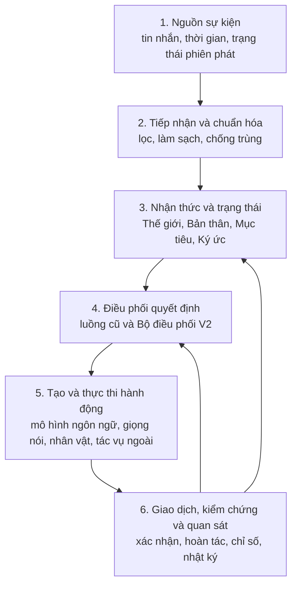
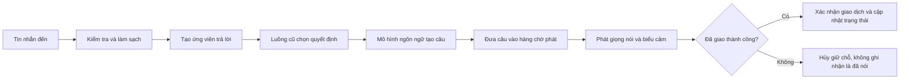
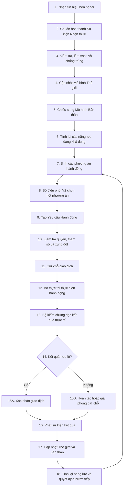
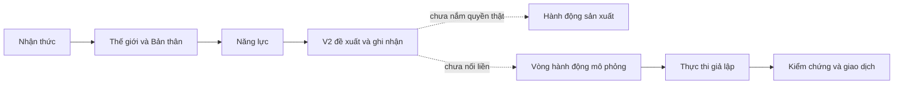
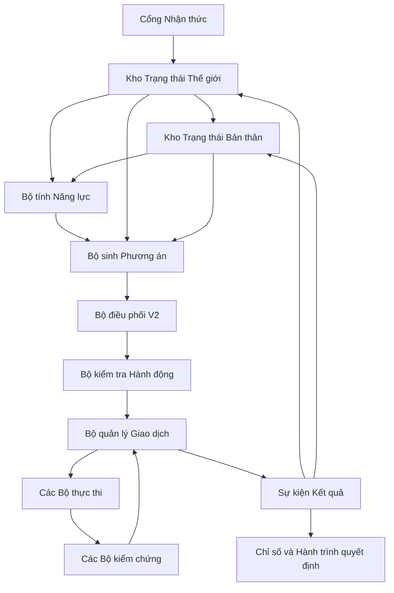
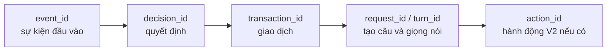
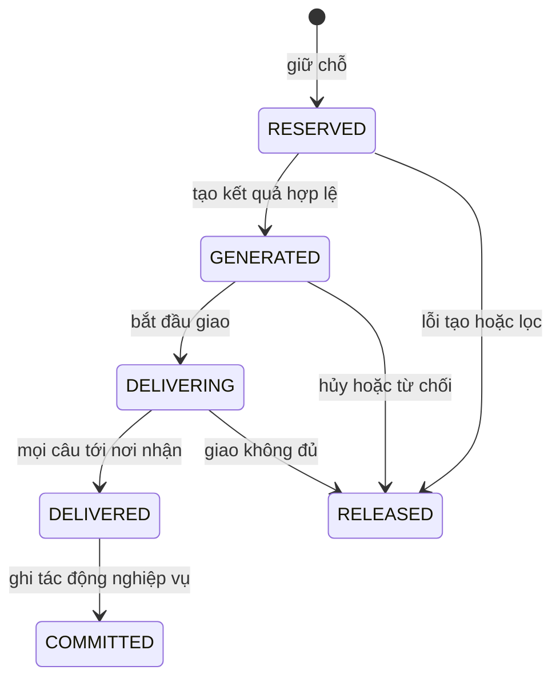
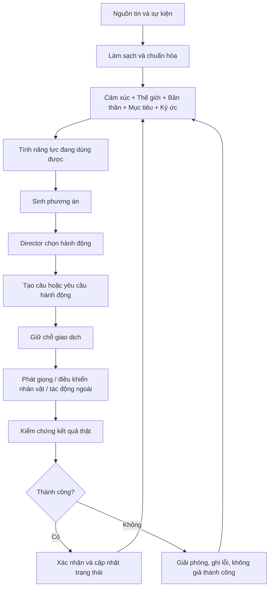

# Mai V2 — Canonical system specification

**Phạm vi:** implementation working tree `v2.0`

**Phiên bản sản phẩm hiện tại:** `1.4.3`

**Ngày xác minh:** 19/08/2026

**Vai trò:** nguồn sự thật duy nhất cho behavior đã triển khai, ownership, vận hành, kiểm thử, an toàn,
tiến độ và known gaps.

Tài liệu này thay thế bộ tài liệu runtime/phase đánh số trước đây. Lịch sử V1 chỉ thuộc
`docs/V1_BASELINE.md`; scope và thứ tự tương lai chỉ thuộc
`MAI_V2_MASTER_IMPLEMENTATION_BLUEPRINT_v2.0.md`. Khi prose mâu thuẫn repository, áp dụng thứ tự:
interface/model bất biến → composition trong `orchestrator/stream_runtime.py` → implementation service →
production YAML → tests → tài liệu này. Nội dung blueprint không phải bằng chứng production.

**Cách đọc tài liệu:**

- Mục 1–15 giúp hiểu tư duy, kiến trúc, luồng vận hành và mức hoàn thiện V2.
- Mục 16–25 là phần bàn giao kỹ thuật: mã nguồn, hợp đồng dữ liệu, cấu hình, lưu trữ, vận hành, an toàn, kiểm thử và xử lý sự cố.
- Mục 26 là bảng thuật ngữ; mục 27 đưa ra mô hình ghi nhớ ngắn nhất cho toàn hệ thống.
- Tên tiếng Anh chỉ được giữ khi đó là tên thật trong mã nguồn, cấu hình, giao thức hoặc công cụ.
- Trạng thái **đã có mã** không mặc nhiên có nghĩa là **đã được ghép vào đường chạy chính** hoặc **đã phát hành**.

---

## 1. Kết luận ngắn

Mai hiện có nền móng kỹ thuật đáng tiếp tục: ranh giới dữ liệu khá rõ, thiết kế giao dịch đúng hướng,
trạng thái có giới hạn, nhiều cờ bật/tắt và bộ kiểm thử rộng. Tuy nhiên, một nhánh mô phỏng vẫn cập nhật
Mô hình Thế giới trước xác nhận cuối; vì vậy chưa được gọi toàn bộ cơ chế giao dịch là an toàn.

Tuy nhiên, **V2 chưa phải một vòng tự chủ hoàn chỉnh đang chạy trong thực tế**. Các phần quan sát thế giới, mô hình bản thân, năng lực, lựa chọn hành động và khung thực thi đã được xây dựng ở nhiều mức độ khác nhau, nhưng chưa nối liền thành một đường đi duy nhất. Bộ chọn V2 hiện chủ yếu đề xuất và ghi nhận quyết định; quyết định thật vẫn do luồng cũ nắm quyền. Các bộ chuyển đổi giọng nói và nhân vật ảo đã có mã, nhưng chưa được lắp đầy đủ vào điểm khởi động chính. Hành động bên ngoài mới dừng ở khung và mô phỏng.

Vì vậy, cách mô tả chính xác nhất là:

> Hệ thống đã có phần lớn khung xương của V2, nhưng chưa có đủ cơ bắp và dây thần kinh để V2 tự quan sát, tự quyết định, thực hiện hành động thật, kiểm chứng kết quả rồi học từ kết quả đó trong cùng một vòng kín.

Trạng thái phát hành khách quan:

| Phạm vi | Trạng thái đã xác minh |
|---|---|
| Đường hội thoại kế thừa V1 | Có implementation và hồi quy rộng; chưa có live evidence mới trong đợt rà soát này |
| Nền nhận thức/trạng thái V2 | Có mã, chủ yếu ở shadow hoặc từng thành phần riêng |
| Director V2 takeover | Chưa tiếp quản thật; nhánh hiện trả quyết định legacy |
| Action adapters | Có mã và test đơn vị; chưa được compose đầy đủ |
| External action | Chỉ có khung và mock; registry executor production trống |
| Vòng tự chủ khép kín | Chưa đạt |
| Release readiness | Chưa đạt: môi trường chuẩn đã phục hồi, nhưng repository hygiene và release evidence chưa đủ tin cậy |

Không dùng một điểm số tổng hợp làm cổng phát hành. Chỉ code, composition, test và release evidence tương
ứng mới được phép nâng một capability từ “có mã” lên “đang chạy” hoặc “production”.

---

## 2. Hệ thống này đang giải quyết bài toán gì?

Mai là một hệ thống nhân vật ảo có khả năng:

- nhận sự kiện từ buổi phát trực tiếp;
- hiểu tin nhắn và tình trạng phiên phát;
- chọn lúc nên nói, chờ hoặc tự nói;
- tạo nội dung bằng mô hình ngôn ngữ chạy qua `llama.cpp`;
- phát giọng nói và điều khiển biểu cảm nhân vật;
- ghi nhận trạng thái giao tiếp;
- từng bước mở rộng sang hành động bên ngoài như đổi cảnh, phát nội dung hoặc gọi khách.

V1 tập trung vào hội thoại trực tiếp và độ ổn định khi phát sóng. V2 mở rộng Mai từ một hệ thống “nhận tin nhắn rồi trả lời” thành một tác nhân có vòng hoạt động đầy đủ:

> quan sát → hiểu tình hình → hiểu bản thân → biết mình làm được gì → chọn hành động → thực hiện → kiểm chứng → cập nhật trạng thái → quyết định tiếp.

Đây là thay đổi về bản chất vận hành, không chỉ là thêm vài chức năng mới.

---

## 3. Cấu trúc hệ thống hiện tại

Hệ thống có thể được hiểu theo sáu lớp.



### 3.1. Lớp nguồn sự kiện

Đây là nơi hệ thống nhận dữ liệu từ bên ngoài, gồm tin nhắn người xem, sự kiện thời gian, trạng thái buổi phát và các tín hiệu mở rộng trong V2.

Trách nhiệm chính:

- nhận dữ liệu thô;
- đóng dấu thời gian và nguồn phát sinh;
- chuyển dữ liệu sang dạng sự kiện chung;
- không tự quyết định hành động.

### 3.2. Lớp tiếp nhận và chuẩn hóa

Lớp này bảo vệ phần lõi khỏi dữ liệu xấu. Nó kiểm tra cấu trúc, làm sạch nội dung, loại sự kiện trùng và giới hạn dữ liệu trước khi đưa vào hệ thống.

Nếu bỏ qua lớp này, cùng một tin nhắn có thể được xử lý nhiều lần hoặc dữ liệu không hợp lệ có thể làm sai trạng thái.

### 3.3. Lớp nhận thức và trạng thái

Đây là phần quan trọng nhất của V2, gồm:

- **Mô hình Thế giới:** hệ thống tin rằng bên ngoài đang xảy ra điều gì;
- **Mô hình Bản thân:** Mai đang nói hay chờ, đang bận hay rảnh, mục tiêu và ý định hiện tại là gì;
- **Danh mục năng lực:** tại thời điểm này Mai được phép và có khả năng làm những gì;
- **Mục tiêu và ý định ngắn:** điều Mai đang muốn đạt được trong vài bước tiếp theo;
- **Ký ức:** dữ liệu cũ có ích cho quyết định hiện tại.

Trạng thái tốt không chỉ lưu giá trị. Nó còn phải lưu nguồn, độ tin cậy, thời hạn hiệu lực và quyền được phép ghi đè.

### 3.4. Lớp điều phối quyết định

Lớp này nhận các phương án như:

- trả lời tin nhắn;
- tiếp tục chờ;
- tự mở lời;
- nói một câu đã tạo;
- đổi biểu cảm;
- thực hiện hành động bên ngoài.

Sau đó nó chọn một phương án phù hợp theo mức ưu tiên, thời gian chờ, xung đột và khả năng thực thi.

Hiện tại có hai cơ chế cùng tồn tại:

- luồng cũ vẫn quyết định hành vi thật;
- Bộ điều phối V2 chạy ở chế độ quan sát hoặc tiếp quản có kiểm soát, nhưng kết quả V2 chưa thực sự thay thế quyết định cũ trong đường chạy chính.

### 3.5. Lớp tạo và thực thi hành động

Lớp này biến quyết định thành kết quả có thể nhìn hoặc nghe thấy:

- mô hình ngôn ngữ tạo câu trả lời;
- bộ phát giọng nói chuyển văn bản thành âm thanh;
- bộ điều khiển nhân vật đổi biểu cảm hoặc chuyển động;
- bộ thực thi ngoài dự kiến điều khiển cảnh, nội dung hoặc cuộc gọi.

Giọng nói và nhân vật đã có các bộ chuyển đổi V2, nhưng chưa được lắp hoàn chỉnh vào điểm ghép chính của hệ thống. Bộ thực thi ngoài mới có khung đăng ký và mô phỏng; chưa có hành động thật đủ để chứng minh V2 đã tự chủ ngoài hội thoại.

### 3.6. Lớp giao dịch, kiểm chứng và quan sát

Một hành động không được xem là thành công chỉ vì đã tạo xong nội dung. Hệ thống phân biệt:

1. đã tạo hành động;
2. đã gửi hành động;
3. đã xác nhận hành động thành công;
4. đã ghi nhận kết quả vào trạng thái.

Đây là tư duy đúng. Nó ngăn hệ thống ghi nhớ rằng mình đã nói hoặc đã làm trong khi hành động thực tế chưa tới người xem.

---

## 4. Luồng vận hành đang chạy hiện nay

### 4.1. Luồng trả lời tin nhắn



Điểm tốt của luồng này là **tạo câu không đồng nghĩa với đã nói**. Chỉ khi phần giao nhận xác nhận thành công, trạng thái hội thoại mới được ghi nhận.

### 4.2. Luồng tự nói

Khi không có tin nhắn phù hợp, hệ thống theo dõi thời gian im lặng và điều kiện tự nói. Nếu đủ điều kiện, nó tạo một ứng viên tự nói, đưa qua điều phối, tạo câu rồi sử dụng cùng đường giao nhận như câu trả lời bình thường.

Rủi ro hiện tại không nằm ở kỹ thuật phát câu mà ở chất lượng suy luận. Trong mẫu kiểm tra tải, có trường hợp Mai suy đoán nguyên nhân người xem im lặng hoặc họ đang làm gì dù không có bằng chứng. Bộ chấm tự động không phát hiện các lỗi này vì đang thiên về cấu trúc và chỉ số, chưa đánh giá đủ tính bám sát dữ kiện.

### 4.3. Luồng mô phỏng hành động chung

Hệ thống đã có một vòng mô phỏng để chứng minh các bước giữ chỗ, thực thi, kiểm chứng, xác nhận hoặc hoàn tác. Đây là nền móng tốt cho hành động V2.

Tuy nhiên, trong một nhánh hiện tại, trạng thái Thế giới có thể được cập nhật trước khi giao dịch được xác nhận hoàn toàn. Nếu bước xác nhận cuối thất bại, trạng thái có nguy cơ ghi nhận một kết quả chưa chắc đã xảy ra. Đây là lỗi về tính nguyên tử cần được sửa trước khi nối hành động thật.

---

## 5. Luồng V2 đầy đủ cần có

Đây là luồng đích của V2, từ lúc có tín hiệu đến lúc kết quả quay lại làm đầu vào cho quyết định tiếp theo.



### Bước 1–3: tiếp nhận sự thật từ bên ngoài

Mọi đầu vào phải được đổi thành một kiểu sự kiện chung, có nguồn, thời gian, mã nhận diện và mức tin cậy. Sau đó hệ thống kiểm tra dữ liệu, loại trùng và từ chối sự kiện không hợp lệ.

Kết quả của ba bước đầu chưa phải là quyết định; nó chỉ là dữ kiện đã được làm sạch.

### Bước 4: cập nhật Mô hình Thế giới

Mô hình Thế giới trả lời câu hỏi “bên ngoài đang có gì?”. Ví dụ:

- có tin nhắn mới;
- buổi phát đang ở cảnh nào;
- khách mời đang trực tuyến hay không;
- hành động vừa rồi thành công hay thất bại.

Mỗi dữ kiện cần kèm nguồn, độ tin cậy, thời hạn và thẩm quyền cập nhật. Dữ kiện hết hạn không được tiếp tục dùng như sự thật hiện tại.

### Bước 5: cập nhật Mô hình Bản thân

Mô hình Bản thân trả lời câu hỏi “Mai đang ở trạng thái nào?”. Ví dụ:

- đang nói hay đang chờ;
- có giao dịch nào đang mở;
- đang theo mục tiêu nào;
- ý định ngắn hiện tại là gì;
- có thể nhận thêm hành động hay không.

Hiện phần mục tiêu đã có khả năng chứa một số bước ngắn, nhưng liên kết từ ý định hiện tại vào ảnh chụp trạng thái bản thân chưa hoàn chỉnh.

### Bước 6: tính năng lực khả dụng

Danh mục năng lực không chỉ liệt kê chức năng. Nó phải trả lời “ngay lúc này hành động nào thực sự dùng được?”.

Ví dụ, `CALL_GUEST` chỉ khả dụng khi:

- chức năng đã được bật;
- có bộ thực thi thật;
- khách đang trực tuyến;
- Mai không ở trong hành động xung đột;
- thời gian chờ đã hết;
- quyền vận hành cho phép.

Nguyên tắc hiện tại là từ chối mặc định: thiếu bằng chứng thì coi như không khả dụng. Đây là lựa chọn an toàn.

### Bước 7–8: sinh phương án và chọn hành động

Các bộ phận chuyên trách tạo ra phương án. Bộ điều phối V2 so sánh chúng rồi chọn đúng một hành động hoặc chọn tiếp tục chờ.

Quyết định phải dựa trên:

- ưu tiên;
- mức cấp thiết;
- mục tiêu đang theo đuổi;
- năng lực khả dụng;
- xung đột với hành động đang chạy;
- thời gian chờ;
- rủi ro và khả năng hoàn tác.

Điểm còn thiếu quan trọng nhất là Bộ điều phối V2 chưa thực sự sở hữu quyết định trong đường chạy chính. Kết quả V2 được tính nhưng vẫn bị bỏ qua để trả về quyết định của luồng cũ.

### Bước 9–11: lập yêu cầu và giữ chỗ

Quyết định được chuyển thành Yêu cầu Hành động có kiểu rõ ràng, tham số, nguồn quyết định và mã chống thực hiện lặp. Hệ thống kiểm tra quyền, tham số, xung đột và năng lực thêm một lần trước khi giữ chỗ giao dịch.

Giữ chỗ có hai mục đích:

- ngăn hai hành động cùng chiếm một tài nguyên;
- bảo đảm có thể hủy sạch nếu hành động chưa được giao thành công.

### Bước 12–14: thực thi và kiểm chứng

Bộ thực thi gửi lệnh tới giọng nói, nhân vật hoặc hệ thống bên ngoài. Bộ kiểm chứng không được chỉ tin vào việc “đã gửi lệnh”; nó phải đọc bằng chứng thực tế.

Ví dụ với đổi cảnh:

- bộ thực thi gửi yêu cầu đổi sang cảnh B;
- bộ kiểm chứng đọc lại cảnh đang hoạt động;
- chỉ khi cảnh thật sự là B mới cho phép xác nhận giao dịch.

### Bước 15–18: xác nhận, cập nhật và khép vòng

Nếu thành công, giao dịch được xác nhận. Nếu thất bại, hệ thống hoàn tác hoặc giải phóng giữ chỗ. Cả hai trường hợp đều phát một sự kiện kết quả có cấu trúc.

Sự kiện kết quả cập nhật lại Mô hình Thế giới và Mô hình Bản thân. Danh mục năng lực được tính lại, rồi Bộ điều phối chọn bước tiếp theo. Khi kết quả thực tế quay lại ảnh hưởng quyết định sau, vòng V2 mới thực sự khép kín.

---

## 6. Ví dụ cụ thể: gọi khách mời

Giả sử Mai muốn gọi khách có tên Evil.

### Trường hợp thành công

1. Hệ thống nhận tín hiệu Evil đang trực tuyến.
2. Mô hình Thế giới lưu trạng thái này cùng nguồn và thời hạn.
3. Danh mục năng lực bật `CALL_GUEST`.
4. Bộ tạo phương án đề xuất gọi Evil.
5. Bộ điều phối V2 chọn phương án này.
6. Hệ thống tạo yêu cầu `CALL_GUEST(Evil)`.
7. Bộ kiểm tra xác nhận quyền, tham số và xung đột đều hợp lệ.
8. Giao dịch được giữ chỗ.
9. Bộ thực thi gửi lời mời.
10. Bộ kiểm chứng xác nhận lời mời đã được gửi hoặc khách đã vào phòng.
11. Giao dịch được xác nhận.
12. Mô hình Thế giới ghi nhận trạng thái mới.
13. Mô hình Bản thân chuyển sang chờ khách hoặc bắt đầu hội thoại.

### Trường hợp thất bại

Nếu Evil ngoại tuyến, bộ thực thi không sẵn sàng hoặc lời mời không được xác nhận:

1. hành động bị từ chối hoặc thất bại;
2. giao dịch được giải phóng;
3. trạng thái không được ghi là đã gọi thành công;
4. lý do thất bại được phát thành sự kiện;
5. năng lực được tính lại;
6. Bộ điều phối có thể chọn chờ, nói lời chuyển tiếp hoặc thử hành động khác.

Hiện hệ thống chưa có bộ thực thi thật cho ví dụ này. Vì vậy đây là luồng đích, không phải khả năng đang chạy trong sản phẩm.

---

## 7. V2 đã đi đến đâu?

| Khối chức năng | Trạng thái | Nhận định |
|---|---|---|
| Hợp đồng tương thích | Đã có | Tạo nền để V1 và V2 cùng tồn tại |
| Mô hình Thế giới | Đã có ở chế độ an toàn | Có nguồn, độ tin cậy, thời hạn và quyền cập nhật |
| Mô hình Bản thân | Đã có một phần | Chưa nối đầy đủ ý định hiện tại |
| Danh mục năng lực | Đã có | Từ chối mặc định, phù hợp yêu cầu an toàn |
| Vòng hành động mô phỏng | Đã có | Chứng minh được giao dịch nhưng chưa phải hành động thật |
| Bộ điều phối V2 quan sát | Đã có | So sánh được với luồng cũ |
| Tiếp quản có kiểm soát | Chưa hoàn chỉnh | Kết quả V2 chưa nắm quyền quyết định thật |
| Chuyển đổi giọng nói và nhân vật | Có mã, chưa ghép đủ | Chưa được lắp hoàn chỉnh ở điểm khởi động chính |
| Khung thực thi bên ngoài | Có khung | Danh sách bộ thực thi thật còn trống |
| Nhận thức mở rộng | Có nền | Cần gắn với nguồn tín hiệu thật |
| Mục tiêu và ý định ngắn | Có một phần | Liên kết vào trạng thái bản thân còn thiếu |
| Chọn ký ức theo ngữ cảnh | Đã có nền | Cần đo chất lượng khi chạy thật |
| Chính sách hiện thân | Đã có nền | Cần nối với thiết bị và trạng thái thật |
| Ghi hành trình quyết định | Có lớp riêng | Chưa được lắp vào đường chạy chính |
| Cổng đánh giá V2 | Có nhưng còn nông | Chủ yếu tin vào số liệu tự khai, chưa xác thực đủ bằng chứng |
| Vòng tự chủ khép kín | Chưa có | Chưa nối quan sát, quyết định, hành động thật và phản hồi thành một vòng |

Đường V2 đang chạy thực tế có thể tóm tắt như sau:



Nói ngắn gọn: **nửa trên hiểu và đề xuất; nửa dưới chứng minh cách thực thi an toàn; đoạn nối giữa hai nửa chưa hoàn thành.**

---

## 8. Điểm mạnh hiện tại

### 8.1. Tư duy giao dịch đúng

Hệ thống không đồng nhất việc tạo nội dung với việc đã giao nội dung. Cách tách “tạo → giao → xác nhận → ghi trạng thái” giúp hạn chế ghi sai ký ức và trạng thái.

### 8.2. Ưu tiên an toàn khi thiếu thông tin

Năng lực không đủ bằng chứng sẽ bị coi là không khả dụng. Đây là nguyên tắc phù hợp với tác nhân có thể điều khiển hệ thống bên ngoài.

### 8.3. Dữ liệu có nguồn và thời hạn

Mô hình Thế giới lưu cả nguồn, độ tin cậy, thời hạn và thẩm quyền. Nhờ đó dữ kiện cũ hoặc yếu không dễ trở thành sự thật vĩnh viễn.

### 8.4. Có đường lui về V1

V2 được đưa vào theo từng lớp, có cờ bật/tắt và chế độ quan sát. Khi một phần mới sai, hệ thống vẫn có thể quay về hành vi cũ mà không làm hỏng toàn bộ phiên phát.

### 8.5. Bộ kiểm thử rộng

Bộ kiểm thử bao phủ nhiều subsystem và các bài targeted cho lõi V2 đang xanh. Ngày 19/08/2026, sau khi
khôi phục môi trường chuẩn, full offline regression bằng `v2.0\venv` đạt 1.900 bài, 5 deselected và 0 lỗi.
Kết quả này chứng minh đường offline hiện có đang xanh; nó không thay thế live/LLM acceptance hoặc chứng
minh các capability chưa compose đã production.

### 8.6. Có chỉ số, ghi lại và khả năng phát lại

Hệ thống đã chú ý đến chỉ số, nhật ký, phát lại sự kiện, dừng mềm và phục hồi. Đây là nền cần thiết để chẩn đoán một hệ thống thời gian thực.

### 8.7. Hiệu năng mô hình ngôn ngữ ở mức khả dụng

Trong báo cáo tải đã kiểm tra:

- không dùng câu dự phòng;
- không lặp nguyên văn;
- độ trễ từ đầu vào đến từ đầu tiên ở mốc 95% khoảng 807 mili giây;
- độ trễ toàn lượt ở mốc 95% khoảng 2,30 giây;
- tốc độ sinh trung vị khoảng 38 từ đơn vị mô hình mỗi giây.

Về kỹ thuật sinh câu, kết quả đủ khả quan để tiếp tục. Phần cần cải thiện lớn hơn là tính đúng ngữ cảnh và chất lượng hành vi.

---

## 9. Điểm yếu và rủi ro

### 9.1. Bộ điều phối V2 chưa nắm quyền thật — mức nghiêm trọng cao

Nhánh tiếp quản có gọi bộ chọn V2, nhưng sau đó vẫn trả về quyết định của luồng cũ. Vì vậy tên gọi “tiếp quản” hiện mạnh hơn hành vi thực tế.

**Hậu quả:** không thể chứng minh V2 đang điều khiển hệ thống, dù số liệu có thể cho thấy V2 đã tạo quyết định.

### 9.2. Các bộ chuyển đổi hành động chưa được ghép vào điểm khởi động — mức cao

Bộ chuyển đổi giọng nói và nhân vật tồn tại và có kiểm thử riêng, nhưng chưa được khởi tạo đầy đủ trong đường chạy chính.

**Hậu quả:** mã đúng ở cấp đơn vị nhưng không tạo ra giá trị trong sản phẩm.

### 9.3. Chưa có hành động bên ngoài thật — mức cao

Khung đăng ký bộ thực thi đang trống hoặc chưa hoạt động thực tế. Chưa có một lát cắt hoàn chỉnh như đổi cảnh thật, kiểm tra cảnh thật rồi cập nhật trạng thái.

**Hậu quả:** chưa đạt định nghĩa tự chủ khép kín của V2.

### 9.4. Nguy cơ cập nhật trạng thái trước xác nhận giao dịch — mức cao

Vòng hành động mô phỏng có nhánh cập nhật Thế giới trước khi giao dịch được xác nhận xong.

**Hậu quả:** nếu xác nhận cuối thất bại, trạng thái có thể nói rằng hành động đã xảy ra dù thực tế chưa chắc xảy ra.

### 9.5. Ý định ngắn chưa trở thành trạng thái sống — mức trung bình

Mục tiêu có thể chứa một vài bước ngắn, nhưng ảnh chụp trạng thái bản thân chưa mang đầy đủ mã ý định hiện tại.

**Hậu quả:** ý định dễ trở thành dữ liệu phụ thay vì yếu tố thật sự điều khiển quyết định.

### 9.6. Ghi hành trình và cổng phát hành chưa đáng tin cậy hoàn toàn — mức trung bình

Lớp ghi hành trình đã có nhưng chưa nối vào đường chạy chính. Bộ đánh giá phát hành chủ yếu kiểm tra các cờ và số liệu được khai trong dữ liệu đầu vào, chưa xác minh đầy đủ tệp bằng chứng, mã băm hoặc bản sửa đổi nguồn.

**Hậu quả:** có thể báo đạt về hình thức trong khi bằng chứng thực tế thiếu hoặc không khớp.

### 9.7. Chất lượng hiểu ngữ cảnh chưa được chấm đủ sâu — mức cao về sản phẩm

Bộ chấm tự động phát hiện tốt lỗi cấu trúc, lặp câu và một số kiểu mở đầu. Tuy nhiên nó bỏ sót suy đoán không có căn cứ về người xem.

**Hậu quả:** hệ thống có thể đạt chỉ số kỹ thuật nhưng tạo cảm giác thiếu tự nhiên hoặc “bịa suy nghĩ” của khán giả.

### 9.8. Số lượng ứng viên và giao dịch bị hủy cao — mức trung bình

Một lần phát lại ghi nhận 778 sự kiện đầu vào, 1.003 giao dịch được giữ chỗ, 879 giao dịch được giải phóng và 124 kết quả được giao.

**Hậu quả:** hệ thống tạo nhiều phương án hơn mức cần thiết, gây tốn tài nguyên, làm chỉ số khó đọc và tăng nguy cơ tranh chấp.

### 9.9. Điểm ghép chính quá lớn — mức trung bình

Tệp điều phối khởi động dài khoảng 1.790 dòng và vòng điều phối dài khoảng 1.633 dòng.

**Hậu quả:** khó đọc, khó cô lập trách nhiệm, dễ phát sinh lỗi khi thêm một phần V2 mới.

### 9.10. Kiểu dữ liệu và bắt lỗi còn rộng — mức trung bình

Có khoảng 1.141 chỗ dùng kiểu quá rộng và khoảng 257 chỗ bắt mọi ngoại lệ. Một phần là chủ ý để hệ thống không sập khi phát sóng, nhưng mật độ cao làm giảm khả năng phát hiện lỗi thiết kế.

**Hậu quả:** lỗi có thể bị nuốt, hợp đồng giữa các phần kém rõ và việc sửa đổi tốn nhiều công sức hơn.

### 9.11. Cấu hình phân tán — mức trung bình

Có khoảng 31 tệp YAML và gần 50 cờ chức năng nhưng chưa có các hồ sơ cấu hình chuẩn theo mục đích chạy.

**Hậu quả:** khó biết tổ hợp nào là an toàn cho phát triển, thử nghiệm, quan sát V2 hoặc phát sóng thật.

### 9.12. Môi trường chuẩn đã được khôi phục — đã xử lý ngày 19/08/2026

`v2.0\venv` hiện dùng CPython `3.11.15` do `uv` quản lý, cài đúng `requirements.lock.txt` và không còn
phụ thuộc interpreter/package trong snapshot V1. `pip check` đạt; kiểm tra môi trường đạt 9 mục, 0 lỗi và
bỏ qua riêng health endpoint vì `llama-server` không chạy trong lúc xác minh.

**Rủi ro còn lại:** cần giữ bootstrap script và lock file đồng bộ; live/LLM acceptance vẫn phải chạy khi
server thật hoạt động. Backup của venv hỏng chỉ giữ tạm cho tới khi user duyệt kết quả phục hồi.

### 9.13. Kho lưu trữ và thông tin nhạy cảm chưa sạch — mức cao

Bản lưu V1 trong `ver/v1.0` có kích thước khoảng 12,9 GB, gồm mô hình, môi trường Python, nhật ký, sao lưu, cơ sở dữ liệu và tệp `.env` có dữ liệu.

**Hậu quả:** kho nặng, khó sao chép, có nguy cơ mang theo bí mật hoặc dữ liệu vận hành. Cần thay khóa nếu từng có thông tin thật trong tệp môi trường.

### 9.14. Tài liệu và lịch sử phát hành không đồng bộ — mức trung bình

Tài liệu giới thiệu vẫn có chỗ nói V2 chưa triển khai, trong khi tài liệu giai đoạn lại nói nhiều phần đã hoàn thành. Nhật ký thay đổi dừng ở `1.4.3`; một số tài liệu vẫn ghi chờ duyệt hoặc chờ ghi nhận dù mã đã được đưa vào lịch sử. Một vài lần ghi nhận còn gộp nhiều giai đoạn, trái với quy trình một giai đoạn cho mỗi lần duyệt.

**Hậu quả:** người đọc không biết đâu là kế hoạch, đâu là mã đã có và đâu là khả năng đang chạy thật.

---

## 10. Đánh giá tư duy phát triển dự án

### Điều đang làm đúng

1. **Tiến hóa thay vì viết lại:** giữ đường lui V1 và đưa V2 vào từng lớp là quyết định phù hợp cho hệ thống đang phát sóng.
2. **Hợp đồng trước phần cài đặt:** các phần giao tiếp qua kiểu dữ liệu và giao diện chung giúp giảm phụ thuộc trực tiếp.
3. **An toàn trước tự chủ:** từ chối mặc định, thời hạn dữ kiện và cơ chế giao dịch phù hợp với hành động có tác động bên ngoài.
4. **Có khả năng quan sát:** chỉ số, nhật ký và phát lại được xem là một phần kiến trúc, không phải phần thêm sau.
5. **Cấu hình thay vì số cứng:** ngưỡng và thời gian chờ được đẩy ra YAML, thuận lợi cho điều chỉnh.

### Điều cần thay đổi trong cách làm

1. **Hoàn thành theo lát cắt dọc:** không nên tiếp tục tạo thêm nhiều khung ngang. Cần làm trọn một hành động từ nhận thức đến kết quả thật.
2. **Tách “có mã” khỏi “đang chạy”:** mỗi chức năng phải có ba nhãn rõ: đã viết, đã ghép, đã phát hành.
3. **Bằng chứng phải độc lập:** cổng phát hành phải tự đọc và xác minh bằng chứng, không chỉ tin vào dữ liệu tự khai.
4. **Đánh giá con người là bắt buộc:** tính tự nhiên và bám dữ kiện không thể chỉ chấm bằng số liệu cấu trúc.
5. **Giảm độ rộng trước khi tăng độ sâu:** hiện dự án có nhiều giai đoạn và cờ chức năng hơn số vòng hành động thật đã hoàn tất.
6. **Một thay đổi, một mục tiêu kiểm chứng:** tránh gộp nhiều giai đoạn trong cùng một lần ghi nhận vì sẽ khó hồi quy và khó quay lui.

---

## 11. Kiến trúc đích nên hướng tới



Điểm ghép chính chỉ nên làm ba việc:

1. đọc cấu hình;
2. tạo các thành phần;
3. nối chúng với nhau và quản lý vòng đời.

Mỗi trách nhiệm còn lại nên nằm trong một thành phần riêng, có giao diện, kiểm thử và chỉ số riêng. Cách này sẽ giảm kích thước của tệp khởi động và vòng điều phối, đồng thời giúp thay thế từng phần mà không ảnh hưởng toàn hệ thống.

---

## 12. Kế hoạch sửa đổi và nâng cấp

### Mức 0 — khôi phục nền vận hành

Mục tiêu: mọi người có thể chạy đúng cùng một môi trường.

1. **Đã hoàn tất 19/08/2026:** tạo lại môi trường Python `3.11.15` cho V2 từ lock file.
2. **Đã hoàn tất 19/08/2026:** sửa bootstrap/preflight path và chạy lại kiểm tra môi trường chính thức.
3. **Đã hoàn tất 19/08/2026:** full offline regression chạy bằng chính `v2.0\venv`.
4. Làm sạch bản lưu V1 khỏi mô hình, môi trường Python, nhật ký, cơ sở dữ liệu và tệp bí mật.
5. Thay các khóa có nguy cơ đã lộ.

**Điều kiện hoàn tất Mức 0:** phần môi trường đã đạt; toàn Mức 0 vẫn chưa đạt cho tới khi repository/snapshot
V1 được làm sạch và credential có nguy cơ lộ được xử lý.

### Mức 1 — lập lại nguồn sự thật

Mục tiêu: tài liệu, mã và phiên bản nói cùng một điều.

1. Lập bảng trạng thái từng chức năng: đã viết, đã ghép, đã kiểm thử, đã phát hành.
2. Đồng bộ tài liệu giới thiệu, mục lục, tài liệu giai đoạn và nhật ký thay đổi.
3. Ghi rõ phiên bản sản phẩm vẫn là `1.4.3` cho tới khi một bản phát hành mới được chấp nhận.
4. Từ đây chỉ duyệt một giai đoạn hoặc một lát cắt trong mỗi thay đổi.

**Điều kiện hoàn tất:** không còn mâu thuẫn giữa tài liệu tổng quan, tài liệu giai đoạn và hành vi mã nguồn.

### Mức 2 — sửa tính đúng của giao dịch

Mục tiêu: trạng thái không bao giờ đi trước kết quả thật.

1. Chuyển cập nhật Thế giới sang sau khi giao dịch được xác nhận.
2. Bổ sung kiểm thử cho trường hợp bộ thực thi thành công nhưng bước xác nhận cuối thất bại.
3. Bảo đảm mọi thất bại đều giải phóng giữ chỗ và phát sự kiện kết quả rõ ràng.

**Điều kiện hoàn tất:** không có đường đi nào ghi nhận hành động thành công trước xác nhận.

### Mức 3 — cho V2 tiếp quản từng hành vi ít rủi ro

Mục tiêu: chứng minh V2 có quyền quyết định thật mà vẫn an toàn.

Thứ tự nên dùng:

1. `WAIT` — tiếp tục chờ;
2. `READ_CHAT` — đọc và trả lời tin nhắn;
3. tự nói;
4. giọng nói và biểu cảm;
5. hành động bên ngoài.

Mỗi hành vi cần ba chế độ:

- quan sát và so sánh;
- tiếp quản cho một tỷ lệ nhỏ hoặc điều kiện hẹp;
- tiếp quản đầy đủ có thể quay lui.

**Điều kiện hoàn tất:** nhật ký chứng minh quyết định V2 đã được dùng thật, kết quả được giao đúng và có thể tắt về V1 ngay.

### Mức 4 — ghép giọng nói, nhân vật và ý định

Mục tiêu: các phần đã có mã trở thành thành phần đang chạy.

1. Khởi tạo bộ chuyển đổi giọng nói và nhân vật tại điểm ghép chính.
2. Đăng ký cờ chức năng và chỉ số tương ứng.
3. Nối mã ý định hiện tại vào ảnh chụp trạng thái bản thân.
4. Ghi hành trình quyết định từ đầu vào đến kết quả.

**Điều kiện hoàn tất:** có thể lần theo một câu nói từ dữ kiện, ý định, quyết định, giao dịch đến kết quả phát thực tế.

### Mức 5 — hoàn thành một lát cắt hành động thật

Mục tiêu đề xuất: **đổi cảnh phát sóng**.

Luồng phải hoàn chỉnh:

> nhận cảnh hiện tại → xác định cảnh được phép → V2 chọn đổi cảnh → kiểm tra quyền → giữ chỗ → gửi lệnh → đọc lại cảnh thật → xác nhận → cập nhật Thế giới → tính quyết định tiếp.

Lý do chọn đổi cảnh:

- kết quả dễ quan sát;
- dễ kiểm chứng bằng cách đọc lại trạng thái;
- dễ giới hạn danh sách cảnh cho phép;
- có thể hoàn tác về cảnh an toàn;
- ít mơ hồ hơn gọi khách hoặc điều khiển trò chơi.

**Điều kiện hoàn tất:** hành động chạy thật, có kiểm chứng độc lập, có hoàn tác, có chỉ số và có kiểm thử từ đầu đến cuối.

### Mức 6 — nâng chất lượng hành vi

Mục tiêu: Mai không chỉ chạy đúng mà còn nói đúng tình huống.

1. Bổ sung kiểm tra suy đoán không có căn cứ.
2. Tổ chức đánh giá ẩn danh bởi con người cho độ tự nhiên, bám dữ kiện và phù hợp nhân vật.
3. Đưa các lỗi đã phát hiện thành tập kiểm thử hồi quy.
4. Giảm số ứng viên và giao dịch bị giải phóng bằng cách lọc sớm.
5. Đo riêng chất lượng trả lời, tự nói và chuyển tiếp sau hành động thất bại.

**Điều kiện hoàn tất:** đạt cả cổng kỹ thuật và đánh giá con người; không dùng chỉ số tốc độ để thay thế đánh giá nội dung.

### Mức 7 — giảm nợ bảo trì

Mục tiêu: hệ thống dễ mở rộng mà không làm tệp lõi tiếp tục phình to.

1. Tách điểm ghép chính theo nhóm: nhận thức, trạng thái, quyết định, hành động và quan sát.
2. Tách vòng điều phối thành các bộ tạo phương án và chính sách lựa chọn nhỏ hơn.
3. Thu hẹp kiểu dữ liệu quá rộng tại các ranh giới quan trọng.
4. Thay bắt mọi ngoại lệ bằng các nhóm lỗi có ý nghĩa; vẫn giữ lớp bảo vệ cuối để phiên phát không sập.
5. Thêm kiểm tra kiểu, định dạng, độ bao phủ và bí mật vào quy trình tự động.
6. Tạo hồ sơ cấu hình chuẩn: phát triển, kiểm thử, quan sát V2, tiếp quản hạn chế và phát sóng.

---

## 13. Điều kiện để được gọi là V2 hoàn chỉnh

Không nên đổi nhãn sản phẩm thành V2 chỉ vì các lớp hoặc tài liệu mang tên V2. Bản phát hành chỉ nên được công nhận khi đáp ứng đồng thời các điều kiện sau:

1. Bộ điều phối V2 nắm quyền thật trên các hành vi đã công bố.
2. Có ít nhất một hành động bên ngoài chạy từ đầu đến cuối.
3. Mọi hành động đều có kiểm tra quyền, giữ chỗ, thực thi, kiểm chứng và xác nhận hoặc hoàn tác.
4. Kết quả thực tế quay lại cập nhật Thế giới, Bản thân và quyết định tiếp theo.
5. Giọng nói và nhân vật đi qua bộ chuyển đổi V2 trong đường chạy chính.
6. Ý định hiện tại được thể hiện trong trạng thái bản thân và ảnh hưởng quyết định.
7. Hành trình quyết định được ghi đầy đủ và có thể phát lại.
8. Cổng phát hành tự xác minh bằng chứng thay vì tin vào số liệu tự khai.
9. Kiểm thử đơn vị, tích hợp, hồi quy và từ đầu đến cuối đều đạt.
10. Đánh giá con người xác nhận nội dung tự nhiên, bám dữ kiện và đúng nhân vật.
11. Có cách tắt V2 và quay về V1 an toàn trong thời gian ngắn.
12. Môi trường cài đặt chuẩn chạy được trên máy sạch theo đúng tài liệu.

---

## 14. Thứ tự ưu tiên đề xuất

Nếu nguồn lực có hạn, nên làm đúng thứ tự này:

1. sửa môi trường Python;
2. làm sạch kho lưu trữ và thay khóa có nguy cơ lộ;
3. đồng bộ tài liệu, phiên bản và trạng thái chức năng;
4. sửa lỗi cập nhật trạng thái trước xác nhận;
5. cho V2 nắm quyền thật với `WAIT`, sau đó `READ_CHAT`;
6. ghép bộ chuyển đổi giọng nói và nhân vật;
7. hoàn thiện ý định trong Mô hình Bản thân;
8. ghép bộ ghi hành trình quyết định;
9. làm lát cắt đổi cảnh thật;
10. đánh giá nội dung bởi con người và bổ sung kiểm tra bám dữ kiện;
11. giảm số ứng viên và giao dịch bị hủy;
12. tách nhỏ điểm ghép chính và vòng điều phối;
13. thêm kiểm tra kiểu, định dạng, độ bao phủ và bí mật vào quy trình tự động.

Thứ tự này ưu tiên độ tin cậy trước, quyền quyết định thật sau, rồi mới mở rộng hành động và tối ưu kiến trúc.

---

## 15. Kết luận đánh giá kiến trúc

Mai không thiếu ý tưởng và cũng không thiếu nền tảng kỹ thuật. Vấn đề chính là dự án đã phát triển nhiều khối V2 theo chiều ngang nhưng chưa khép kín một đường đi sản xuất theo chiều dọc.

Việc quan trọng nhất lúc này không phải tạo thêm giai đoạn mới. Cần nối các phần hiện có thành một vòng nhỏ nhưng thật, bắt đầu từ hành vi ít rủi ro, có kiểm chứng và có đường quay lui. Khi V2 tự chọn một hành động, thực hiện nó trong hệ thống thật, xác minh kết quả và dùng kết quả đó cho quyết định tiếp theo, dự án mới vượt qua ranh giới từ “khung V2” sang “hệ thống V2 đang hoạt động”.

---

## 16. Bản đồ mã nguồn và nơi chịu trách nhiệm

### 16.1. Cấu trúc thư mục

| Đường dẫn | Vai trò | Khi nào cần đọc |
|---|---|---|
| `interfaces/` | Hợp đồng qua ranh giới giữa các phần | Khi thêm hoặc thay dữ liệu đi qua nhiều hệ thống con |
| `orchestrator/` | Khởi tạo, ghép nối, vòng đời, cấu hình và hạ tầng | Khi sửa cách hệ thống khởi động, dừng hoặc nối dịch vụ |
| `services/` | Phần cài đặt nghiệp vụ theo từng lĩnh vực | Khi sửa hành vi cụ thể |
| `config/` | Ngưỡng, thời hạn, giới hạn, cờ chức năng và đường dẫn | Khi điều chỉnh hành vi vận hành |
| `dashboard/` | Giao diện vận hành, ảnh chụp trạng thái và kênh điều khiển | Khi sửa màn hình hoặc lệnh người vận hành |
| `scripts/` | Khởi động, kiểm tra, đánh giá, sao lưu và phục hồi | Khi chạy hệ thống hoặc tạo bằng chứng phát hành |
| `tests/unit/` | Kiểm thử từng thành phần độc lập | Khi đổi luật hoặc thuật toán cục bộ |
| `tests/integration/` | Kiểm thử đường đi qua nhiều thành phần | Khi đổi ghép nối hoặc ranh giới giao dịch |
| `logs/` | Nhật ký đang chạy, kết quả giao nhận và sự cố | Khi chẩn đoán một phiên |
| `data/` | Cơ sở dữ liệu, muối ẩn danh và bộ dữ liệu xuất | Khi xử lý ký ức, quan hệ hoặc huấn luyện |
| `backups/` | Bản sao dữ liệu có bảng kê và mã kiểm tra | Khi phục hồi |
| `migrations/` | Thay đổi cấu trúc cơ sở dữ liệu | Khi nâng lược đồ SQLite |
| `eval/` | Hợp đồng dữ liệu và tài nguyên đánh giá | Khi xuất dữ liệu hoặc kiểm tra tương thích |
| `models/` | Mô hình ngôn ngữ, giọng nói và tài nguyên liên quan | Khi thay mô hình hoặc giọng |

### 16.2. Điểm khởi động và điểm ghép chính

`scripts/start_live.ps1` là cửa vào chính thức cho phiên phát. Tệp này nhận nền tảng, chạy kiểm tra trước phiên, dựng tham số giọng nói–bảng điều khiển–ký ức rồi gọi `scripts/stream_youtube.py` hoặc `scripts/stream_discord.py`.

`orchestrator/stream_runtime.py` là **điểm ghép duy nhất** của hệ thống đang chạy. Nó đọc cấu hình, tạo dịch vụ, nối hàm gọi lại và quản lý thứ tự khởi động–tắt. Ba tệp sau chỉ hỗ trợ ghép nối, không phải điểm khởi động thứ hai:

- `orchestrator/runtime_tts.py`: dựng giọng nói, kiểm tra sức khỏe và chế độ chỉ phụ đề;
- `orchestrator/runtime_feature_bindings.py`: nối bật/tắt và sức khỏe của chức năng;
- `orchestrator/runtime_operations.py`: nối bảng điều khiển, phục hồi, dừng khẩn cấp và tắt hệ thống.

Không chạy `python -m orchestrator.main`. Đây là lệnh cũ và hiện chủ động thoát để ngăn tạo một hệ thống giả chỉ có bảng điều khiển nhưng thiếu phần lõi.

### 16.3. Bản đồ thành phần nghiệp vụ

| Nhóm | Tệp chính | Trách nhiệm |
|---|---|---|
| Đầu vào | `services/input/youtube_chat.py`, `discord_chat.py`, `chat_router.py` | Nhận tin, chuẩn hóa và chuyển vào hệ thống |
| Cảm xúc | `services/emotion/`, `orchestrator/emotion_orchestrator.py`, `mood_engine.py` | Phân loại, cập nhật cảm xúc và tạo chỉ dẫn phản hồi |
| Trạng thái tác nhân | `services/agent/` | Sự kiện có căn cứ, mục tiêu, chủ đề, mạch hội thoại và ngữ cảnh |
| Tự nói | `services/autonomy/self_talk_planner.py`, `lore_material.py` | Chọn nguyên nhân, ý định, chặng nói và chống lặp |
| Điều phối V1 | `services/director/director.py`, `director_loop.py` | Chọn hành động, mở giao dịch, gọi tạo câu và xác nhận kết quả |
| Điều phối V2 | `services/director/v2_shadow.py`, `v2_takeover.py` | Tạo đề xuất V2, so sánh và tiếp quản có điều kiện |
| Mô hình Thế giới | `services/world/world_model.py` | Lưu sự thật ngoài tác nhân cùng nguồn, độ tin cậy và thời hạn |
| Mô hình Bản thân | `services/self_model/projection.py` | Chiếu trạng thái đang nói, bận, suy giảm, mục tiêu và chủ đề |
| Năng lực | `services/capability/registry.py` | Khai báo và tính khả dụng của hành động |
| Nhận thức V2 | `services/perception/ingress.py` | Nhận, kiểm tra và chống trùng sự kiện nhận thức |
| Hành động chung | `services/action/mock_loop.py`, `mock_backend.py` | Chứng minh vòng giao dịch bằng mô phỏng |
| Chuyển đổi hành động | `services/action/legacy_adapters.py` | Đưa giọng nói và nhân vật cũ về hợp đồng hành động V2 |
| Bộ thực thi ngoài | `services/action/external_registry.py` | Đăng ký bộ thực thi và kiểm chứng bên ngoài |
| Mô hình ngôn ngữ | `services/llm/` | Quản lý `llama.cpp`, dựng lời nhắc, sinh, phân tích và dự phòng |
| Bộ lọc | `services/filter/` | Chặn, yêu cầu tạo lại hoặc thay nội dung không đạt |
| Giọng nói | `services/tts/` | Tách câu, tổng hợp, xếp hàng âm thanh và phụ đề dự phòng |
| Nhân vật ảo | `services/animation/` | Điều khiển VTube Studio, biểu cảm và chính sách hiện thân |
| Ký ức | `services/memory/` | Ký ức làm việc, ký ức ngữ nghĩa và trích xuất sau xác nhận |
| Quan hệ | `services/relationship/` | Hồ sơ ẩn danh, ghi chú, câu chuyện và chi tiết lặp lại |
| Vận hành | `services/operations/` | Sức khỏe, điều khiển, sự cố, dừng, phục hồi và theo dõi dài |
| Đánh giá | `services/evaluation/` | Kịch bản, chất lượng, hiệu chỉnh hành vi và cổng phát hành |
| Dữ liệu | `services/data/` | Làm sạch, kiểm tra lược đồ và cách ly bản ghi lỗi |

### 16.4. Quyền sở hữu bắt buộc

- Bộ chuyển đổi nền tảng sở hữu kết nối và hàng chờ đầu vào.
- `ChatRouter` đưa tin nhắn vào hệ thống, không sở hữu quyết định.
- `Director` sở hữu luật chọn hành động.
- `LLMTurnRunner` sở hữu một lần tạo, phân tích và lọc câu.
- `TTSPipeline` sở hữu kết quả giao nhận giọng nói hoặc phụ đề.
- `DirectorLoop` sở hữu giao dịch và tác động nghiệp vụ sau giao nhận.
- Bảng điều khiển chỉ đọc ảnh chụp và gửi lệnh qua kênh điều khiển; không tự sửa trạng thái nguồn.
- Ký ức không được làm hỏng lượt nói chính nếu truy xuất hoặc ghi thất bại.

---

## 17. Hợp đồng dữ liệu cốt lõi

Các kiểu dữ liệu qua ranh giới nằm trong `interfaces/`. Đây là nguồn sự thật cao hơn phần cài đặt và tài liệu mô tả.

### 17.1. Dữ liệu hội thoại đang chạy

| Kiểu | Trường quan trọng | Ý nghĩa |
|---|---|---|
| `InputEvent` | mã sự kiện, thời gian, nguồn, người dùng, nội dung, thông tin phụ | Tin đã chuẩn hóa từ YouTube hoặc Discord |
| `LLMRequest` | mã yêu cầu, lời nhắc hoặc danh sách tin, giới hạn, độ ngẫu nhiên, hạt giống | Yêu cầu gửi tới mô hình ngôn ngữ |
| `LLMToken` | mã yêu cầu, phần văn bản, cờ kết thúc, thông tin phụ | Dòng kết quả theo đúng thứ tự |
| `ParsedResponse` | văn bản sạch, cảm xúc, tiếp nối, lý do, trạng thái hợp lệ | Kết quả sau khi bỏ phần suy luận và siêu dữ liệu |
| `ResponsePlan` | tình huống, phong cách, cách phản hồi, năng lượng, độ ấm, độ khẩn | Chỉ dẫn duy nhất cho cách nói hiện tại |
| `TTSRequest` | mã yêu cầu, văn bản, giọng, cảm xúc, cường độ, tốc độ | Yêu cầu phát một câu |
| `TTSDeliveryResult` | đã giao, chế độ, tổng câu, câu âm thanh, câu phụ đề, câu lỗi, đã hủy | Bằng chứng giao nhận của toàn lượt |
| `ActionTransaction` | mã giao dịch, khóa chống lặp, hành động, trạng thái, thời gian, lý do | Theo dõi vòng đời tác động nghiệp vụ |
| `DecisionRecord` | mã quyết định, hành động, lý do, bằng chứng, giao dịch, kết quả | Dấu vết cho người vận hành |

### 17.2. Dữ liệu V2

| Kiểu | Nội dung |
|---|---|
| `PerceptionEvent` | sự kiện nhận thức có nguồn tạo, phiên, nền tảng, thực thể, độ tin cậy và khóa chống trùng |
| `StateValue` | giá trị trạng thái kèm nguồn, độ tin cậy, thời gian, bằng chứng, thời hạn và thẩm quyền |
| `WorldSnapshot` | ảnh chụp Thế giới: phiên phát, xã hội, cuộc gọi, nội dung, vật lý và trò chơi |
| `SelfSnapshot` | ảnh chụp Bản thân: đang nói, bận, suy giảm, hành động, ý định, mục tiêu, mạch hội thoại và nhân vật |
| `Capability` | hành động, bộ thực thi, bộ kiểm chứng, rủi ro, quyền, tham số và chính sách giao dịch |
| `CapabilityAvailability` | năng lực có dùng được không, lý do, thời điểm và bằng chứng |
| `DirectorV2Candidate` | phương án V2 gồm nguồn, hành động, năng lực, điểm và bằng chứng |
| `DirectorV2Proposal` | đề xuất được chọn, lý do, điểm và bằng chứng |
| `ActionRequest` | hành động cần làm, mục tiêu, tham số, ý định, bằng chứng, khóa chống lặp và ưu tiên |
| `VerificationResult` | kết quả kiểm chứng, nguồn, mã lý do và bằng chứng |
| `ActionResult` | trạng thái cuối, thời gian, kết quả đã kiểm chứng, dữ liệu kết quả và mã lỗi |

### 17.3. Chuỗi mã để lần theo một lượt



Các mã không thay thế nhau. Khi chẩn đoán, bắt đầu từ `decision_id`, tìm giao dịch, yêu cầu tạo câu, kết quả giao nhận rồi đối chiếu sự kiện đầu vào. Không nối bản ghi chỉ bằng thời gian.

### 17.4. Trạng thái giao dịch



Chỉ `COMMITTED` mới chứng minh tác động nghiệp vụ đã được ghi nhận. Nhật ký tạo câu chỉ chứng minh đã thử, không chứng minh người xem đã nghe.

---

## 18. Sự kiện, xử lý đồng thời và giới hạn trạng thái

### 18.1. Các nhóm sự kiện

| Nhóm | Ví dụ | Nơi tiếp nhận | Tác động |
|---|---|---|---|
| Nền tảng | tin YouTube, Discord, ủng hộ | Bộ chuyển đổi đầu vào | Cảm xúc, độ nổi bật, trạng thái và phương án trả lời |
| Nội bộ | đồng hồ, im lặng, mục tiêu, mạch hội thoại | Đầu vào của Director | Phương án chờ, tự nói hoặc tiếp tục chủ đề |
| Vận hành | tạm dừng, tiếp tục, dừng khẩn cấp | Kênh điều khiển | Đóng hoặc mở cổng hành động |
| Giao nhận | âm thanh, phụ đề, hủy | `DirectorLoop` | Xác nhận hoặc giải phóng giao dịch |
| V2 | nhận thức, khả dụng, kết quả hành động | Thế giới, Bản thân, Năng lực | Tạo vòng quyết định tiếp theo |

### 18.2. Mô hình xử lý đồng thời

- Mọi thao tác vào/ra dùng `async/await`.
- Mỗi nguồn tin có tác vụ tiêu thụ riêng.
- Một khóa dùng chung ngăn hai lượt mô hình ngôn ngữ chạy đồng thời trên cùng `llama-server`.
- `Director` chạy theo nhịp và là nguồn quyết định chính khi cơ chế phân xử được bật.
- Giọng nói có khóa riêng vì VieNeu-TTS không an toàn khi nhiều lượt tổng hợp chồng nhau.
- Bộ phát âm thanh dùng hàng chờ, không cho hai câu phát chồng.
- Hàng chờ sự kiện có giới hạn; khi đầy sẽ bỏ sự kiện cũ hoặc mới theo cấu hình, không chặn nguồn phát.

### 18.3. Trạng thái bắt buộc có giới hạn

Hàng chờ sự kiện, nhóm tin nổi bật, quyết định, giao dịch, yêu cầu giao nhận, bộ đệm nhật ký, ký ức làm việc, mục tiêu, mạch hội thoại, âm thanh và cửa sổ chống lặp đều phải có dung lượng tối đa hoặc thời hạn trong YAML. Thành phần mới cần chỉ số về mức cao nhất, số bản ghi bị bỏ và số bản ghi hết hạn.

---

## 19. Hệ thống cấu hình và cờ chức năng

### 19.1. Nguyên tắc

`orchestrator/config_loader.py` đọc YAML theo tên logic và nạp lại nguyên khối. YAML mới lỗi thì cấu hình cũ được giữ. Ngưỡng, thời gian chờ, dung lượng và trọng số sản xuất phải nằm trong YAML, không ghi cứng trong mã.

### 19.2. Bản đồ cấu hình

| Tệp | Phạm vi sở hữu |
|---|---|
| `system.yaml` | phiên bản, đường dẫn, bảng điều khiển, hàng chờ sự kiện và tài nguyên |
| `models.yaml` | `llama.cpp`, tham số sinh, VieNeu-TTS, phụ đề và mô hình ký ức |
| `features.yaml` | bật/tắt, phụ thuộc, xung đột và chi phí tài nguyên |
| `capabilities.yaml` | năng lực, quyền, sức khỏe và hành động mô phỏng |
| `chat_sources.yaml` | YouTube và Discord |
| `director.yaml`, `chat_salience.yaml` | nhịp quyết định, phân xử, chấm điểm, giao dịch và V2 |
| `agent_state.yaml`, `agent_goals.yaml` | trạng thái tác nhân, mục tiêu và thời hạn |
| `hosting.yaml`, `autonomy.yaml`, `autonomy_content_pool.yaml`, `self_talk.yaml` | dẫn phiên, thôi thúc, kho nội dung và tự nói |
| `conversation.yaml` | mạch hội thoại, khớp chủ đề, ngữ cảnh và sửa mâu thuẫn |
| `mood_engine.yaml`, `emotion_appraisal.yaml`, `mood_style.yaml`, `affect_v2.yaml`, `mood_ab_cases.yaml` | hệ cảm xúc, cách nói và ca phát lại A/B |
| `pacing.yaml`, `filters.yaml` | nhịp nói và luật an toàn nội dung |
| `animation.yaml`, `relationships.yaml` | nhân vật ảo và dữ liệu quan hệ |
| `logging.yaml`, `data_privacy.yaml` | nhật ký, ẩn danh, sao lưu và bộ dữ liệu |
| `operations.yaml`, `evaluation.yaml` | vận hành, kiểm tra dài, đánh giá và phát hành |
| `data_schema_registry.yaml` | dấu vân tay lược đồ bản ghi |
| `state_machine.yaml`, `triggers.yaml` | trạng thái hội thoại và luật kích hoạt |

### 19.3. Giá trị quan trọng đang dùng

- Phiên bản sản phẩm: `system.yaml::app.version = 1.4.3`.
- Bảng điều khiển: `127.0.0.1:7860`.
- `llama.cpp`: `127.0.0.1:8080`, ngữ cảnh 4.096 đơn vị, mô hình GGUF Gemma 12B lượng tử hóa.
- Giọng nói: VieNeu-TTS, CUDA, âm thanh 48 kHz.
- Phụ đề dự phòng: `logs/live/subtitle.txt`; ghi phụ đề lỗi thì lượt không được xác nhận.
- Đầu vào giọng nói đang tắt.
- Ký ức ngữ nghĩa chỉ được ghép khi cờ dòng lệnh `-Memory` và cấu hình liên quan cùng cho phép.

### 19.4. Cách hiểu cờ chức năng

Một chức năng chỉ thực sự hoạt động khi đã được khai báo, đủ phụ thuộc, không xung đột tài nguyên, có phần cài đặt, được ghép vào `StreamRuntime`, có bộ chuyển đổi bên ngoài nếu cần, sức khỏe đạt và cờ đang bật. “Bật trong YAML” không phải bằng chứng có đầu ra thật.

Ảnh chụp `config/features.yaml` ngày 19/08/2026:

- **Đang bật:** `filter_rule`, `tts_streaming`, `animation_smooth`, `data_collector`,
  `director_goal_arbiter`, `director_chat_gate`, `conversation_continuity`, `mood_behavior_policy`,
  `mood_v2_shadow`, `mood_v2_prompt`, `action_transactions`, `decision_records`,
  `operator_dashboard_v2`, `proactive_hosting`, `self_talk_planner`, `behavior_library`,
  `natural_timing`, `self_talk_lore`, `relationship_memory`, `evaluation_harness`,
  `evaluation_acceptance`, `live_operations`, `kv_cache_q8`, `ambient_talk`, `world_model_shadow`,
  `perception_expansion`, `self_model_projection`, `capability_registry`, `action_mock_closed_loop`,
  `director_v2_shadow`.
- **Đang tắt/tùy chọn:** `input_voice`, `input_emotion_voice`, `filter_ai`, `tts_emotion_aware`,
  `embodiment_policy`, `animation_micro`, `speech_action_adapter`, `avatar_action_adapter`,
  `memory_semantic`, `memory_hierarchical`, `qc_persona`, `agent_context`, `context_selector`,
  `goal_proposals`, `thread_extraction`, `human_like_calibration`, `release_gate_evaluation`,
  `speculative_decoding`, `turn_taking_predictor`, `director_v2_takeover`.

Trong đó `speech_action_adapter` và `avatar_action_adapter` là cờ có implementation nhưng chưa được ghép
vào composition root; `director_v2_takeover` chưa tạo takeover thật. Trạng thái bật/tắt không được dùng để
suy ra mức production.

### 19.5. Hồ sơ cấu hình nên chuẩn hóa

| Hồ sơ | Mục đích | Đặc điểm |
|---|---|---|
| Phát triển | Sửa mã nhanh | Nguồn giả, không loa, không tác động ngoài |
| Kiểm thử | Chạy tự động | Đồng hồ và dữ liệu cố định, không mạng |
| Quan sát V2 | So sánh V1–V2 | V2 đề xuất nhưng không có quyền |
| Tiếp quản hạn chế | Thử V2 an toàn | Chỉ hành vi ít rủi ro, có quay lui |
| Phát sóng | Chạy thật | Kiểm tra trước phiên, giọng nói, bảng điều khiển và sao lưu đầy đủ |

### 19.6. Quy trình đổi cấu hình

Xác định tệp sở hữu → thay một nhóm giá trị phục vụ cùng giả thuyết → kiểm tra kiểu và khoảng → chạy kiểm thử liên quan → phát lại nếu đổi quyết định hoặc câu nói → so sánh chỉ số → ghi giá trị quay lui.

---

## 20. Lưu trữ, dữ liệu và thời điểm ghi

### 20.1. Bản đồ lưu trữ

| Đường dẫn | Nội dung | Đặc tính |
|---|---|---|
| `logs/events.jsonl` | sự kiện, lỗi và chuyển trạng thái | Nhật ký dòng, có xoay tệp |
| `logs/turns.jsonl` | các lần thử tạo câu | Không chứng minh đã giao |
| `logs/delivery_outcomes.jsonl` | kết quả giao nhận | Nối với lượt bằng bộ mã tổng hợp |
| `logs/quarantine.jsonl` | bản ghi sai lược đồ | Không dùng để huấn luyện |
| `logs/pref_pairs.jsonl` | cặp kết quả được chọn và bị loại | Đầu vào dữ liệu ưu tiên |
| `logs/ratings.jsonl`, `corrections.jsonl` | đánh giá và câu sửa của người vận hành | Dùng khi xuất bộ dữ liệu |
| `logs/live/subtitle.txt` | câu phụ đề mới nhất | Ghi tạm rồi thay nguyên tử |
| `logs/operations/incidents.jsonl` | sự cố đã làm sạch | Chỉ thêm, không sửa lịch sử |
| `logs/operations/operator_audit.jsonl` | lệnh làm thay đổi hệ thống | Chỉ thêm |
| `logs/operations/last_runtime_snapshot.json` | ảnh chụp cuối phiên | Dùng cho bảng điều khiển ngoại tuyến |
| `data/mai.db` | ký ức ngữ nghĩa và quan hệ | SQLite, sao lưu trước chuyển đổi |
| `data/privacy_salt.bin` | muối ẩn danh cục bộ | Không đưa vào kho mã nguồn |
| `data/datasets/<mã_bộ_dữ_liệu>/` | dữ liệu chuẩn, SFT, DPO và bảng kê | Bất biến sau khi xuất |
| `backups/data/` | nhật ký và bộ dữ liệu đã sao lưu | Có bảng kê và SHA-256 |
| `docs/baselines/*.json` | bằng chứng đánh giá/phát hành | Làm sạch và gắn phiên bản |

### 20.2. Ba lớp dữ liệu

1. **Nhật ký thô:** chỉ thêm cho tới khi xoay tệp; giữ bằng chứng tại thời điểm xảy ra.
2. **Dữ liệu chuẩn:** tạo lại từ nhật ký thô qua bộ chuyển đổi có phiên bản.
3. **Gói dữ liệu:** ảnh chụp bất biến dùng để huấn luyện hoặc đánh giá, có bảng kê và mã kiểm tra.

Không sửa nhãn phiên bản của nhật ký cũ để làm như nó thuộc lược đồ mới. Khi đổi lược đồ phải thêm kiểu và bộ chuyển đổi mới.

### 20.3. Luật ghi dữ liệu theo kết quả giao nhận

| Dữ liệu | Trước khi giao | Giao thành công | Giao thất bại |
|---|---|---|---|
| Câu do mô hình tạo | tạm giữ | ghi vào lịch sử | không ghi lịch sử nghiệp vụ |
| Tin trong nhóm nổi bật | vẫn còn | hoàn tất hoặc loại | giữ hoặc thử lại theo chính sách |
| Mục tiêu và chặng hội thoại | chưa tiến | cập nhật | giữ nguyên |
| Ký ức | chưa ghi | trích xuất và ghi không đồng bộ | bỏ qua |
| Sự kiện đã nói | chưa tạo | thêm vào trạng thái có căn cứ | không tạo |
| Bản ghi quyết định | đang giữ hoặc giao | xác nhận | giải phóng hoặc chưa giao |
| Nhật ký chẩn đoán | có thể ghi | ghi kết quả | ghi lỗi |

Nhật ký chẩn đoán được phép tồn tại trước xác nhận vì nó mô tả một lần thử. Nó không được dùng thay bằng chứng nghiệp vụ.

### 20.4. Cơ sở dữ liệu và chuyển đổi

`data/mai.db` chứa bảng nền, ký ức/vector và quan hệ. Mỗi chuyển đổi phải sao lưu trước, chạy trong giao dịch SQLite, chỉ đánh dấu đã áp dụng khi toàn bộ thành công, không sửa tệp chuyển đổi đã phát hành và luôn thêm tệp số mới cho thay đổi tiếp theo.

### 20.5. Lưu giữ và sao lưu

Cấu hình hiện đặt chu kỳ xem xét dữ liệu cá nhân là 30 ngày nhưng **không tự động xóa**. Đây là lời nhắc xem xét thủ công. Nhật ký xoay tệp có thể loại bản ghi cũ, nên phiên cần giữ phải sao lưu sau khi kết thúc. Sao lưu chỉ sao chép; phục hồi mặc định chỉ kiểm tra và từ chối ghi đè nếu chưa có lệnh rõ ràng.

---

## 21. Cài đặt, khởi động, vận hành và tắt

### 21.1. Điều kiện máy

- Windows 11; môi trường khóa của repository dùng Python `3.11.x` (mặc định `3.11.15`).
- `llama-server.exe` và mô hình GGUF đúng đường dẫn trong `config/models.yaml`.
- GPU NVIDIA, trình điều khiển và CUDA phù hợp nếu dùng VieNeu-TTS trên GPU.
- Tệp âm thanh mẫu của giọng Mai.
- Quyền đọc YouTube hoặc mã Discord cho nền tảng tương ứng.
- OBS đọc tệp phụ đề UTF-8 nếu dùng phụ đề.

### 21.2. Tạo lại môi trường Python

Môi trường khóa phải được tạo bằng `scripts/bootstrap_environment.ps1`. Script dùng `uv` để cài Python
`3.11.15`, dựng và kiểm tra `venv.next`, cài đúng `requirements.lock.txt`, chạy `pip check`, rồi mới đổi
sang `venv`. `venv` cũ được đổi tên thành backup có thời điểm; không bị xóa tự động. Nếu bước dựng hoặc
kiểm tra thất bại, `venv` hiện tại không bị thay đổi.

```powershell
# Môi trường production/dev đầy đủ và tái lập từ lock file
.\scripts\bootstrap_environment.ps1

# Xác minh dependency và phần cứng; bỏ health check khi llama-server chưa chạy
.\scripts\check_environment.ps1 -SkipLlamaHealth
```

`requirements.txt` chỉ là danh sách dependency trực tiếp để bảo trì; không dùng nó thay
`requirements.lock.txt` khi dựng môi trường chuẩn. Profile CI tối giản chỉ dùng trong automation bằng
`bootstrap_environment.ps1 -Profile CI`; nó không đủ để chạy live.

Lock file khai báo PyPI, PyTorch CUDA và wheel index của `llama-cpp-python`. Bootstrap cho phép uv xét
đủ ba index bằng `unsafe-best-match`; đây là tương thích có chủ đích với lock hiện tại, không được thêm
index khác nếu chưa review nguồn cung ứng.

Không coi môi trường sẵn sàng cho tới khi Python thực sự là `3.11.x`, `pip check` đạt và công cụ kiểm tra
xác nhận Windows, cấu hình, tệp thực thi, mô hình, âm thanh mẫu, CUDA và thư viện.

### 21.3. Khởi động phiên

```powershell
# YouTube
.\scripts\start_live.ps1 -Platform youtube -VideoId "VIDEO_ID"

# Discord
$env:DISCORD_BOT_TOKEN = "YOUR_TOKEN"
.\scripts\start_live.ps1 -Platform discord

# YouTube và Discord
$env:DISCORD_BOT_TOKEN = "YOUR_TOKEN"
.\scripts\start_live.ps1 -Platform youtube -VideoId "VIDEO_ID" -WithDiscord
```

Thêm `-Memory` để ghép ký ức ngữ nghĩa. `-NoTts` và `-NoDashboard` chỉ dùng để cô lập lỗi, không đại diện cấu hình phát sóng đầy đủ.

### 21.4. Thứ tự khởi động bên trong

1. Chạy kiểm tra tĩnh trước phiên.
2. Đọc và kiểm tra YAML quan trọng.
3. Tính trạng thái cờ chức năng và phụ thuộc.
4. Khởi động `llama.cpp` nếu hệ thống được phép quản lý tiến trình.
5. Chờ điểm `/health` của mô hình.
6. Tạo cảm xúc, trạng thái, bộ lọc, ký ức, giọng nói, Director và vận hành.
7. Khởi động dịch vụ trạng thái, nguồn tin, Director, sức khỏe và bảng điều khiển.

Nếu giọng nói lỗi nhưng tệp phụ đề hoạt động, hệ thống có thể chạy suy giảm. Nếu cả hai nơi nhận đều không hoạt động, quá trình ghép phải dừng sớm.

### 21.5. Kiểm tra trước khi phát

1. Chạy kiểm tra bằng mã video hoặc quyền nền tảng thật.
2. Xác nhận cổng 7860 và 8080 không bị phiên khác chiếm.
3. Kiểm tra thiết bị âm thanh và tệp phụ đề OBS.
4. Mở `http://127.0.0.1:7860/` và kiểm tra sức khỏe, hàng chờ, độ trễ, giao nhận và sự cố.
5. Gửi một tin thử trong phiên riêng hoặc không công khai.
6. Xác nhận giao dịch, bản ghi quyết định và vận hành trực tiếp đang bật.
7. Xem trước phạm vi sao lưu nếu phiên có dữ liệu cần giữ.

### 21.6. Tắt hệ thống

Dùng `Ctrl+C` và chờ tắt mềm: tạm dừng phục hồi → dừng Director → dừng nguồn tin → hủy tổng hợp và hàng chờ âm thanh → đóng bảng điều khiển → dừng dịch vụ phụ và tiến trình mô hình do Mai sở hữu → lưu ảnh chụp cuối và đẩy hết nhật ký.

Không đóng cưỡng bức toàn bộ tiến trình Python và không dừng một `llama-server` do người vận hành khác khởi động.

### 21.7. Sau phiên

```powershell
.\venv\Scripts\python.exe scripts\post_stream_review.py
.\venv\Scripts\python.exe scripts\backup_data.py --dry-run
.\venv\Scripts\python.exe scripts\backup_data.py
```

Kiểm tra ảnh chụp cuối, bản ghi JSONL lỗi, sự cố chưa xử lý và bằng chứng ổn định trước khi kết luận phiên an toàn.

---

## 22. Quan sát, chỉ số và cảnh báo

### 22.1. Những gì người vận hành cần nhìn thấy

Màn hình trực tiếp cần hiển thị: trạng thái hệ thống và WebSocket; hành động và câu Mai đang nói; tin hoặc mạch hội thoại đang xử lý; giao nhận và giao dịch; độ đầy hàng chờ; độ trễ mô hình và giọng nói; sức khỏe GPU; sự cố hoặc hành động cần người vận hành.

### 22.2. Nhóm chỉ số quan trọng

| Nhóm | Chỉ số cần theo dõi | Ý nghĩa |
|---|---|---|
| Đầu vào | sự kiện, trùng, bị bỏ, độ trễ tiếp nhận | Nguồn tin có ổn định không |
| Director | hành động theo loại, lý do `WAIT`, tuổi tin được chọn | Quyết định có hợp lý không |
| V2 | đề xuất, đồng thuận V1–V2, tiếp quản thật, lý do từ chối | V2 đang quan sát hay nắm quyền |
| Mô hình | thời gian tới từ đầu tiên, toàn lượt, tốc độ sinh, lỗi và dự phòng | Khả năng phản hồi |
| Nội dung | lặp nghĩa, mở đầu công thức, câu hỏi cuối, vi phạm bám dữ kiện | Chất lượng câu nói |
| Giọng nói | thời gian tới âm thanh đầu, tổng hợp, chế độ giao, hàng chờ | Khả năng phát câu |
| Giao dịch | giữ chỗ, xác nhận, giải phóng, trùng, giao dịch treo | Tính đúng của tác động |
| Trạng thái | kích thước, hết hạn, bị loại, tuổi dữ kiện | Trạng thái có phình hoặc cũ không |
| Vận hành | sức khỏe, thử lại, mạch ngắt, dừng khẩn cấp, sự cố | Độ an toàn phiên |
| Dữ liệu | bản ghi cách ly, lỗi ghi, bộ đệm, lỗi mã kiểm tra | Độ tin cậy dữ liệu |

### 22.3. Nguyên tắc cảnh báo

- Dùng cửa sổ và số lần lặp để tránh bão cảnh báo.
- Giao dịch ở trạng thái giữa quá lâu là lỗi tính đúng, không chỉ là lỗi hiệu năng.
- Chỉ số nội dung tốt không được che lỗi thực thi; lỗi thực thi khác 0 phải chặn kết luận đạt.
- Dữ liệu GPU không đọc được phải hiện “không khả dụng” hoặc “đã cũ”, không sinh số giả.
- Bảng điều khiển ngoại tuyến phải khóa lệnh thay đổi hệ thống.

---

## 23. An toàn, riêng tư và phục hồi

### 23.1. Ranh giới không tin cậy

Nội dung nền tảng, đầu ra mô hình, yêu cầu bảng điều khiển, tệp sao lưu bên ngoài và trạng thái từ bộ thực thi đều không đáng tin mặc định. Tin nhắn chỉ là dữ liệu, không phải lệnh hệ thống. Luật an toàn cứng không được phụ thuộc việc mô hình có “nghe lời” hay không.

### 23.2. Khóa và thông tin nhạy cảm

- Mã Discord chỉ đọc từ biến môi trường.
- Không ghi khóa vào YAML, nhật ký, ảnh chụp, bằng chứng hoặc lịch sử lệnh chia sẻ.
- `.env.example` chỉ chứa tên biến và giá trị mẫu.
- Nếu khóa từng xuất hiện trong tệp lưu trữ, phải thu hồi và tạo khóa mới trước khi chỉ xóa tệp.
- Bản lưu `ver/v1.0` hiện có dấu hiệu chứa `.env`; cần xử lý như nguy cơ thật.

### 23.3. Danh tính người xem

Danh tính lưu lâu dài dùng muối cục bộ tại `data/privacy_salt.bin`. Trước khi ghi, hệ thống phải che thư điện tử, số điện thoại, đường dẫn nhạy cảm và mã nhận diện. Bản ghi quyết định chỉ giữ tham chiếu và tóm tắt có giới hạn.

### 23.4. Dừng khẩn cấp

Đóng cổng phát giọng → đóng cổng hành động môi trường → hủy tổng hợp và âm thanh → tạm dừng Director và phục hồi → ghi lệnh cùng sự cố → chỉ mở lại sau khi loại trạng thái cũ và xem xét nguyên nhân.

### 23.5. Thang phục hồi

| Mức | Khi dùng | Hành động |
|---|---|---|
| 1. Thử lại | Lỗi tạm thời | Thử lại có giới hạn và khoảng nghỉ |
| 2. Suy giảm | Phần phụ lỗi | Dùng phụ đề, ký ức làm việc hoặc bộ đệm |
| 3. Tạm dừng | Chưa rõ tính đúng | Ngừng hành động mới, giữ quan sát |
| 4. Dừng khẩn cấp | Có nguy cơ không an toàn | Đóng cổng và hủy ngay |
| 5. Khởi động lại mềm | Dịch vụ cần đặt lại | Tắt đúng quy trình rồi chạy lại |
| 6. Phục hồi dữ liệu | Dữ liệu hỏng | Kiểm tra mã, dừng hệ thống và phục hồi |

### 23.6. Nguyên tắc quay lui

- Cảm xúc V2: tắt chỉ dẫn V2, giữ cảm xúc cũ.
- Bảng điều khiển mới: chuyển sang `/legacy` hoặc tắt chức năng.
- Ký ức ngữ nghĩa: chạy không có `-Memory`.
- Giọng nói chính: chuyển sang phụ đề nếu nơi nhận còn khỏe.
- Mô hình mới: trỏ lại tệp GGUF đã biết ổn định.
- Cơ sở dữ liệu: dừng hệ thống và phục hồi bản trước chuyển đổi.
- V2: tắt tiếp quản, quay về quyết định cũ mà không xóa bằng chứng sự cố.

---

## 24. Kiểm thử, đánh giá và cổng phát hành

### 24.1. Các tầng kiểm thử

| Tầng | Mục tiêu |
|---|---|
| Kiểm thử đơn vị | Luật quyết định, chấm điểm, trạng thái, bộ lọc và kiểu dữ liệu hoạt động độc lập |
| Kiểm thử tích hợp | Nhiều phần phối hợp đúng qua giao diện và giao dịch |
| Hồi quy ngoại tuyến | Phần không cần mô hình thật hoặc bài chạy dài không bị hỏng |
| Kiểm thử mô hình thật | Kết nối, dòng kết quả, phân tích và hủy `llama.cpp` |
| Kiểm thử chậm | Giới hạn, thời gian, hàng chờ và độ bền |
| Phát lại | Cùng dữ liệu tạo hành vi có thể so sánh |
| Kiểm tra toàn tuyến | Đầu vào thật → quyết định → mô hình → giọng nói → giao dịch |
| Đánh giá con người | Tự nhiên, bám dữ kiện, đúng nhân vật và phù hợp tình huống |

### 24.2. Kết quả xác minh gần nhất

Ngày 19/08/2026:

- `compileall` source chính: đạt;
- CPython `3.11.15`, 125 dependency từ lock và `pip check`: đạt;
- `scripts/check_environment.ps1 -SkipLlamaHealth`: 9 đạt, 0 lỗi, 1 bỏ qua;
- regression của environment checker: 6 đạt;
- full offline `pytest -m "not llm and not slow"`: 1.900 đạt, 5 deselected, 0 lỗi, 114,45 giây;
- còn một cảnh báo deprecation giữa Starlette TestClient và `httpx`;
- chưa chạy live/LLM acceptance vì `llama-server` không được khởi động trong phase môi trường.

Kết quả cũ dùng Python 3.12 thay thế chỉ còn giá trị chẩn đoán lịch sử, không phải release evidence hiện tại.

### 24.3. Lệnh kiểm thử theo vùng

```powershell
# Director, giao dịch và quyết định
.\venv\Scripts\python.exe -m pytest tests -k "director or transaction or decision" -q

# Cảm xúc
.\venv\Scripts\python.exe -m pytest tests -k "emotion or mood or affect or hybrid" -q

# Mô hình, lời nhắc và bộ lọc; không gọi mô hình thật
.\venv\Scripts\python.exe -m pytest tests -k "llm or prompt or parser or filter" -m "not llm" -q

# Giọng nói và giao nhận
.\venv\Scripts\python.exe -m pytest tests -k "tts or subtitle or delivery or audio" -q

# Vận hành
.\venv\Scripts\python.exe -m pytest tests -k "dashboard or health or shutdown or emergency or incident" -q

# Hồi quy ngoại tuyến
.\venv\Scripts\python.exe -m pytest tests -m "not llm and not slow" --tb=short -q
```

Chỉ chạy các lệnh này sau khi tạo lại môi trường Python chuẩn.

### 24.4. Trường hợp thất bại bắt buộc phải kiểm thử

Mỗi hành động mới cần ít nhất:

- thực thi và kiểm chứng thành công;
- tạo nội dung thất bại hoặc bộ lọc từ chối;
- giao nhận một phần;
- bộ thực thi báo thành công nhưng bộ kiểm chứng báo thất bại;
- xác nhận cuối thất bại;
- cùng khóa chống lặp được gửi hai lần;
- hủy trong lúc tạo hoặc giao;
- tắt hệ thống khi hành động đang chạy;
- bộ thực thi không khỏe;
- dữ kiện Thế giới hết hạn;
- quyền bị thu hồi sau khi tạo phương án nhưng trước thực thi.

### 24.5. Cổng phát hành

Một bản phát hành phải có bằng chứng đã làm sạch cho đúng `system.app.version`, gồm kiểm thử đúng vùng, hồi quy ngoại tuyến, mô hình thật nếu có ảnh hưởng, kiểm thử chậm nếu đổi hàng chờ hoặc vòng đời, kiểm tra khói, kiểm tra trước phiên thật, phát lại nếu đổi hành vi và đánh giá con người nếu thay phong cách nói.

Công cụ cổng phát hành chỉ kết luận đủ điều kiện hoặc bị chặn. Nó không tự tăng phiên bản, không tự xóa đường lui V1 và không thay người vận hành quyết định phát hành.

---

## 25. Hướng dẫn chẩn đoán và mở rộng

### 25.1. Chẩn đoán một lượt không thành công

1. Lấy `decision_id` trên bảng điều khiển.
2. Kiểm tra hành động và lý do, nhất là `WAIT`, giữ an toàn hoặc thời gian chờ.
3. Tìm `transaction_id` và trạng thái cuối.
4. Tìm `request_id` trong `events.jsonl` và `turns.jsonl`.
5. Nối `delivery_outcomes.jsonl` bằng phiên, yêu cầu và lượt.
6. Xác nhận chế độ giao, số câu và cờ hủy.
7. Chỉ sau đó mới kết luận lỗi ở đầu vào, Director, mô hình, bộ lọc, giọng nói hay xác nhận.

### 25.2. Bảng triệu chứng nhanh

| Triệu chứng | Kiểm tra đầu tiên | Không nên làm ngay |
|---|---|---|
| Không có tin nhắn | Sức khỏe bộ chuyển đổi và `InputEvent` | Tăng ngưỡng Director |
| Director luôn chờ | Lý do, tạm dừng, an toàn, thời gian chờ và điểm tin | Tăng toàn bộ điểm nổi bật |
| Chọn sai tin | Mã tin, loại, tuổi, nhóm và điểm | Sửa mô hình ngôn ngữ |
| Có câu nhưng không có tiếng | `tts_pipeline_last_delivery_mode` | Ghi nhận là đã nói |
| Có âm thanh nhưng không nghe | Hàng chờ, thiết bị và bộ trộn OBS | Tạo lại nội dung |
| Phụ đề không hiện | Đường dẫn, quyền ghi và nguồn chữ OBS | Xác nhận giao dịch dù ghi lỗi |
| Đã nói nhưng không ghi lịch sử | `delivered` và chuyển `DELIVERED → COMMITTED` | Ghi lịch sử trước giọng nói |
| Lịch sử đổi dù giao lỗi | Ranh giới giao dịch | Chỉ thêm nhật ký rồi bỏ qua |
| Tự nói dồn dập | Nguyên nhân, im lặng và thời gian chờ | Thêm độ trễ âm thanh để che lỗi |
| Câu nói bịa ngữ cảnh | Bằng chứng, nguyên nhân và lời nhắc | Chỉ giảm độ ngẫu nhiên |
| Bảng điều khiển trống | Ảnh chụp nguồn, API và WebSocket | Suy luận dữ liệu khác để lấp ô |
| Nhật ký không ghi được | Quyền ổ đĩa, bộ đệm và số bản ghi bỏ | Làm phần hội thoại dừng hoàn toàn |

### 25.3. Quy trình thêm một chức năng

1. Xác định phần lõi hay tùy chọn.
2. Nếu đi qua ranh giới, tạo hoặc dùng giao diện trong `interfaces/`.
3. Cài đặt trong đúng `services/<lĩnh_vực>/`.
4. Đặt ngưỡng, thời hạn và dung lượng trong YAML.
5. Đăng ký cờ và phụ thuộc nếu là chức năng tùy chọn.
6. Thêm ít nhất một chỉ số và trạng thái sức khỏe.
7. Ghép duy nhất tại `StreamRuntime` hoặc tệp hỗ trợ do nó gọi.
8. Kiểm thử thành công, lỗi, lặp, hủy và tắt hệ thống.
9. Cập nhật tài liệu trước khi đổi hành vi sản phẩm.
10. Phát lại và đánh giá con người nếu đầu ra hoặc quyết định thay đổi.

### 25.4. Quy trình phát triển dự án

> đọc tài liệu và hợp đồng → nêu tệp, rủi ro và kiểm thử → sửa tài liệu → xác nhận phạm vi → sửa mã đúng một mục tiêu → chạy kiểm thử → báo chỉ số và rủi ro → dừng để duyệt.

Không tự chuyển giai đoạn, không bỏ đường lui V1 trước khi có bằng chứng quan sát–tiếp quản và không thêm logic V3 khi vòng V2 chưa khép kín.

---

## 26. Bảng thuật ngữ thống nhất

| Thuật ngữ dùng trong tài liệu | Tên trong mã hoặc cách gọi phổ biến | Nghĩa |
|---|---|---|
| Điểm ghép chính | Composition root | Nơi tạo và nối thành phần khi khởi động |
| Bộ điều phối | Director | Phần chọn hành động tiếp theo |
| Mô hình ngôn ngữ | LLM | Phần tạo câu trả lời |
| Sự kiện nhận thức | `PerceptionEvent` | Dữ kiện V2 đã chuẩn hóa |
| Mô hình Thế giới | World Model | Điều hệ thống tin đang xảy ra bên ngoài |
| Mô hình Bản thân | Self Model | Trạng thái hiện tại của Mai |
| Năng lực | Capability | Hành động được khai báo cùng quyền và điều kiện |
| Khả dụng | Availability | Năng lực có thể dùng ngay hay không |
| Phương án | Candidate | Một hành động có thể được chọn |
| Đề xuất | Proposal | Phương án V2 được ưu tiên |
| Yêu cầu hành động | `ActionRequest` | Lệnh có kiểu và tham số chuẩn |
| Bộ thực thi | Executor | Phần gửi lệnh ra hệ thống đích |
| Bộ kiểm chứng | Verifier | Phần đọc bằng chứng hành động thật sự xảy ra |
| Giao dịch | Transaction | Vòng giữ chỗ, giao, xác nhận hoặc giải phóng |
| Khóa chống lặp | Idempotency key | Ngăn cùng hành động thực hiện hai lần |
| Giao nhận | Delivery | Kết quả thực tế đã tới nơi nhận |
| Xác nhận | Commit | Ghi tác động sau khi có bằng chứng |
| Giải phóng | Release | Hủy giữ chỗ khi hành động chưa hoàn tất |
| Chế độ quan sát | Shadow | Chạy để so sánh nhưng không có quyền thật |
| Tiếp quản | Takeover | V2 được dùng làm quyết định thật trong phạm vi cho phép |
| Chế độ suy giảm | Degraded mode | Tiếp tục chạy ở mức thấp hơn nhưng còn an toàn |
| Phát lại | Replay | Chạy lại dữ liệu cố định để so sánh |
| Cờ chức năng | Feature toggle | Công tắc bật/tắt có kiểm soát |
| Thời hạn hiệu lực | TTL | Thời gian dữ kiện còn được dùng |
| Bằng chứng nguồn | Provenance | Dữ liệu cho biết thông tin đến từ đâu |

---

## 27. Mô hình ghi nhớ toàn hệ thống



Nhánh hội thoại V1 đã đi được phần lớn vòng này. V2 đã có các khối nhận thức, Thế giới, Bản thân, Năng lực, đề xuất và giao dịch mô phỏng, nhưng chưa nối thành một vòng sản xuất duy nhất. Mục tiêu gần nhất phải là hoàn tất một lát cắt thật, không tiếp tục mở rộng nhiều khung độc lập.

### Kết luận cuối

Sau khi bổ sung, tài liệu này có thể dùng để hiểu mục tiêu và kiến trúc Mai; lần theo luồng tin nhắn, tự nói và V2; tìm tệp chịu trách nhiệm; hiểu hợp đồng và thời điểm ghi dữ liệu; đọc cấu hình; cài đặt, khởi động, theo dõi và tắt; xử lý lỗi; hiểu sao lưu, quay lui và kiểm thử; đồng thời xác định chính xác vì sao V2 chưa hoàn chỉnh.

Tài liệu mô tả hiện trạng đã đối chiếu ngày 19/08/2026. Khi mã, cấu hình, phiên bản hoặc trạng thái ghép nối thay đổi, phần tương ứng phải được cập nhật cùng thay đổi đó. Nếu có mâu thuẫn, áp dụng thứ tự nguồn sự thật ở đầu tài liệu và báo conflict trước khi sửa.
